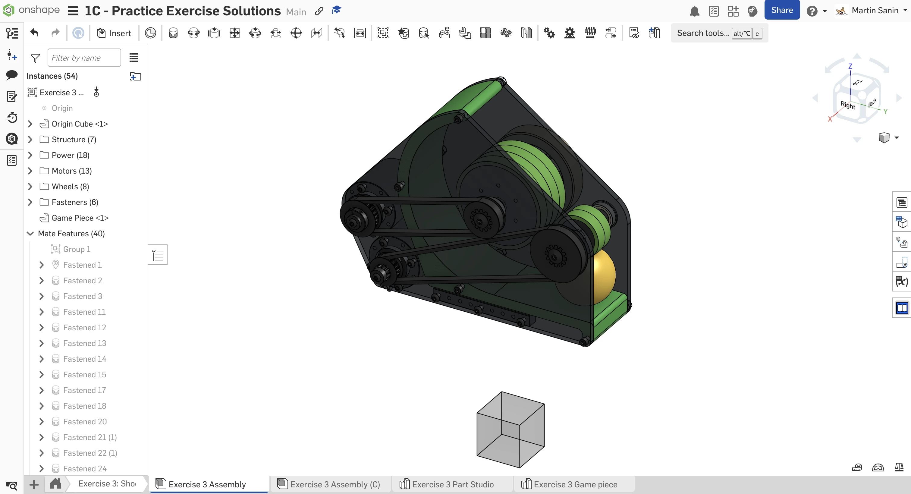

---
title: 网站功能指南
description: 了解 FRCDesign.org 的各项功能，以便更高效地浏览网站内容
template: splash
---

网站上有若干功能，如果忽略了它们，会很难高效地学习内容。下面会通过示例介绍这些功能，帮助你在开始浏览网站之前快速了解它们。

## 全站通用

- [链接](/learning-course/)以绿色文字显示
- 点击图片可放大查看，如有说明文字也会一并显示。按 `Esc` 键可再次缩小。
- 网站提供与内容相关的[术语表](/resources/glossary/)。只要在网站中提到术语表中的词，该词就会带下划线。将鼠标悬停在这些带下划线的词上，可快速查看释义（例如 COTS、OTB）。
- 部分信息放在可折叠的下拉区域中。请大家点开查看具体内容！

<Aside type="example" title="Example（示例）" collapse>
为保持页面整洁，部分信息会折叠隐藏在这里。
</Aside>

### 提示框（Admonitions / Call-Outs）

<Aside type="tip" title="Tip（提示）">
快速提示会显示在像这样的 “Tip（提示）”框中。
</Aside>

<Aside type="note" title="Note（备注）">
关于内容的额外说明会显示在像这样的 “Note（备注）”框中。
</Aside>

<Aside type="caution" title="Warning（警告）">
请留意所有像这样的 “Warning（警告）”框中的内容。
</Aside>

<Aside type="example" title="Example（示例）">
不同概念的示例会显示在像这样的 “Example（示例）”框中。
</Aside>

## 学习课程

### 按钮

页面上重要的 Onshape 文档会以如下按钮的形式呈现：

<LinkButton href="https://cad.onshape.com/documents/812b2974ed32b9c89e8f1e25/w/747e47444b6c685bd0bee334/e/58894354f0152cd6485fe45e" center>
  1A 练习 Document（文档）
</LinkButton>

### 幻灯片

<Slides>
  
  点击两侧的箭头即可切换幻灯片。

  
  说明文字下方的圆点表示当前是第几张幻灯片，也可点击圆点跳转到对应幻灯片。

  
  部分幻灯片包含视频。点击任意幻灯片可打开更大的幻灯片视图。
</Slides>

<Aside type="caution" title="Warning（警告）">
你可能需要关闭广告拦截扩展，某些内容才能正常加载（本网站不投放任何广告）。
</Aside>

<Aside type="tip" title="Tip（提示）">
如果幻灯片加载有问题，刷新网页通常即可恢复。
</Aside>
