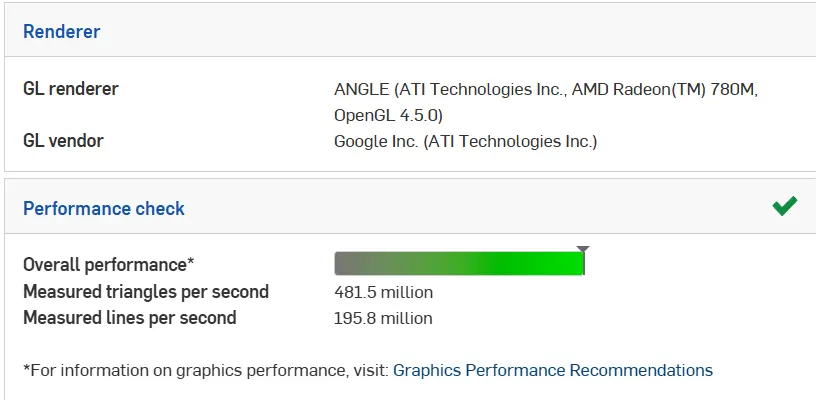
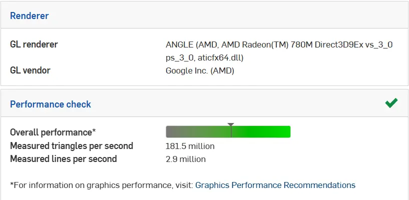
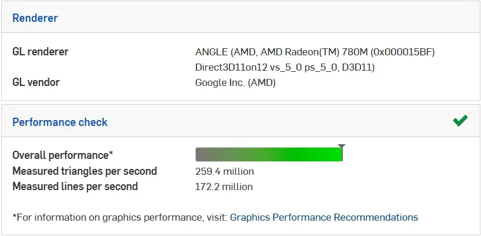

---
title: 性能调校
description: 针对你的系统优化 Onshape 性能
---

## 性能调校

完成初始账号设置后，Onshape 会运行浏览器检查，以确保兼容性。根据你使用的浏览器，还可以通过一些额外步骤来提升性能。

<Aside type="tip" title="Tip（提示）">
你可以在 [Onshape 兼容性检查页面](https://cad.onshape.com/check) 测试当前性能。
</Aside>

<Aside type="note" title="Note（备注）">
如果浏览器检查失败，可以尝试换一个浏览器。目前，Chrome、Edge、Opera 和 Arc 等 Chromium 浏览器对 Onshape 的支持最好，不过 Firefox 通常也可以正常使用。Safari 的支持情况不太理想。
</Aside>

### 提升 Chrome 性能

如果你使用 Chrome，可以尝试修改以下设置来提升渲染速度。

- 首先，在搜索栏中输入 `chrome://settings/`，进入 Chrome 设置。确保 “Use graphics acceleration when available（可用时使用图形加速）” 已启用。如果你刚刚修改并启用了它，请重新启动 Chrome。

  <ContentFigure src="../img/performance-tuning/graphicsacceleration.webp" alt="图形加速设置" />

- 前往 `chrome://flags/`，并启用 “Override Software Rendering List（覆盖软件渲染列表）”：

  <ContentFigure src="../img/performance-tuning/override-rendering-list.webp" alt="覆盖软件渲染列表" />

- 最后，尝试调整 ANGLE 图形后端：

  <ContentFigure src="../img/performance-tuning/ANGLE-backend.webp" alt="ANGLE 后端" />

请注意，性能表现取决于你自己的电脑配置。我们建议按以下流程测试：

- 选择一个 ANGLE 图形后端：`chrome://flags/#use-angle`
- 点击 Relaunch（重新启动）按钮
- [检查你的性能](https://cad.onshape.com/check)

对每个后端重复这些步骤，然后使用性能最好的选项。下面这些示例都来自同一台电脑。

<Slides>
  
  默认配置

  
  OpenGL

  
  Direct3D 9

  
  Direct3D 11

  
  Direct3D 11 on 12
</Slides>

在上面的示例中，Direct3D 11 略微优于 OpenGL，但并不总是如此。
