---
title: "练习 1：简单齿轮变速箱"
description: 建模一个简单齿轮箱
---

## 实操练习
该开始练习了！和之前使用阶段 1A 练习文档一样，先通过下面的按钮**复制一份阶段 1B 练习文档**。每个练习都有一个文件夹、一个 “reference” 标签页（预览最终模型应有的样子），以及一两个用于完成练习的标签页。1B 练习答案文档中也提供了解答，方便你之后检查自己的成果。

<LinkButton href="https://cad.onshape.com/documents/ce41613fac38db8c00e65020/w/a65651477167d5e36fe871c0/e/755940e52d82bddfdf7be61e" external center>1B 练习文档（复制这个）</LinkButton>
<LinkButton href="https://cad.onshape.com/documents/c6a8ec29479a2578841fb9f2/w/85094b3baa15a05c873920c9/e/47efe87a05a8318bffd60957" external center>1B 练习答案</LinkButton>

## 练习 1：简单齿轮变速箱

在本练习中，你将建模并装配一个简单的单级齿轮箱。本练习的目标是介绍如何建模一个非常简单的齿轮传动。此外，你还会学习如何使用 [`Robot Shaft` （轴）和 `Robot Spacer` （隔套、垫柱）FeatureScript（自定义特征脚本）](https://cad.onshape.com/documents/9cffa92db8b62219498f89af/w/06b332ccabc9d2e0aa0abf88/e/99672d1e329b38e647d90146)，以及 `Replicate`（仿制）工具。你还会使用 [FRCDesignLib 零件库](/learning-course/course-setup/required-course-tools/part-library) 插入齿轮、电机等紧固件以外的零部件。

<Aside type="note" title="Note（备注）">
练习 1 会向 CAD（计算机辅助设计）模型中添加紧固件（螺栓和螺母）。你可以在 [设计手册](/design-handbook/structure/structure/) 页面了解更多紧固件标准。
</Aside>

### 布局草图（规划草图）

布局草图（规划草图）是一种 Sketch（草图）的形式，用来表达设计的几何关系，但不指定所有具体细节。
它类似房屋的框架，用来定义整体结构和关键部件之间的关系，但不包含墙面、涂装这类最终细节。
把关键尺寸放在布局草图中，后续需要调整时会更方便。之后几乎所有设计都会使用布局草图完成前期规划。

<Aside type="tip" title="Tip（提示）：电机">
本练习使用的电机是一种 CIM 级电机，型号为 Falcon 500。虽然它已经停产，但许多队伍仍然拥有这类电机；它使用与大多数其他 FRC 电机相同的 2" （2英寸）安装孔位，如 [电机页面](../motors) 中所述。
</Aside>

### Part Studio（零件工作室）说明
在你复制的文档中，**进入 “Exercise #1 Part Studio” 标签页**，并**按照幻灯片中的说明**完成 Part Studio（零件工作室）。

<Slides>

  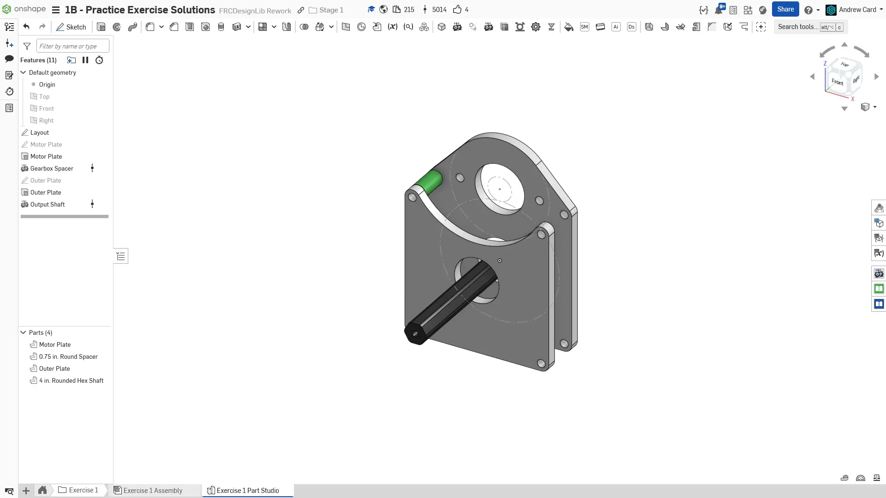
  完成后的零件工作室。

  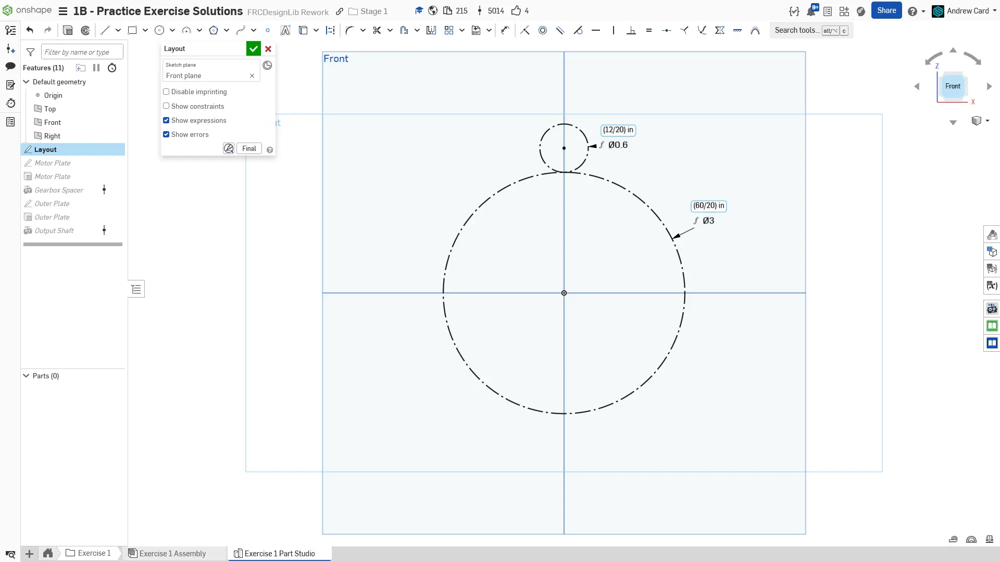
  先创建齿轮箱的布局草图。画出 60T 和 12T 齿轮的分度圆构造线。将两个分度圆设置为相切，用来约束齿轮之间的中心距。再约束两个齿轮中心点位于同一竖直线上。

  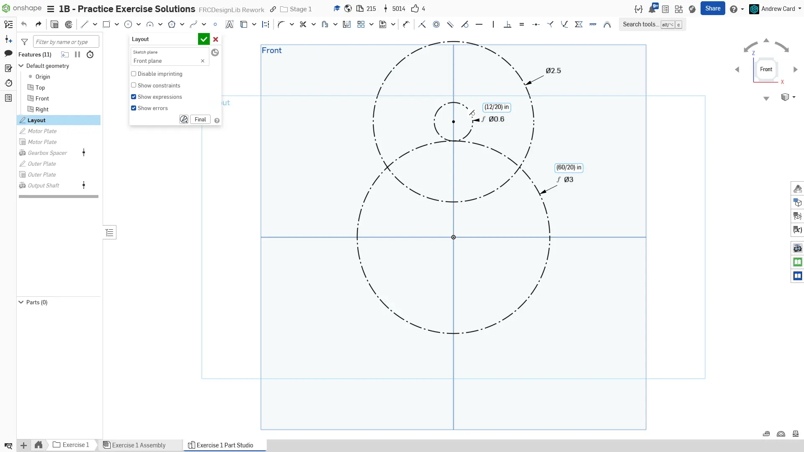
  在电机连接的 12T 齿轮周围添加电机外轮廓构造线，也就是一个直径 2.5" 的圆。至此，布局草图完成。

  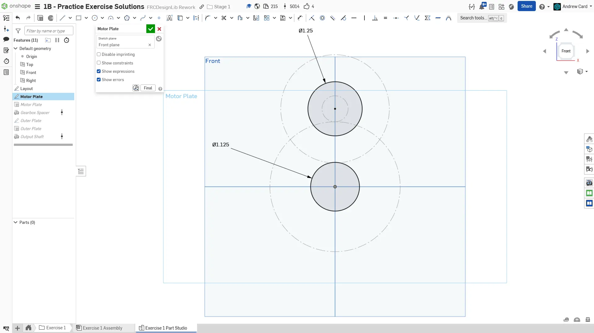
  为齿轮箱电机安装板创建一个新草图。以布局草图为参考，画出一个 1.125" 的轴承孔，以及一个 1.25" 的电机定位凸台孔（电机上凸出来的那一圈）。注意，根据加工方式和公差不同，你可能需要把轴承孔画得比标称尺寸（1.125"）略大或略小。

  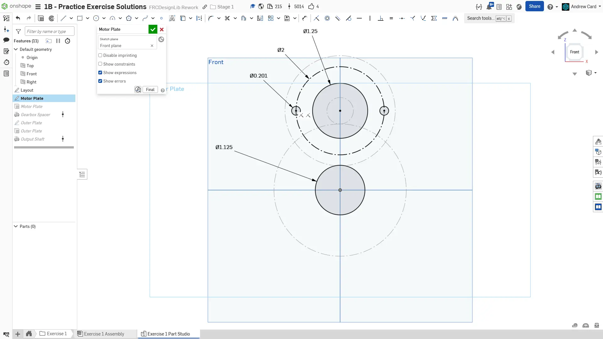
  在直径 2" 的螺栓分布圆上添加两个电机安装孔。只使用两个安装孔时，除了使用圆形阵列，也可以画一个直径 2" 的构造圆并标注尺寸，然后在圆上画出螺栓孔。别忘了约束孔位角度；这里使用的是水平约束。

  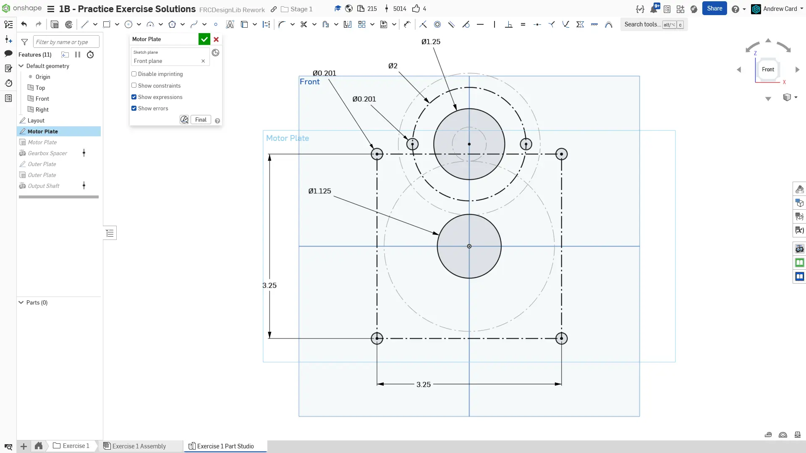
  添加用于连接两块板件的四个螺栓孔。使用中心矩形创建构造几何，这样只需要两个尺寸就能约束这些孔。注意，如果板件是对称的，可以只画一半的草图，然后使用草图镜像工具镜像另一半。

  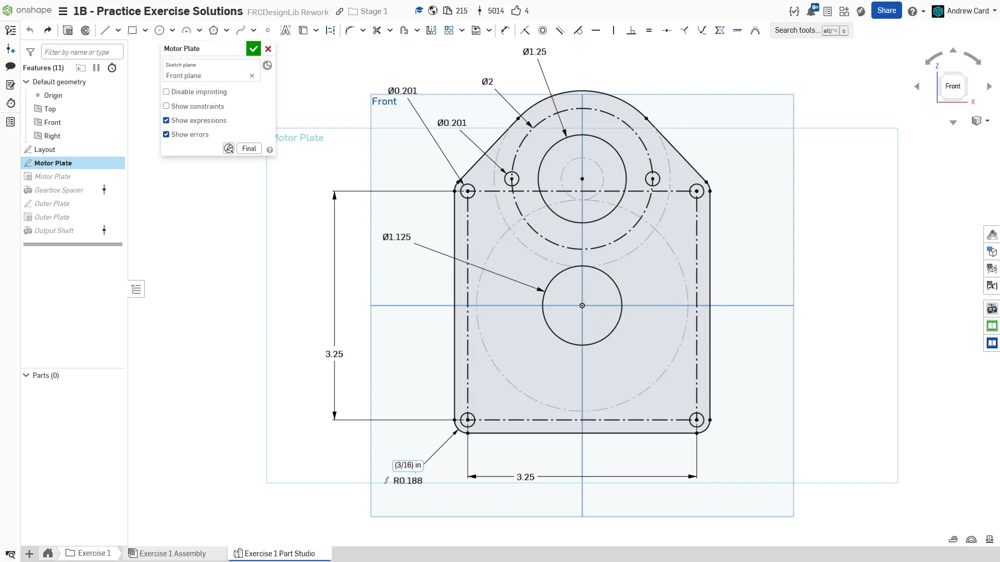
  使用圆心圆弧、直线和草图镜像工具，围绕孔位和电机外轮廓画出板件外轮廓。由于原点被合理地放在竖直对称线上，你可以使用右平面对板件外轮廓进行镜像，来完成另一半草图。

  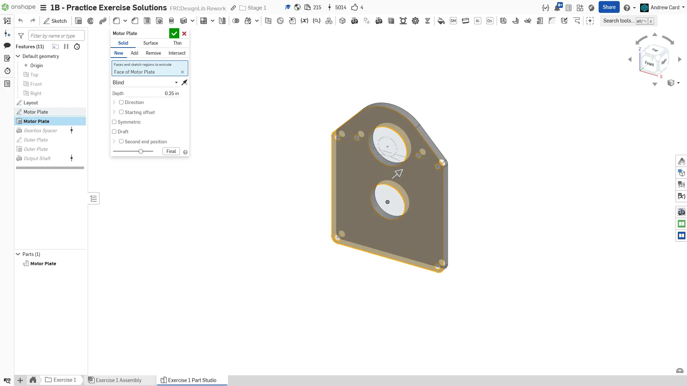
  将齿轮箱电机安装板拉伸为 1/4" 厚。

  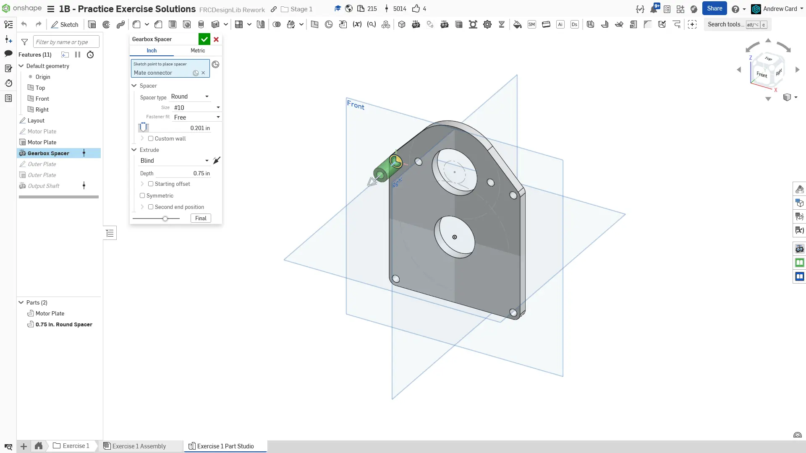
  使用 Robot Spacer FeatureScript 添加一个 #10 自由配合、3/8" 外径（自动）、3/4" 长的隔套（垫柱）。

  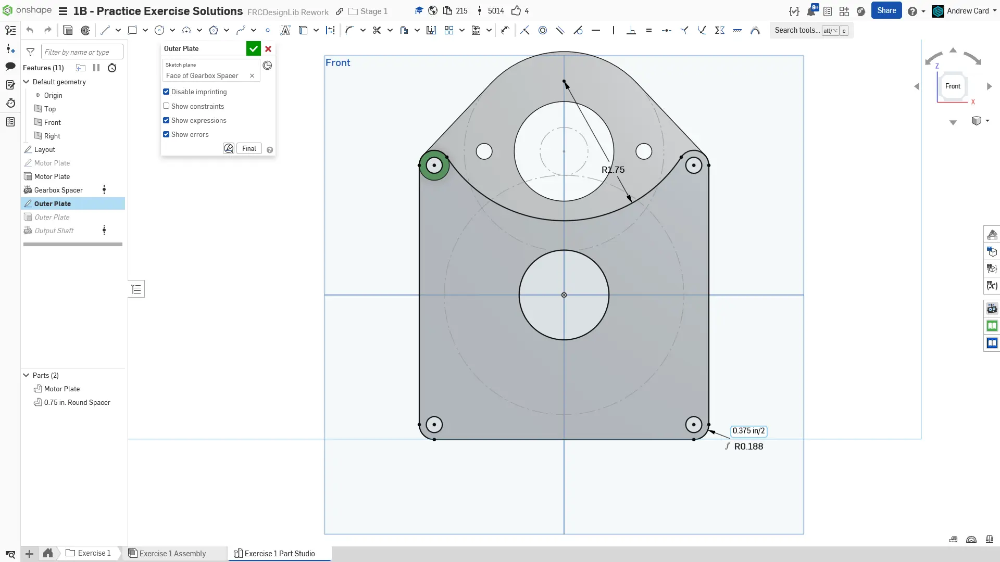
  在隔套（垫柱）的另一个面上创建齿轮箱外板草图。使用 `Use`（投影）草图工具投影齿轮箱电机安装板的孔和边线，但需要用某个圆弧工具在顶部添加一个圆弧切口。注意，这个草图大部分可以通过相切、相等、竖直等约束来定义。

  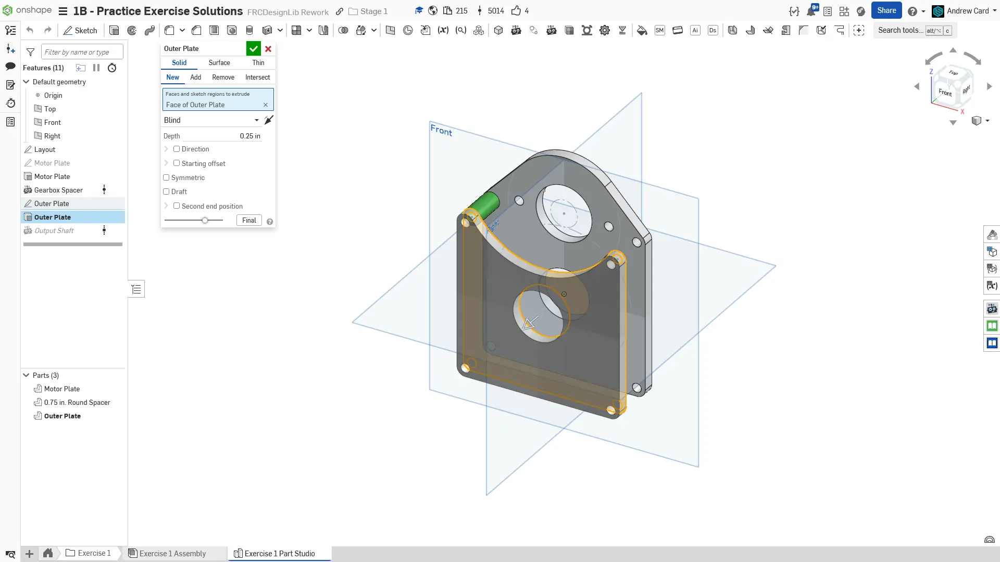
  将齿轮箱外板拉伸为 1/4" 厚。

  
  使用 Robot Shaft FeatureScript 建模输出轴。按照视频中使用的设置操作。

  
  完成后的零件工作室。给关键草图和特征命名。在零件列表中右键点击板件和隔套（垫柱），设置它们的名称、材料（6061 铝）和外观。轴的材料会由 Robot Shaft FeatureScript 自动确定。
</Slides>

### Assembly（装配体）说明

组装装配体时，**你可能会觉得把电机小齿轮配合到电机轴上有些困难**。

有些Mate（配合）连接器并不会直接显示出来，我们可以通过**按住 `Shift` 键来锁定该面上所有可见的配合连接器**，从而选中这些连接器。观看下面的视频了解具体操作。

<ContentFigure src="zI8wBHeTfdc">配合时使用 Shift 键锁定配合连接器</ContentFigure>

现在，在你复制的文档中**进入 “Exercise #1 Assembly” 标签页**，并**按照幻灯片中的说明**完成装配体。

<Slides>
  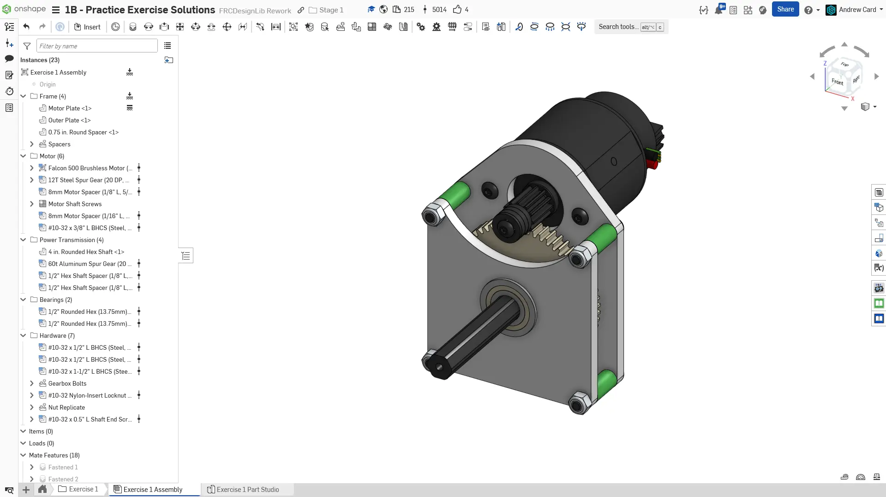
  最终装配体。

  
  将零件工作室对应的零件插入装配体，并固定齿轮箱板。使用“分组配合”将两块板件组合在一起，然后将隔套通过配合，安装到电机板上。接着，使用 Replicate（仿制）工具，把隔套及其关联配合仿制到其他隔套位置。

  
  使用 FRCDesignLib 中的零件装配轴承和轴。

  
  使用 FRCDesignLib 中的零件装配电机和电机小齿轮。你需要使用配合推断锁定功能，将电机与电机小齿轮紧固在一起：具体方法请参考上方的下拉说明。

  
  使用 FRCDesignLib 中的零件装配轴用隔套和齿轮。可配置零件会在实例列表中显示蓝色网格图标。注意，在完成配合之后，你仍然可以把齿轮齿数从 40T 改为 60T。使用这类可配置零件可以让模型更参数化，因为你无需重新插入和重新配合零件，就能修改该零件。

  
  从 FRCDesignLib 插入轴端固定螺栓。

  
  使用 FRCDesignLib 零件添加电机螺栓、齿轮箱螺栓和螺母。

  
  完成后的装配体。确保把零件整理到文件夹中，并给仿制特征命名。
</Slides>

<Aside type="tip" title="Tip（提示）：检查">
请确保由你自己，或队内更有经验的队员/导师来 [**检查你的 CAD！**](/learning-course/stage1/1a/focusing-on-improvement) 你的装配体应包含 19 个实例，重量约为 2.3 lbs。
</Aside>

### 可配置零件

在本练习中，你完成了自己的第一个齿轮箱。在这个过程中，你也使用了零件配置。零件配置是一项强大的工具，可以让同一个零件拥有不同变体。你从 FRCDesignLib 插入的齿轮就是可配置零件，因此可以轻松修改齿轮齿数，而不需要插入新的零部件。只要有可配置零件可用，就尽量使用它们，让你的模型更加参数化。
