---
title: "练习 2：两级齿轮变速箱"
description: 建模一个两级齿轮箱
---

## 练习 2：两级齿轮变速箱

在本练习中，你将建模并装配一个两级齿轮变速箱。本练习的目标是练习更进阶的齿轮变速箱建模。你还会学习如何使用用于零件镂空减重的 [`Part Lighten` FeatureScript（自定义特征脚本）](https://cad.onshape.com/documents/028ca8fb10baf53e1f6fce96/w/b1250a450d0ba88f0a8b1811/e/a8b9e45297aac9f5688c871d)。

<Aside type="caution" title="Warning（警告）">
虽然本阶段会要求你在完成零件工作室内的零件建模后给板件做镂空减重，但这并不是最佳做法。在建模完整机构或整台机器人时，你应该**等机构或整机完成所有设计评审和修改之后，再对板件进行减重**。否则，每次板件或机构发生变化，你都要花时间重新修正减重镂空结构。
</Aside>

### Part Studio（零件工作室）说明
在你复制的文档中，**进入 “Exercise #2 Part Studio” 标签页**，并**按照幻灯片中的说明**完成零件工作室中的零件建模。

<Slides>
  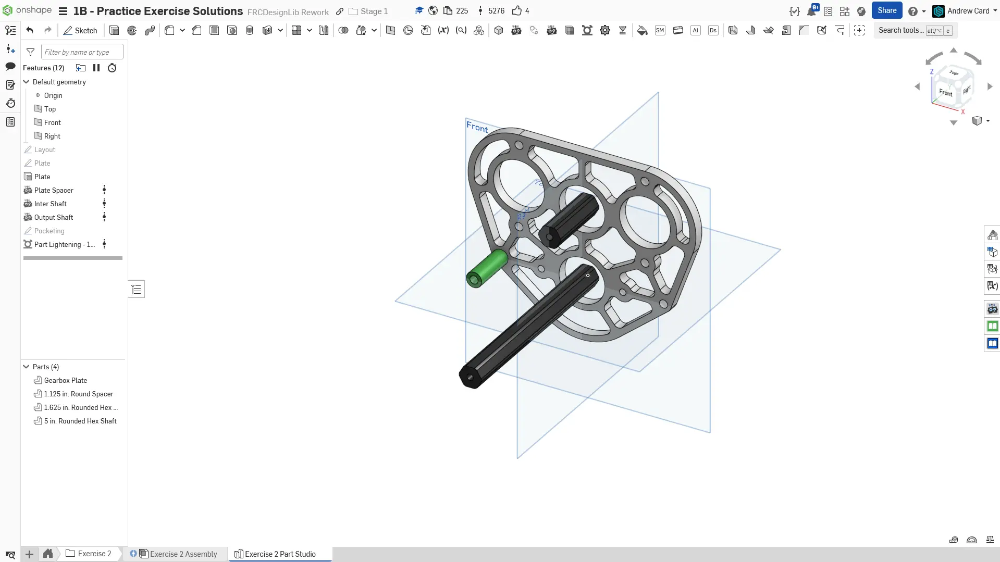
  最终零件工作室。

  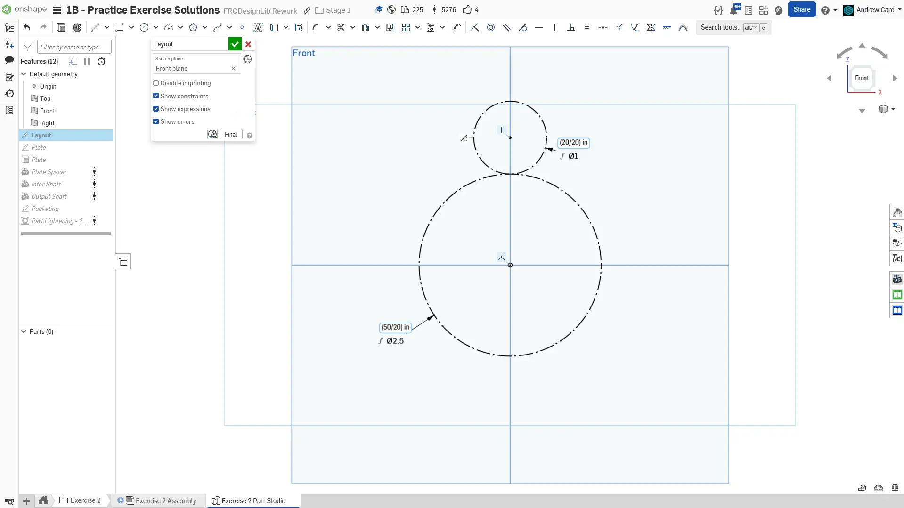
  创建齿轮箱的布局草图。先绘制第二级传动，也就是一个 20T 齿轮驱动一个 50T 齿轮。

  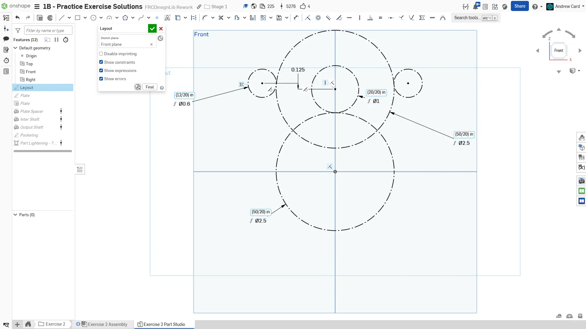
  绘制第一级传动，也就是一个 12T 电机小齿轮驱动一个 50T 齿轮。

  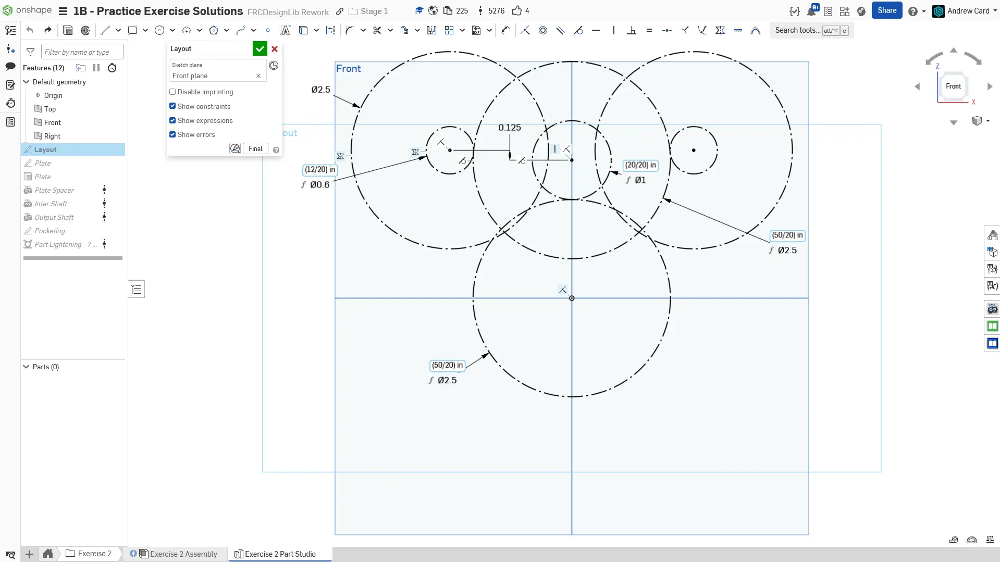
  用直径 2.5" 的圆画出电机外轮廓。至此，齿轮箱布局草图完成。

  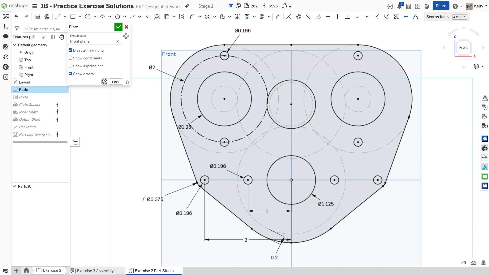
  创建一个新草图来绘制板件轮廓。参考布局草图，添加直径 1.125" 的轴承孔，以及直径 1.25" 的电机定位凸台孔。还需要添加电机安装孔。你可以使用 `Mirror`（镜像）草图工具，把左侧几何镜像到右侧。

  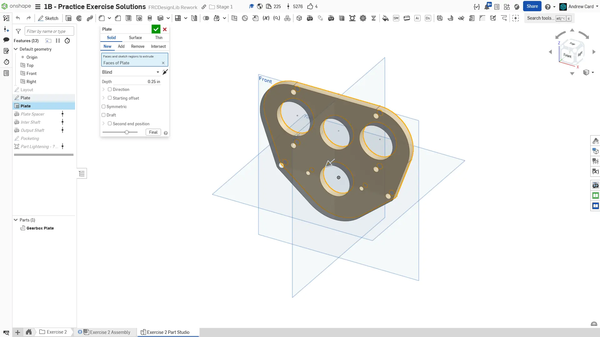
  将板件拉伸为 1/4" 厚。

  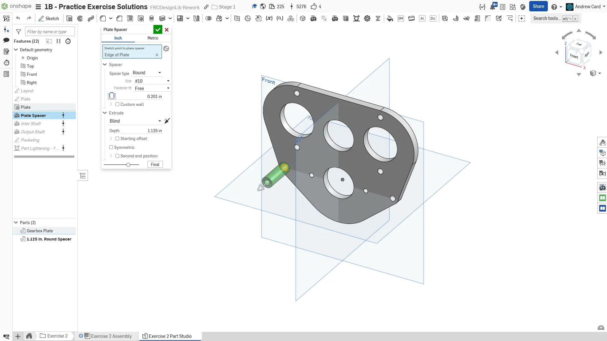
  使用 Robot Spacer FeatureScript 创建齿轮箱隔套（垫柱）。

  
  使用 Robot Shaft FeatureScript 创建第一级传动轴。

  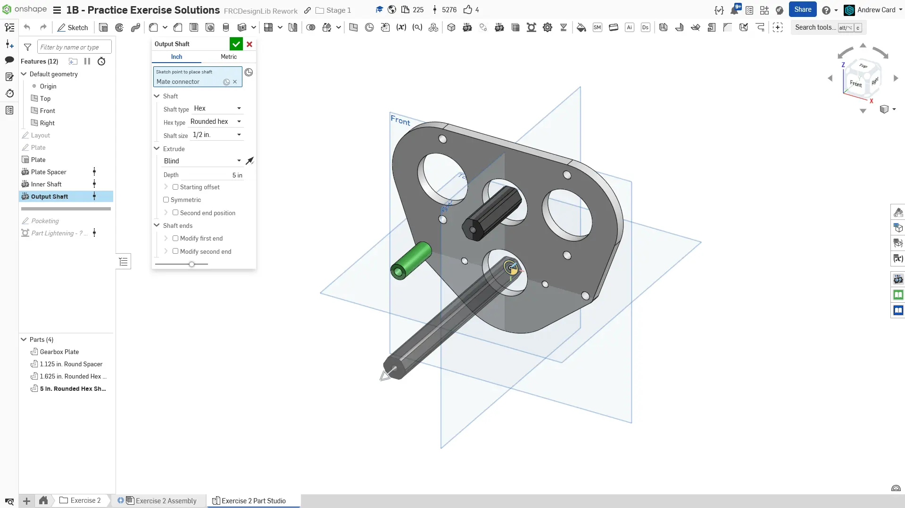
  使用 Robot Shaft FeatureScript 创建第二级传动轴（输出轴）。

  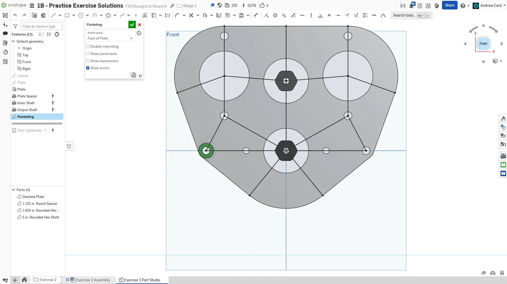
  在板件表面创建草图，并绘制镂空减重所需的加强筋线。

  
  使用 Part Lighten FeatureScript，选择上一个草图中所创建的加强筋线，对板件进行减重开槽。

  
  完成后的零件工作室。给草图、特征和零件命名。设置板件和隔套的名称、材料（6061 铝）和外观。
</Slides>

### Assembly（装配体）说明

接下来，在你复制的文档中**进入 “Exercise #2 Assembly” 标签页**，并**按照幻灯片中的说明**完成本练习。

<Slides>
  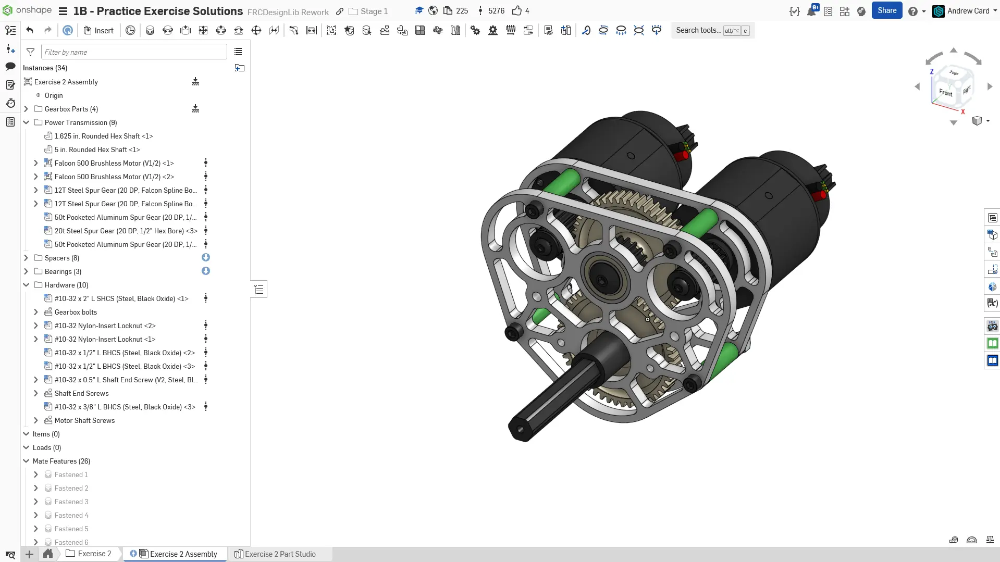
  最终装配体。

  
  将零件工作室中的零件插入到装配体中，并只固定齿轮箱板。将隔套（垫柱）配合到齿轮箱板上。接着，使用 Replicate（仿制）工具，把隔套及其关联配合仿制到其他隔套位置。

  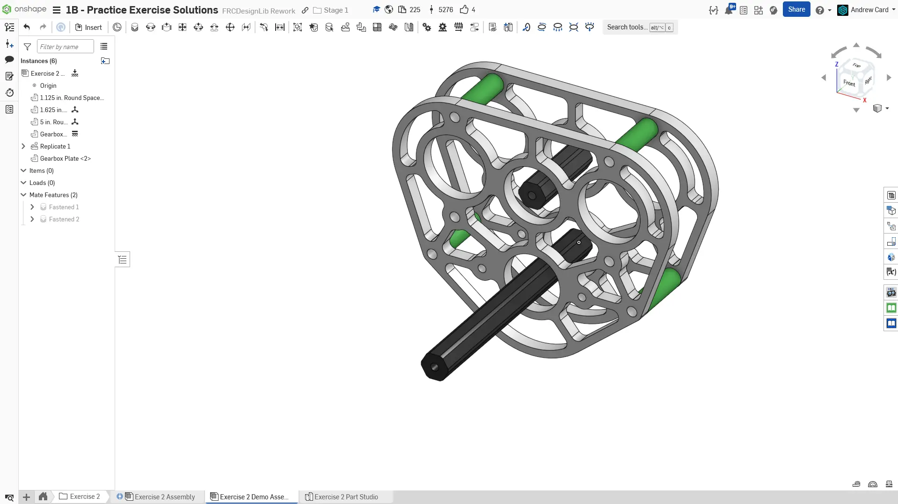
  复制齿轮箱板，并将它配合到正确位置。

  
  使用 FRCDesignLib 中的零件装配轴承和轴。

  
  使用 FRCDesignLib 中的零件装配电机和电机小齿轮。

  
  使用 FRCDesignLib 中的零件装配轴用隔套和齿轮。

  
  使用 FRCDesignLib 零件装配轴端固定螺栓、电机螺栓、齿轮箱螺栓和螺母。

  
  完成后的装配体。确保把零件整理到文件夹中，并给仿制特征命名。
</Slides>

<Aside type="tip" title="Tip（提示）：检查">
请确保由你自己，或队内更有经验的队员/导师来 [**检查你的 CAD！**](/learning-course/stage1/1a/focusing-on-improvement) 你的装配体应包含 27 个实例。
</Aside>

在本练习中，你练习了更复杂的齿轮箱建模，并学习了如何将更大的装配体配合在一起。
