---
title: "练习 3：齿轮与同步带变速箱"
description: 建模一个齿轮与同步带结合的变速箱
---

## 练习 3：同步带与齿轮传动

在本练习中，你将建模一个使用齿轮和同步带的两级齿轮箱。这个变速箱还会包含框架和加强板等结构元素，这些内容你已经在阶段 1A 学过。本练习的目标是继续提升你的建模能力。

<Aside type="caution" title="Warning（警告）：记住！">
始终确保你的草图完全**定义**，为特征**重命名**，并使用**文件夹**整理好特征树和实例树。
</Aside>

### Part Studio（零件工作室）说明

在你复制的文档中，**进入 “Exercise #3 Part Studio” 标签页**，并**按照幻灯片中的说明**完成本练习的零件工作室。

<Slides>
  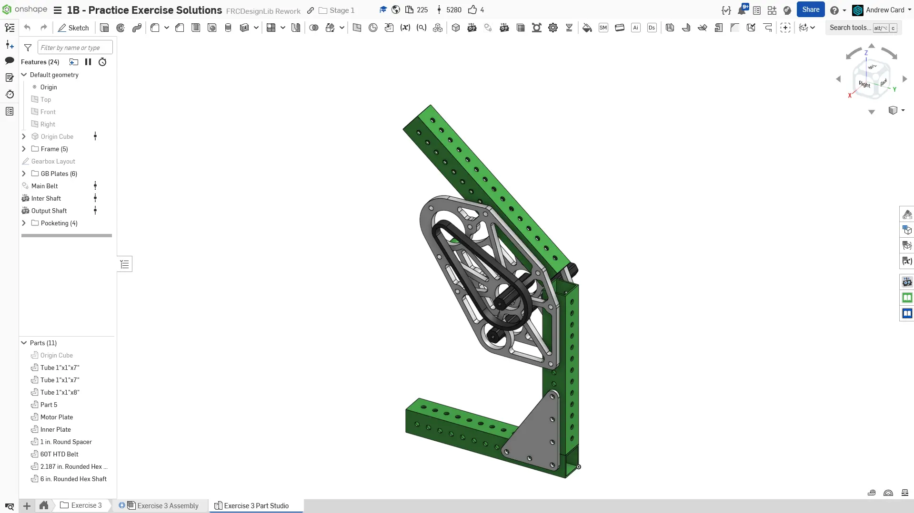
  最终零件工作室。

  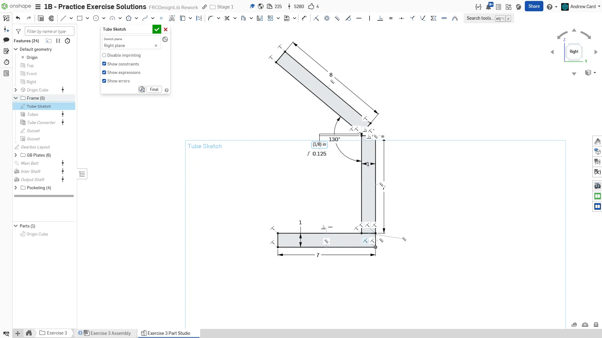
  先使用 Origin Cube 特征（这样后续才能使用同步带相关函数）。然后绘制框架的管材轮廓。斜管和竖直管之间留有 1/8" 间隙，用于容纳装配公差。

  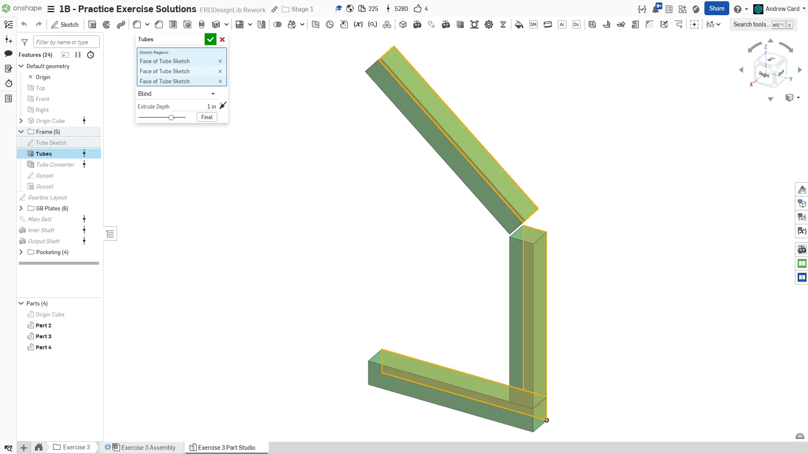
  使用 Extrude Individual FeatureScript（自定义特征脚本）拉伸管材轮廓。

  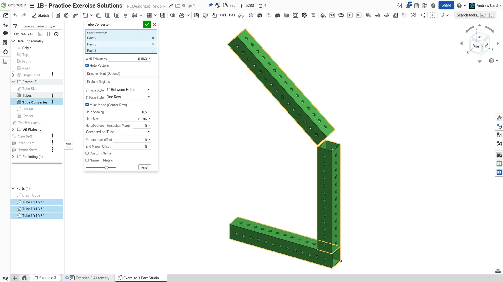
  使用 Tube Converter FeatureScript，将矩形转换为带孔阵列的 1x1 薄壁管（壁厚 1/16"）。

  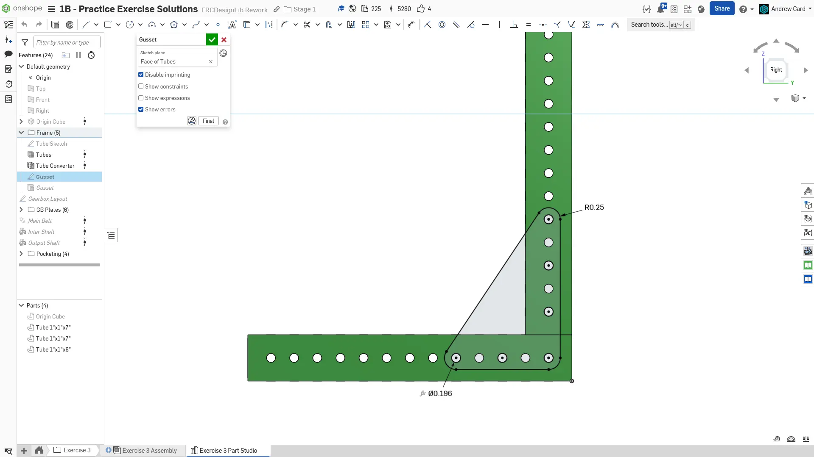
  绘制一个简单的 L 形加强板。

  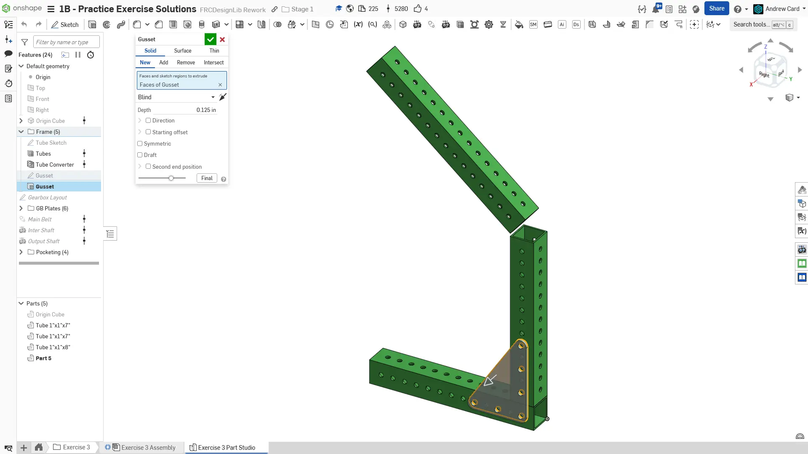
  拉伸加强板，0.125" 厚。

  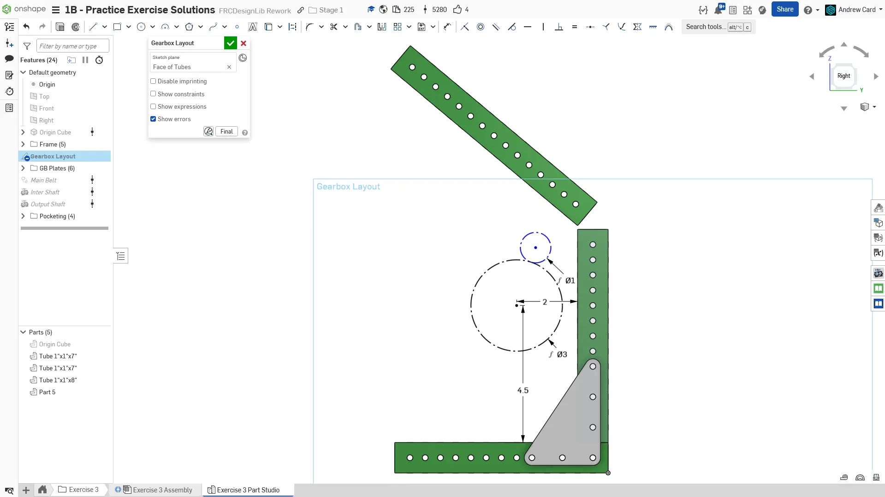
  在底部管材的外侧面上创建齿轮箱布局草图。先绘制两个齿轮：一个 60T 齿轮和一个 20T 齿轮。60T 齿轮是输出端，我们希望通过 2" 和 4.5" 两个尺寸把输出端的中心点约束到指定位置。

  
  接着，绘制 5 mm 齿距的 12T 和 36T 同步带轮。用一条直线连接两个同步带轮。使用一开始插入的 Origin Cube FeatureScript 中的 #PulleyPD_5mm() 函数，计算同步带轮的分度圆直径。同时让 36T 同步带轮的分度圆与竖直管之间保持 0.25" 间距。因为这个同步带轮和齿轮是同心的，所以这一步会完全约束齿轮的位置。

  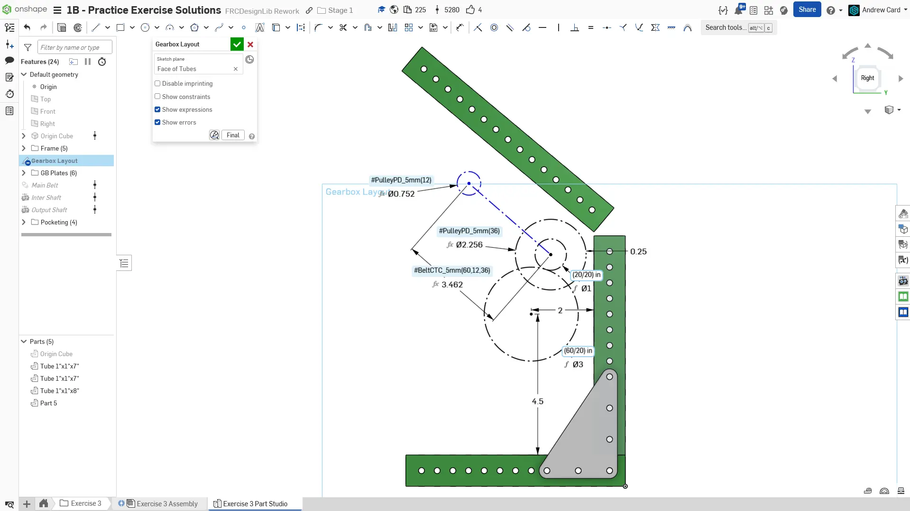
  使用 #BeltCTC_5mm() 函数，在布局草图中添加一条 60T HTD5 同步带对应的中心距。

  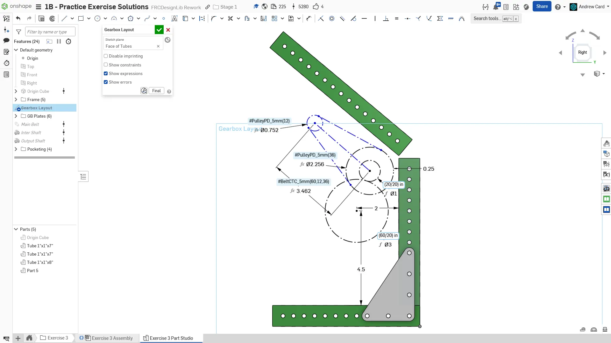
  可选：绘制两条相切线连接两个同步带轮的分度圆。这可以用来表示同步带。建议大家都画上，因为这样能看到同步带是否与其他地方有干涉。

  
  最后，为电机绘制一个 2.5" 的外轮廓圆。让电机外轮廓圆与斜管之间保持 1/8" 间距。至此，布局草图已完全定义。

  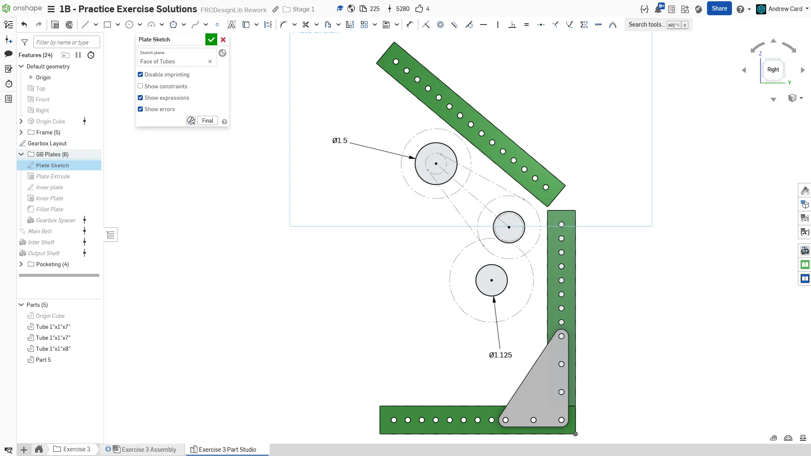
  在底部管材的外侧面上创建板件草图。先绘制两个直径 1.125" 的轴承孔。再为电机定位凸台添加一个 1.5" 的孔，使电机上的 12T 同步带轮能够穿过该孔，便于实际装配。当你创建变速箱装配体时，这一点会更清楚。

  
  使用圆形阵列为电机添加一个 2" 安装螺栓分布圆。将左上角的安装孔中心点约束为与两个同步带轮之间的中心线重合（重合约束会使用该直线的无限延长线）。

  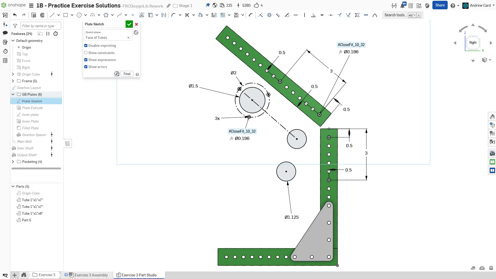
  为板件添加管材安装孔。注意，这些孔参考的是管材边缘，而不是管材上的孔。这样做是为了让模型更参数化，因为管材发生变化时，管材孔位可能会改变，从而破坏变速箱板草图。这就是选择尺寸基准的重要性。

  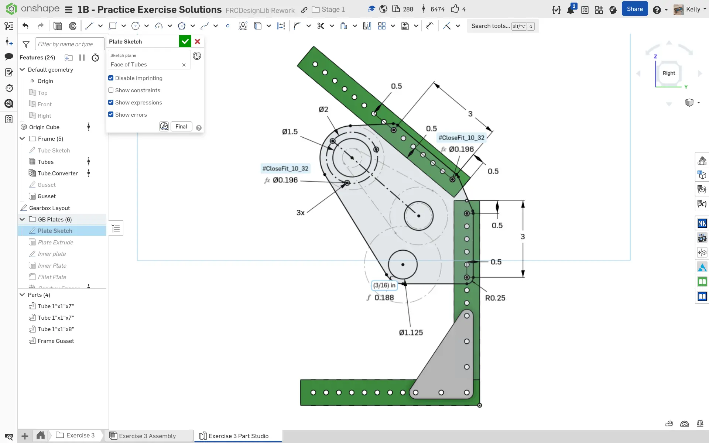
  使用圆心圆弧和相切线绘制板件外轮廓。具体参数请参考图片。

  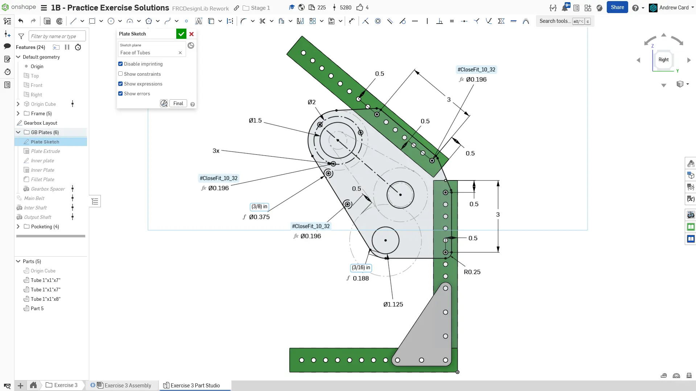
  为隔套添加两个孔。构造圆表示直径 3/8" 的隔套。上方孔所安装的隔套外边缘与板件左边缘相切，并与 2.5" 电机外轮廓圆相切。

  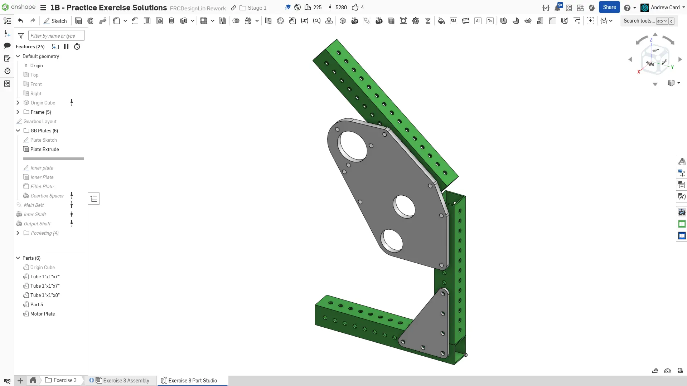
  将板件拉伸为 1/4" 厚。

  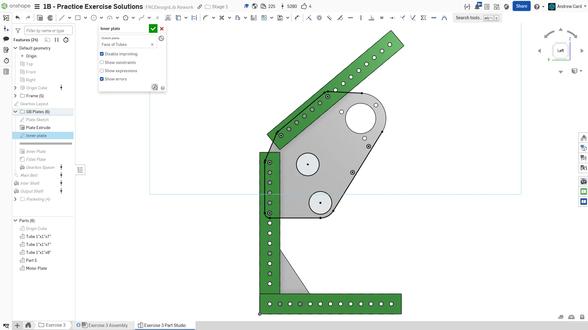
  在另一侧，为内侧板创建草图。使用 `Use`（使用投影）草图功能复制共用几何轮廓（安装孔和外轮廓）。注意不要复制电机安装孔，因为内侧板上会为电机本身留出镂空槽，方便电机通过安装在外板上。

  
  为电机安装镂空槽添加一段圆弧，完成板件外轮廓。

  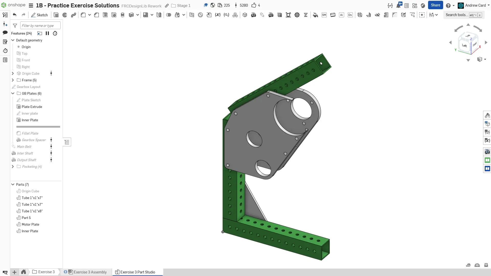
  将内侧板拉伸为 1/4" 厚。

  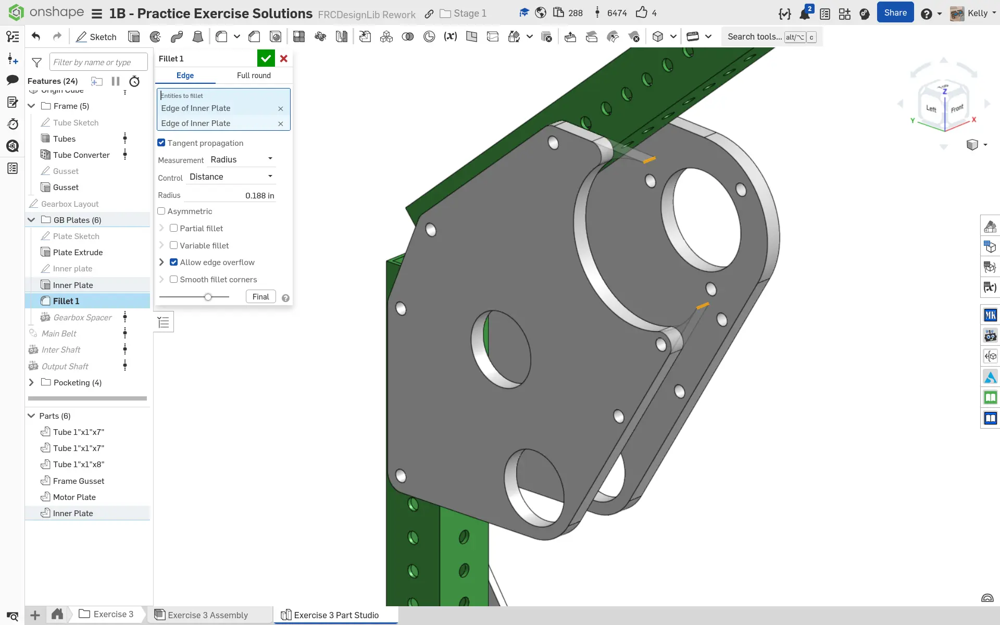
  在电机切口的两条边上添加半径 3/16" 的圆角。选择这个半径是为了匹配直径 3/8" 的隔套。

  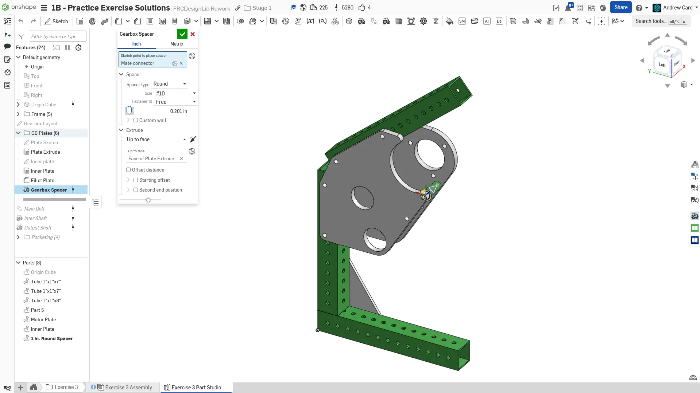
  建模直径 3/8" 的隔套。可以使用 `Up to Face`（到面）终止条件，让隔套长度保持参数化。

  
  使用 Belt & Chain Gen FeatureScript 创建同步带模型。同步带齿距为 5 mm，宽度为 9 mm。将参考平面偏移 0.5"，避免同步带与板件干涉。保持同步带为简化模型，因为开启同同步带齿形建模会拖慢零件工作室的重建速度。注意，Belt & Chain Gen FeatureScript 还会计算同步带的节线长度，这可以用来验证第 7 步和第 8 步中计算的中心距是否正确。

  
  使用 Robot Shaft FeatureScript 创建第一级轴。

  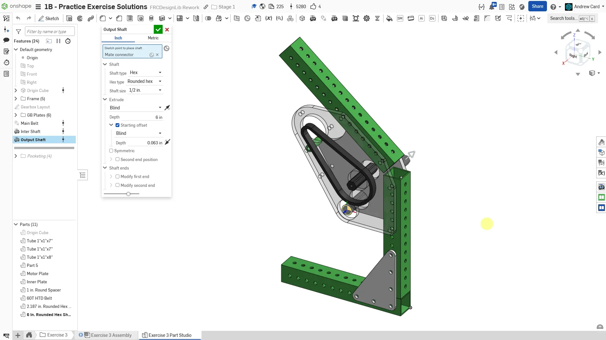
  使用 Robot Shaft FeatureScript 创建输出轴。

  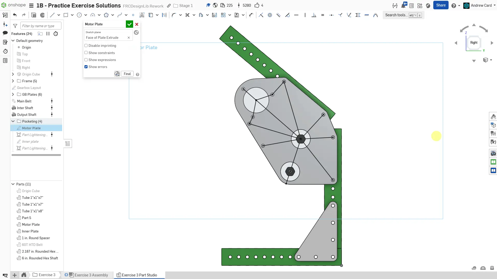
  可选：对板件进行镂空减重开槽。首先，在电机板外侧面上创建草图，并绘制用于形成加强筋的线。

  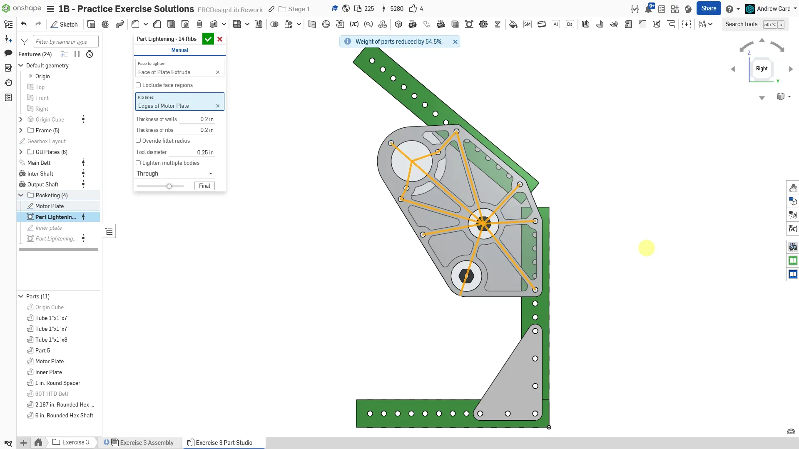
  使用 Part Lighten FeatureScript，选择上一步草图来添加镂空减重开槽。加强筋宽度使用 0.15"，刀具直径（tool diameter）使用 0.26"。

  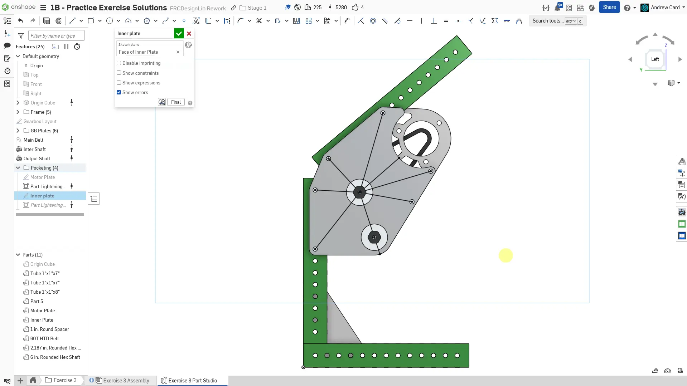
  在内侧板上创建草图，并绘制加强筋线。你可以使用 `Use`（使用投影）草图功能，从电机板镂空减重草图中复制加强筋线。

  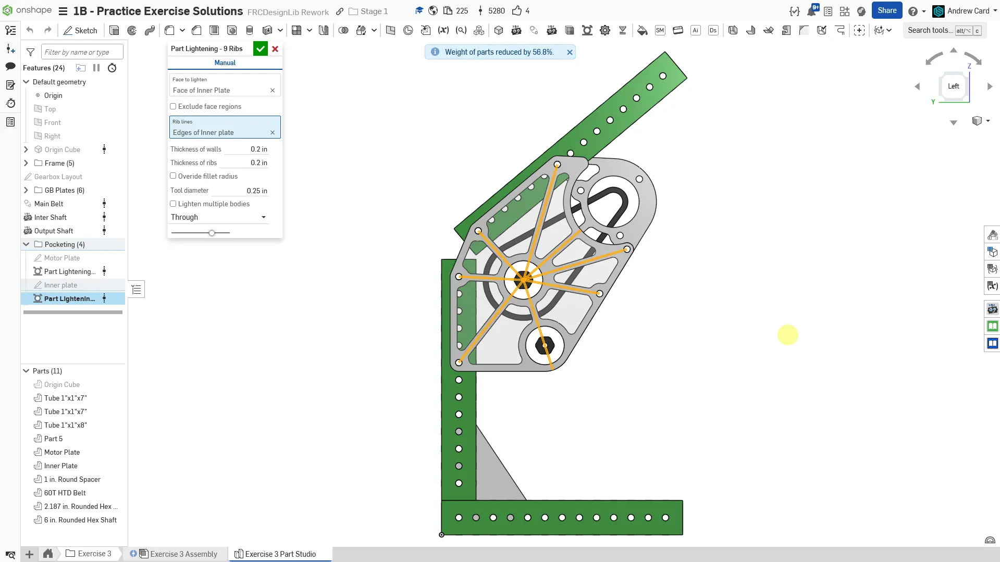
  使用 Part Lighten FeatureScript，选择上一步草图来添加镂空减重开槽。同样，使用 0.15" 宽的加强筋和 0.26" 的刀具直径（tool diameter）。

  
  完成零件工作室的零件建模后。给关键草图和零件命名。将板件和隔套的材料设置为 6061 铝。管材、加强板和轴的材料应已自动设置好。
</Slides>

### Assembly（装配体）说明

现在你已经完成了零件工作室，请在你复制的文档中**进入 “Exercise #3 Assembly” 标签页**，并**按照幻灯片中的说明**完成本练习。

<Slides>
  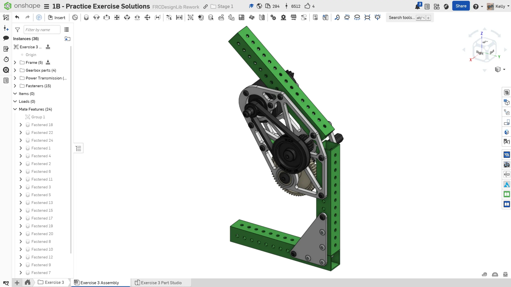
  最终装配体。

  
  将零件工作室中的零件插入装配体，并只固定底部管材。对管材、板件和加强板使用分组配合（group mate）。复制加强板，并将它配合到管材另一侧。接着，将隔套配合到板件上，并使用 Replicate（仿制）工具仿制隔套。

  
  使用 FRCDesignLib 中的零件装配轴承和轴。把轴承安装到轴承孔中，并使用 Replicate（仿制）工具仿制轴承。

  
  使用 FRCDesignLib 中的零件，装配 36T 同步带轮、同步带、电机和电机的同步带轮。注意，电机的同步带轮相对于轴底部偏移了 1/16"，这样能更好地与同步带对齐。另外，同步带只需要一个紧固配合，因为它的方向已经由零件工作室中的建模方式确定。

  
  使用 FRCDesignLib 中的零件装配轴用隔套和齿轮。注意，这次 60T 齿轮使用的是镂空减重齿轮。镂空减重齿轮与普通齿轮相同，只是去除了一部分材料以减轻重量。

  
  使用 FRCDesignLib 零件装配轴端固定螺栓。

  
  使用 FRCDesignLib 零件装配电机螺栓、变速箱螺栓和螺母。

  
  使用 FRCDesignLib 零件装配加强板铆钉。

  
  完成后的装配体。确保把零件整理到文件夹中，并给仿制特征命名。
</Slides>

<Aside type="tip" title="Tip（提示）：检查">
请确保由你自己，或队内更有经验的队员/导师来 [**检查你的 CAD（计算机辅助设计）！**](/learning-course/stage1/1a/focusing-on-improvement) 你的装配体应包含 31 个实例。
</Aside>

在本练习中，你建模了一个比较复杂的变速箱，并把它与一些框架元素集成在一起。到这里，你应该已经开始熟悉草图和拉伸工具了。你也可以通过尝试不同设置，进一步熟悉目前用过的 FeatureScript 中的各种选项。

### 参数化建模

想要感受模型的参数化程度如何，可以尝试修改布局草图中的一些关键尺寸，例如管材长度、管材角度、同步带长度和齿轮尺寸。试一试哪些修改可以顺利更新，哪些修改还需要在 CAD 中额外修复。

你可能也会好奇，这些设计中的孔尺寸、材料等是如何选择的。建议你浏览 [设计手册](/design-handbook/) 页面，进一步学习其中涵盖的各类深入主题；也可以与你的队伍、其他学生或导师在 DDS Discord 上讨论。
