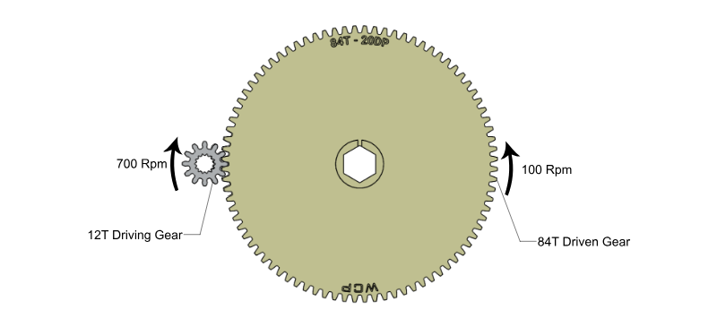
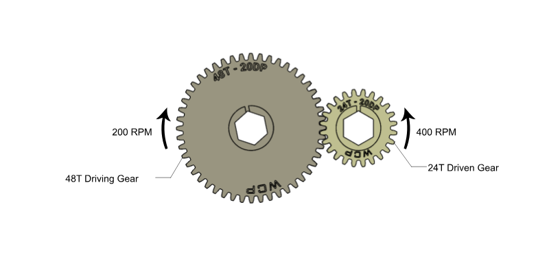
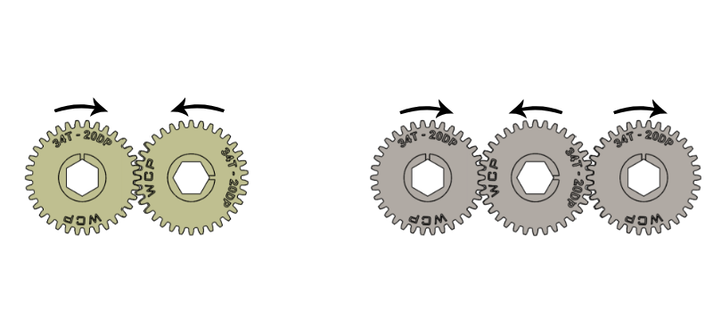

---
title: 齿轮基础
description: 齿轮入门
---

import ContentRow from '@components/content/ContentRow.astro';
import ContentRowCaption from '@components/content/ContentRowCaption.astro';

## 动力传动
在 FRC 中，最常见的三类动力传动是齿轮、链条和链轮、同步带和同步带轮。虽然它们最终都能改变速度和扭矩，但各自适合不同的使用场景。接下来的几个小节会分别介绍这些传动方式，以及如何对它们进行建模。

<Aside type="note" title="Note（备注）">
齿轮、链轮和同步带轮都遵循对应的齿形标准，用来规定齿的尺寸。这意味着零件齿数与直径之间的比例是固定的。齿形标准有很多种，但只有相同齿形标准的零件才能啮合或配合使用。
</Aside>

## 齿轮基础

齿轮是一种带齿的机械零件，通过齿与齿之间的啮合，在旋转轴之间传递运动或动力。你可以把它们理解成带齿的轮子，齿互相啮合后，就能传递扭矩、改变速度，并改变旋转方向。

<ContentRow mediaHeight="25rem">
  <ContentFigure src="../img/1b/gears/simple-gears.webp" gif alt="简单齿轮动画" />
  <ContentFigure src="../img/1b/gears/gearbox-animated.webp" gif alt="齿轮箱动画" />
  <ContentRowCaption>齿轮啮合动画。注意，互相啮合的齿轮会朝相反方向旋转。</ContentRowCaption>
</ContentRow>

要改变从输入端到输出端的扭矩和速度，就必须使用不同尺寸的齿轮。记住，传动比与齿轮的齿数有关。齿与齿总是一对一啮合，但不同尺寸的齿轮每转一圈经过的齿数不同。即使齿轮表面接触处的线速度相同，角速度也会不同。点击下面的幻灯片，查看不同传动比的可视化示例。

:::center
### **用齿轮改变速度和扭矩**
:::

<Slides>
  
  一个 12T 齿轮驱动一个 84T 齿轮。传动比为 84:12，可简化为 7:1。扭矩增大到 7 倍，速度降低到原来的 1/7。（图片来源：WCP）

  
  一个 48T 齿轮驱动一个 24T 齿轮。传动比为 24:48，可简化为 1:2。扭矩降低到原来的 1/2，速度增大到 2 倍。（图片来源：WCP）

  
  如果使用相同尺寸的齿轮，速度和扭矩不会发生变化。不过，从输入端到输出端如果有偶数个齿轮，最终的旋转方向会反向；如果有奇数个齿轮，最终的旋转方向保持不变。（图片来源：WCP）
</Slides>

### 中心距计算

要计算两个齿轮应该相距多远，可以使用下面的公式计算齿轮中心距（C2C）：

:::center
**`C2C = 0.5 * PD1 + 0.5 * PD2`**
:::

其中 `PD1` 和 `PD2` 是两个齿轮的*分度圆直径*。**分度圆直径（PD）** 是穿过齿轮齿部中心的一条假想圆的直径。为了让两个齿轮正确啮合，它们的分度圆应当相切。PD 的计算公式如下：

:::center
**`PD = (# of teeth) / DP`**
:::

其中 DP 表示**径节**。目前你可以先假设它始终为 20。如果你感兴趣，可以在设计手册页面中了解更多相关内容。

<Aside type="note" title="Note（备注）">
注：在FRC中，使用的更多是径节（DP）齿轮，其中DP（Diametral Pitch） 表示每 1 英寸分度圆直径上有多少个齿。DP 是英制齿轮标准，数值越大齿越小；模数（m）是公制齿轮标准，数值越大齿越大。
</Aside>

<ContentFigure src="../img/1b/gears/gear-diagram.webp" alt="齿轮分度圆示意图" width="70%">齿轮分度圆直径和外径示意图。（图片来源：WCP）</ContentFigure>

### 齿轮传动建模

建模时，设置两个齿轮中心距的简单方法是：先画两个直径等于齿轮分度圆直径的圆，然后让这两个圆相切。例如，如果你需要让一个 20T 齿轮和一个 60T 齿轮啮合，可以画一个 `20/20 = 1"` 的圆和一个 `60/20 = 3"` 的圆，并在两个圆之间添加相切约束。

<ContentFigure src="../img/1b/gears/gear-cad.webp" alt="CAD 齿轮建模" width="60%">通过约束两个分度圆构造圆相切来建立齿轮中心距。圆的直径由齿数除以 DP 得出，此处 DP 为 20。</ContentFigure>

建议输入分度圆直径的分数形式（例如：`(60/20)"`），而不是直接输入计算后的分度圆直径（例如：只输入 `3"` 作为尺寸）。这样你就能更容易看出这个圆代表什么零件（齿轮、链轮或带轮），以及它有多少齿。

<Aside type="tip" title="Tip（提示）">
在 Sketch（草图）菜单中勾选 `Show Expression`（显示表达式）复选框，可以显示尺寸的计算表达式。显示效果会类似上一张图片，这样你就能很容易看出两个齿轮分别是 20T 和 60T，并且都是 20 DP。
</Aside>
