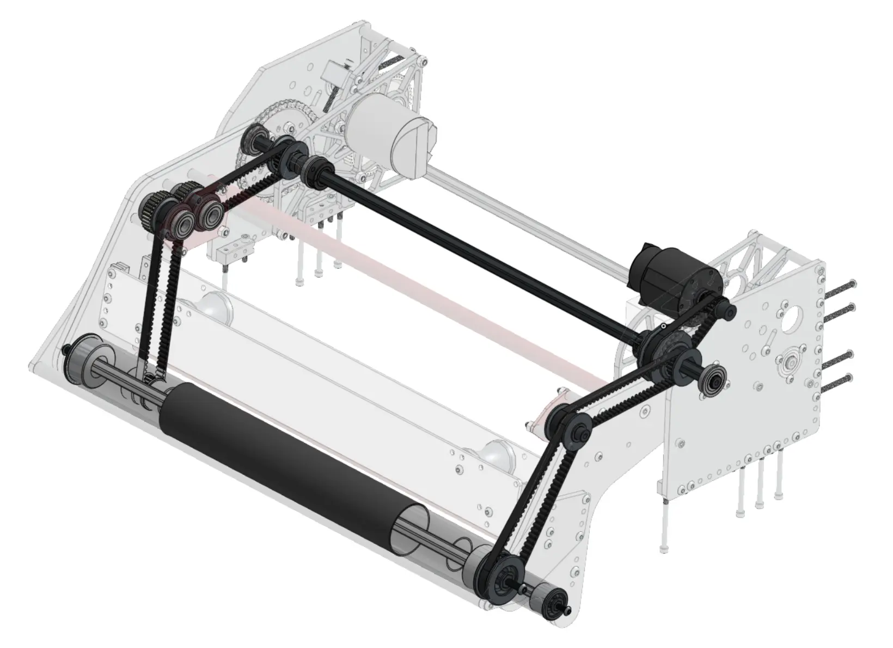
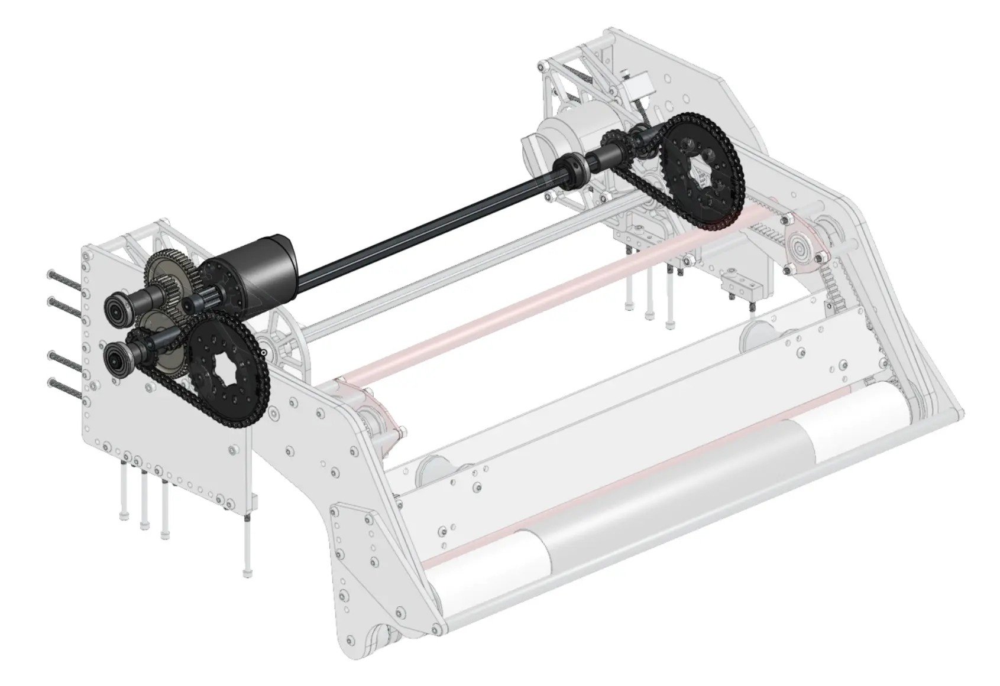
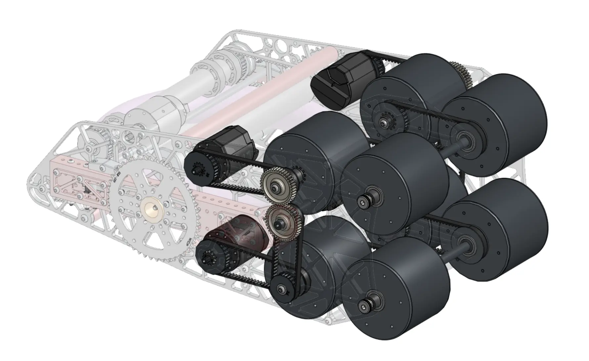
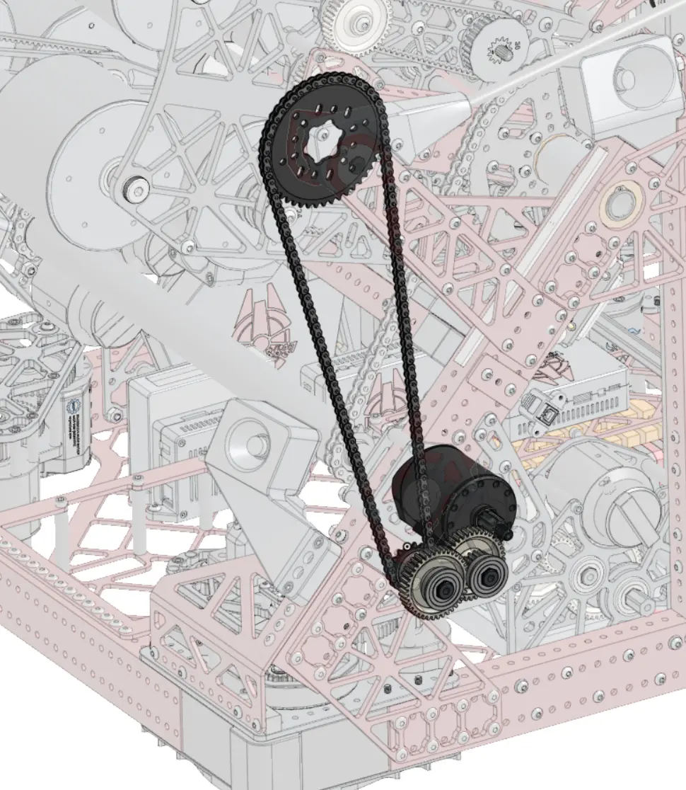
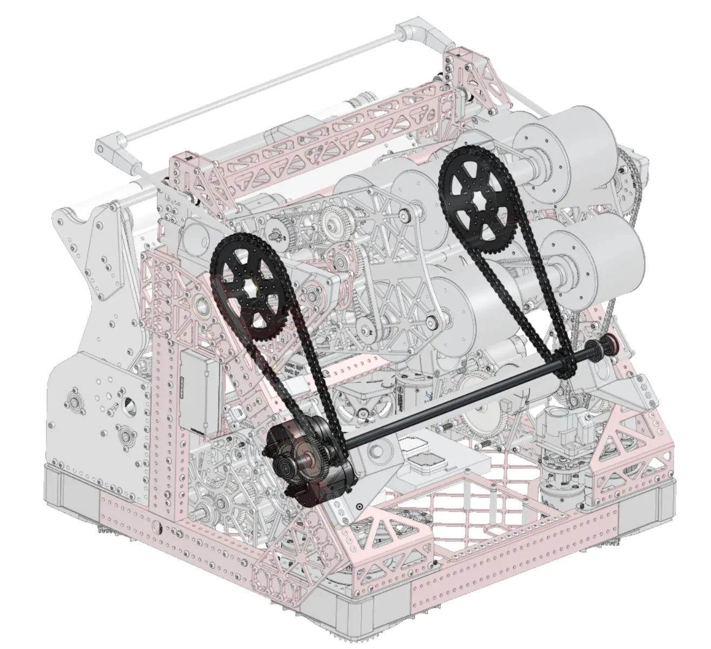

---
title: 传动系统简介
description: FRC 传动系统入门
---

到目前为止，你创建的模型都是结构件，但这只构成了机器人机械系统的一部分。为了让机器人移动并完成得分动作，我们通常会使用电机产生旋转运动。在 1B 阶段，你将开始学习基础*传动系统*的建模。传动系统包括电机、轴承、轴、齿轮、同步带和链条等零部件，它们用于把电机的旋转运动转化为各种设计所需的实际动作。

在本阶段，你将重点学习传动系统的基础原理，练习并掌握传动结构的 CAD 建模方法。电机选型、传动比计算等内容将放在教程第二阶段，结合多种传动机构另行讲解。

### 示例

下面是机器人中几种不同类型动力传动的示例。

<Slides>
  
  使用同步带和齿轮传动带动的拾取机构的滚轮旋转。（图片来源：FRC 3647）

  
  使用齿轮和链条传动进行驱动拾取机构转动。（图片来源：FRC 3647）

  
  使用同步带和齿轮传动带动的射击机构的旋转轮旋转。（图片来源：FRC 3647）

  
  使用齿轮和链条传动进行驱动小型机械臂旋转。（图片来源：FRC 3647）

  
  使用齿轮和链条传动进行驱动大型机械臂旋转。（图片来源：FRC 3647）
</Slides>

本阶段的练习会以独立齿轮箱的形式，帮助你练习简单传动系统的建模。到第二阶段，开始建模与执行机构融为一体的集成式传动总成。
