---
title: "练习 2：死轴滚轮"
description: 建模死轴滚轮
---

在本练习中，你将建模几个死轴滚轮。要让滚轮、轮子，甚至机械臂等结构旋转，通常可以使用两类轴：活轴和死轴。

## 活轴与死轴滚轮

你会在阶段 2 中更深入学习活轴和死轴设计。现在只需要知道：活轴指我们驱动轴本身，让机构随轴旋转；死轴则是直接驱动旋转零件。
对于活轴，轴在固定轴承中旋转；对于死轴，轴承安装在旋转零件上。可以看看下面的图示来帮助理解。

<Aside type="example" title="Example（示例）：活轴与死轴滚轮">
<ContentFigure src="../img/1c/dead-axle-rollers/dead-vs-live.webp" alt="死轴与活轴对比" width="40%">死轴（左）和活轴（右）滚轮的剖视图。死轴滚轮安装在轴承上，需要直接驱动滚轮本体（本例中通过集成带轮驱动）。活轴滚轮则由六角轴上更远位置的带轮驱动。</ContentFigure>
</Aside>

## Part Studio（零件工作室）说明

在你复制的文档中，**进入 “Exercise #2 Part Studio” 标签页**，并**按照幻灯片中的说明**完成本练习的零件工作室。

<Slides>
  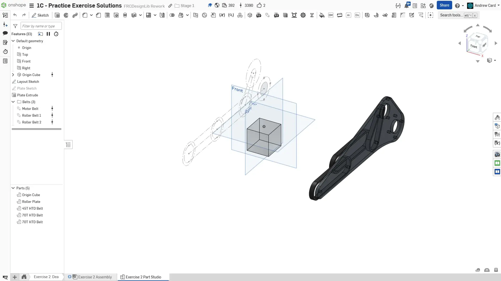
  最终零件工作室。

  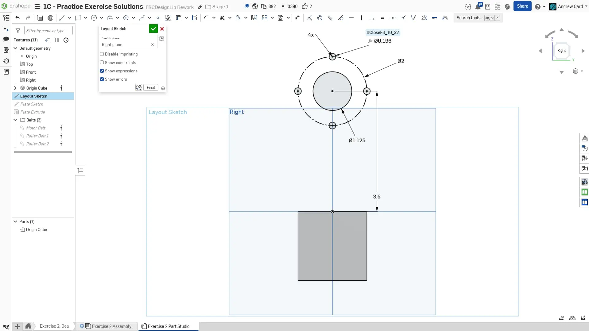
  在右平面上创建一个新草图作为布局草图。先绘制一个枢轴孔，并在其周围绘制螺栓孔阵列。

  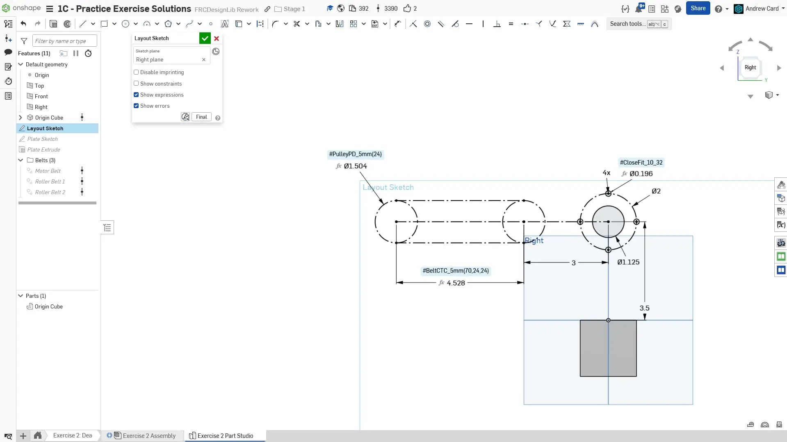
  在枢轴孔左侧绘制滚轮之间的第一段同步带路径。

  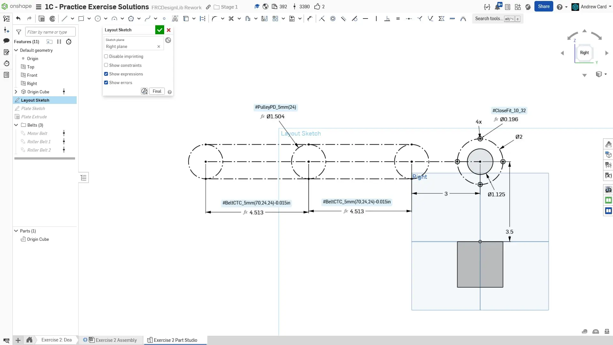
  创建第二段同步带路径，长度与第一段相同。

  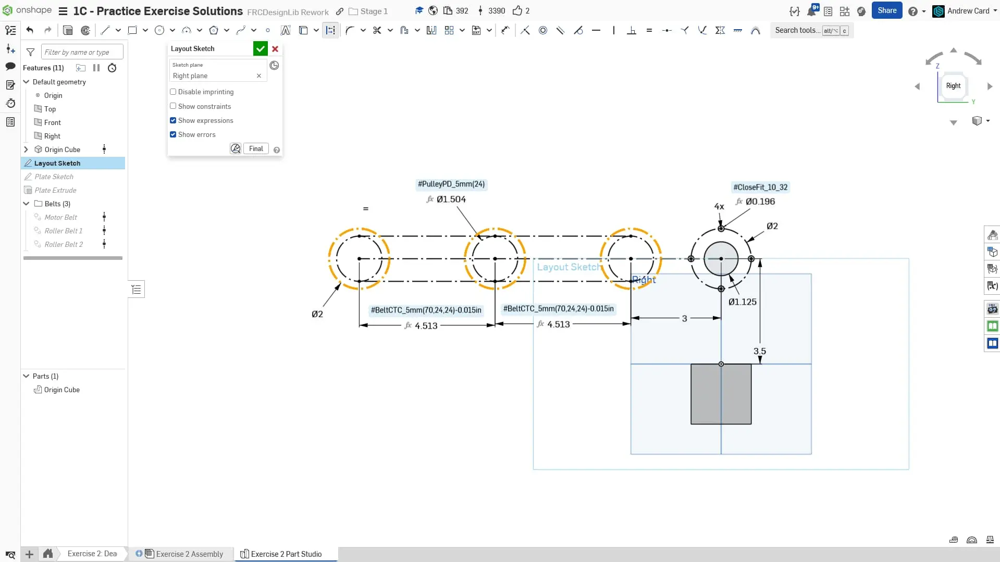
  在同步带路径两端添加 2" 圆，表示滚轮。

  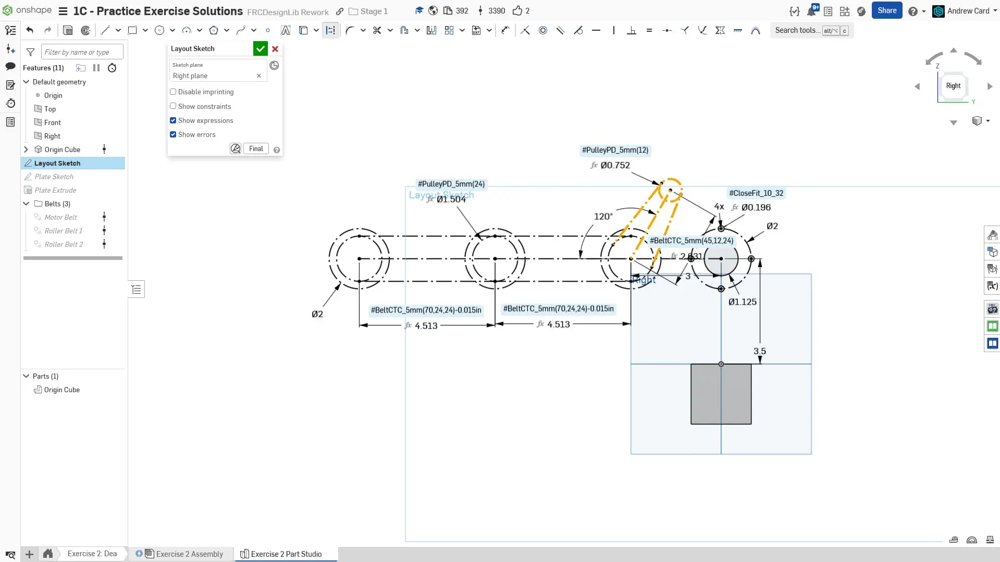
  从第一个滚轮开始，向枢轴点方向倾斜绘制电机同步带路径。

  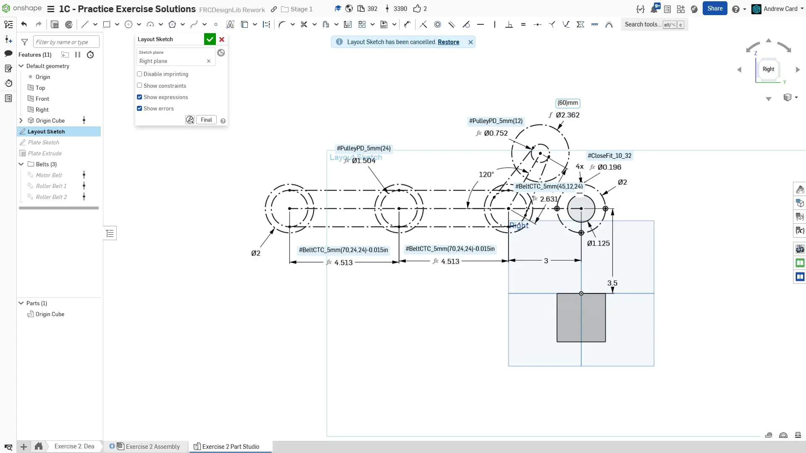
  添加一个 60mm 圆表示电机，这会在制作板件时提供有用信息。

  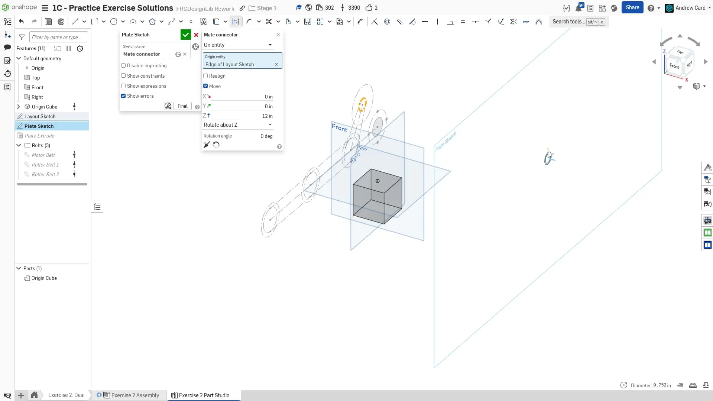
  创建一个相对布局草图偏移的板件草图。这与上一个练习类似。

  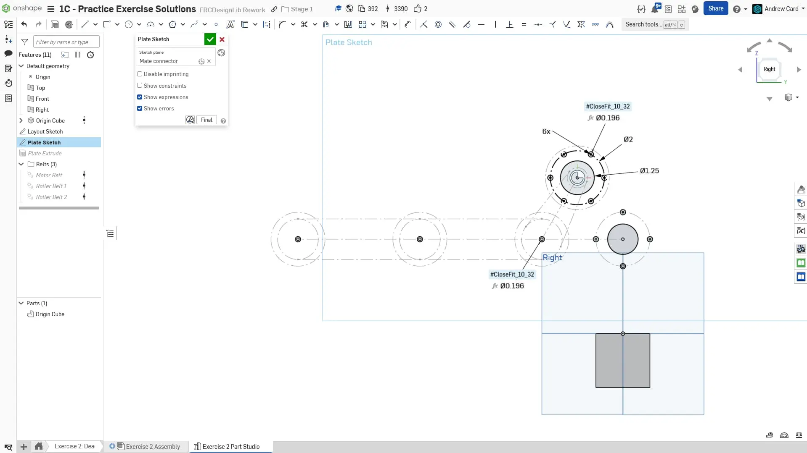
  开始绘制板件草图时，先复制螺栓孔阵列和枢轴孔，并添加滚轮用螺栓孔。同时添加电机螺栓孔阵列，方法与上一个练习相同，但这里使用 6 孔阵列。和之前一样，我们只保留其中 3 个真实孔，其余设为构造圆。

  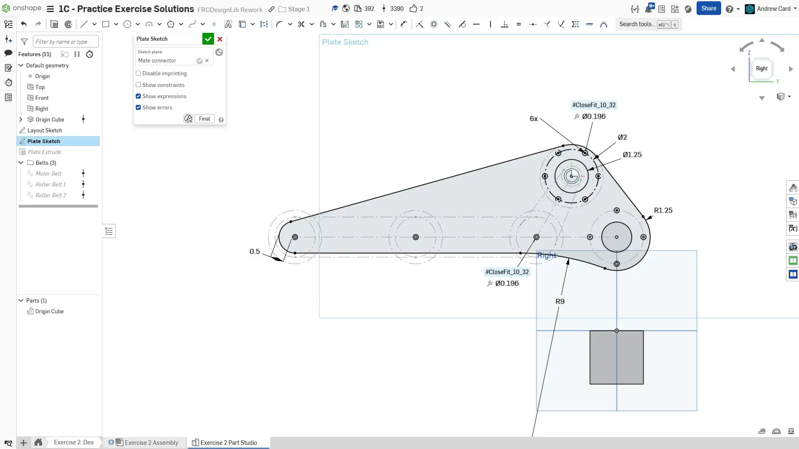
  根据上一张幻灯片中创建的孔绘制板件外轮廓。

  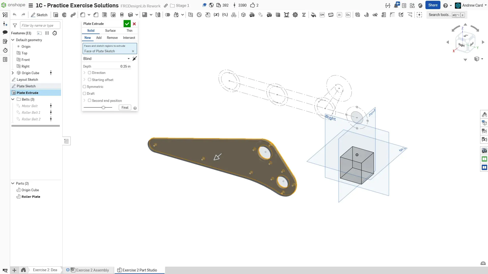
  沿 “Right” 方向拉伸板件。

  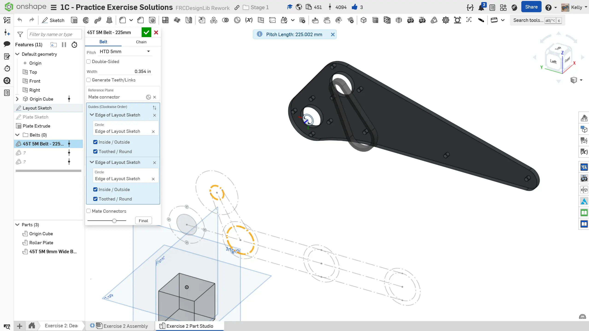
  使用 Belt & Chain Gen 创建电机同步带。这里的偏移量并不重要，因为你会在装配体中把同步带配合到带轮上。

  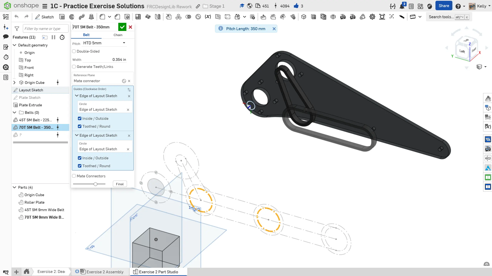
  使用 Belt & Chain Gen 创建第一条滚轮同步带。

  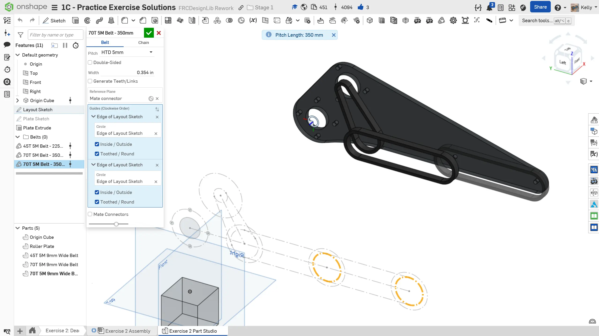
  使用 Belt & Chain Gen 创建第二条滚轮同步带。

  
  给特征命名并整理到文件夹中，完成零件工作室。将板件材料指定为聚碳酸酯。
</Slides>

## Assembly（装配体）说明

接下来，在你复制的文档中**进入 “Exercise #2 Assembly” 标签页**，并**按照幻灯片中的说明**完成本练习。

<Slides>
  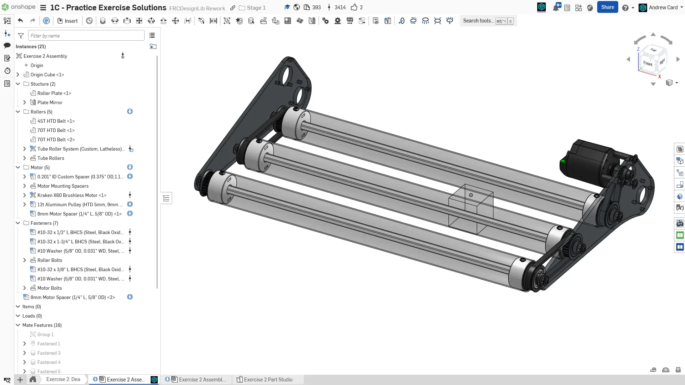
  最终装配体。

  
  先插入零件工作室，并将 Origin Cube 和板件组配合在一起。然后把 Origin Cube 紧固到原点。

  
  使用 Assembly Mirror（装配体镜像）将板件复制到另一侧。

  
  从 FRCDesignLib 插入一个滚轮。确保长度设置为 24"，并将螺栓端盖设置为 HTD 选项。你可以将第一个滚轮配合到侧板上的某个孔。然后将这个单个滚轮仿制到另外两个孔位。注意，如图所示，仿制时要选择整个装配体。

  
  使用同步带的中心配合点和滚轮带轮，将同步带配合到滚轮上。

  
  插入电机、带轮、轴用隔套和轴端螺栓。将电机组件装配在一起，并把带轮配合到同步带中心。

  
  分别点击板件和电机的面，测量它们之间的距离。将这个距离复制到剪贴板。打开 FRCDesignLib Inserter，插入一个自定义圆孔隔套，长度使用刚才复制的数值。其他配置无需修改。将这个隔套连接到板件上，并使用仿制将它添加到另外三个板件孔位。

  
  向装配体添加紧固件。注意，每个螺栓都使用了垫圈。将螺栓连接到聚碳酸酯板件时，最佳实践是使用垫圈，这有助于防止板件开裂。滚轮应使用 1/2" #10-32 螺栓固定，电机应使用 1.75" #10-32 螺栓固定。

  
  使用文件夹整理你的装配体。
</Slides>

<Aside type="tip" title="Tip（提示）：检查">
请确保由你自己，或队内更有经验的队员/导师来 [**检查你的 CAD（计算机辅助设计）！**](/zh/learning-course/stage1/1a/focusing-on-improvement)。
</Aside>

## 减少独特零件数量

你可能已经注意到，第 3 个滚轮两端都有 24T 带轮，尽管只有一端连接了同步带。
虽然可配置滚轮允许你为没有同步带的一端选择不安装带轮，但在这种情况下保留带轮也有好处，因为这样可以减少独特零件数量。
这样一来，三个滚轮完全相同，零件追踪和备件准备都会更简单。

