---
title: "练习 3：球类发射机构"
description: 建模一个发射机构
---

从练习 3 开始，说明幻灯片只会提供逐个零件的操作说明和关键细节。
对于具体特征细节，你应参考练习答案文档。
这样做是为了帮助你适应后续指导逐渐减少的练习。

在本练习中，你将建模一个非常简单的 2.5" 球类发射机构。
这个机构包含 3D 打印带轮、3D 打印坡道和螺母条。建模时一定要注意布局草图。

## 3D 打印带轮
到目前为止，你在装配体中只使用过 COTS（现成商业零件）带轮。
不过，3D 打印带轮也是非常好的替代方案，因为它们成本更低、容易获得（前提是你有 3D 打印机），并且高度可定制。

3D 打印带轮可以通过带轮生成器轻松生成，例如 FRCDesignLib 中包含的工具，以及 Robot Pulley FeatureScript（自定义特征脚本）。
不过，必须特别注意轴接口。3D 打印六角孔很容易被磨圆或打滑，因此应使用金属嵌件（可从 [WCP](https://wcproducts.com/products/adapters) 或 [Thrifty Bot](https://www.thethriftybot.com/products/qty-5-aluminum-insert-for-3d-printed-parts) 等供应商购买），以更好地传递扭矩。
下面是几种使用不同嵌件的 3D 打印带轮示例。

<Aside type="example" title="Example（示例）：3D 打印带轮嵌件">
<ContentFigure src="../img/1c/shooter/3dp-pulleys.webp" alt="带有不同嵌件的 3D 打印带轮">带六角轴嵌件的 3D 打印带轮（左）、用于 Kraken 电机的 SplineXS 嵌件（中），以及用于 NEO/CIM 电机的小齿轮嵌件（右）。</ContentFigure>
</Aside>

<Aside type="caution" title="Warning（警告）">
由于 3D 打印带轮孔很容易磨损，应尽量始终使用金属嵌件或小齿轮嵌件。
相比购买 COTS 嵌件，一个便宜的替代方案是从 [Fabworks](https://www.fabworks.com) 这类激光切割服务商处订购。批量较大时（约 20 件），单价通常只有约 1 美元。
</Aside>

## 螺母条
螺母条是一种非常通用的结构件，常用于连接相互垂直的板件，或连接板件与管材。
[WCP](https://wcproducts.com/products/nut-strips)、[REV](https://www.revrobotics.com/3-8in-nut-strips/) 和 [Last Anvil](https://lastanvil.com/products/nut-strip) 等供应商提供 6" 长的螺母条，孔位为 #10-32 或 #8-32 螺纹孔。
这些螺母条非常结实，也可以很容易切割成任意长度。
在你刚完成的练习中，螺母条可以让你轻松把发射机构安装到任意表面上。

<Aside type="example" title="Example（示例）：螺母条">
<ContentFigure src="../img/1c/shooter/nut-strips-real.webp" alt="螺母条使用示例" width="50%">螺母条可用于将板件连接到管材，或将板件连接到垂直板件。（图片来源：FRC 4414）</ContentFigure>
</Aside>

## 块状电机
创建机构时，有时在制作定制零件时需要参考特定 COTS 零部件。大多数情况下，草图中的构造几何就足够了（例如电机外轮廓），但有时你需要更复杂的参考。与其把完整细节的零部件派生到零件工作室中（这会显著拖慢加载速度），你可以创建或派生“块状”几何，例如本练习中使用的 FRCDesignLib “block motor”。

<ContentFigure src="../img/1c/shooter/block-motor-example.webp" alt="块状电机示例" border />

从 FRCDesignLib 插入块状电机时，使用 “Differentiation Variable”（区分变量）很重要，这是由 Onshape 处理派生零件的方式决定的。为每个块状电机分配唯一值，可以避免零件工作室中出现相关错误。

## Part Studio（零件工作室）说明

在你复制的文档中，**进入 “Exercise #3 Part Studio” 标签页**，并**按照幻灯片中的说明**完成本练习的零件工作室。

<Slides>
  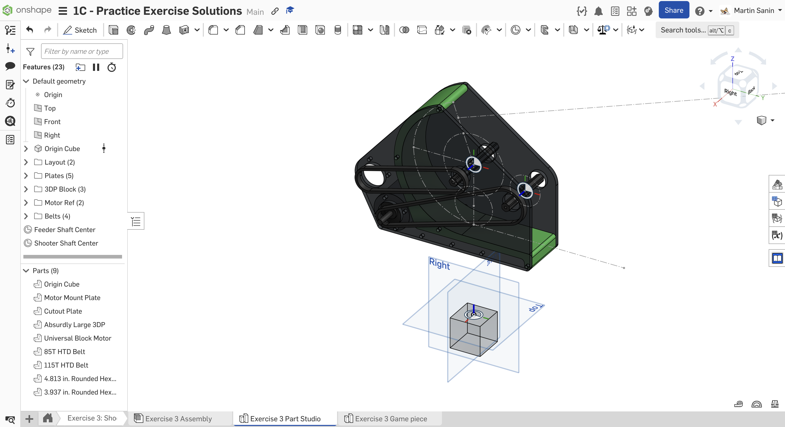
  最终零件工作室。

  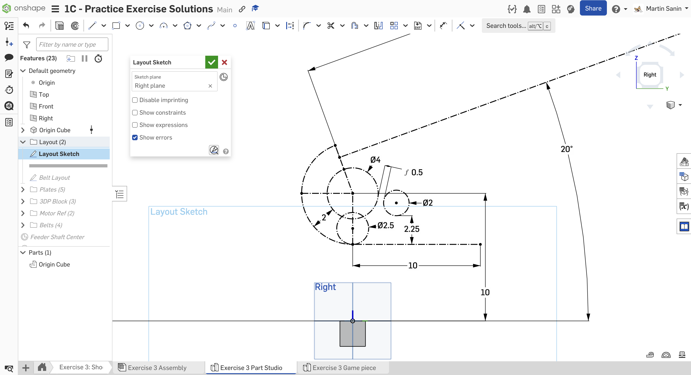
  在右平面上创建布局草图。先绘制 4" 发射轮、2" 供球轮和球的路径。

  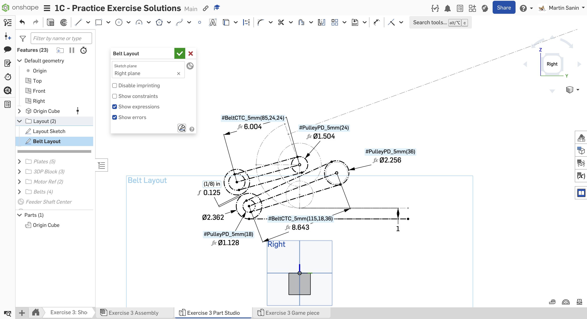
  在右平面上创建一个新草图，绘制同步带、带轮和电机。最下方的构造线定义了发射机构的底部。

  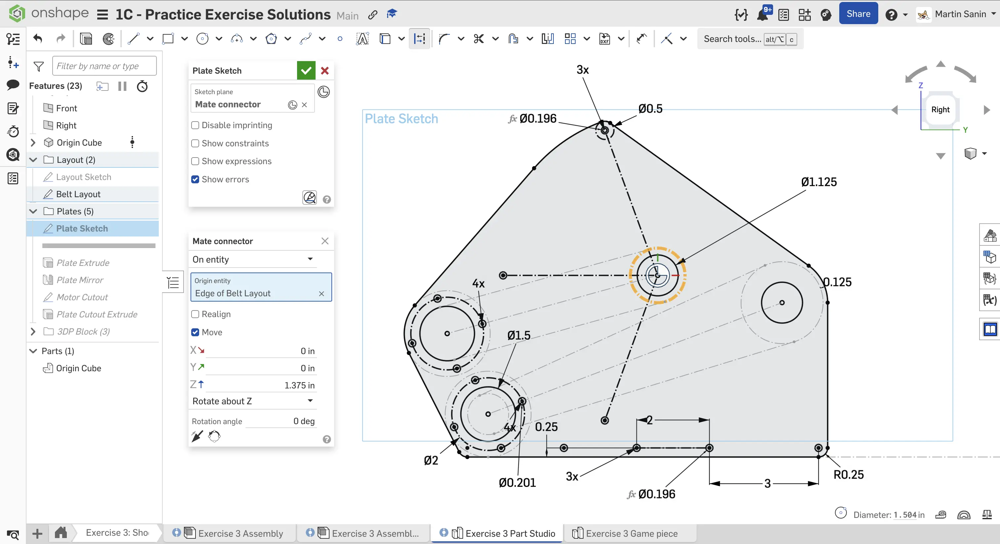
  使用一个相对布局草图平面偏移 1.375" 的配合连接器作为草图平面，绘制侧板。使用圆形阵列绘制发射机构弧形导板周围的 #10-32 间隙孔。

  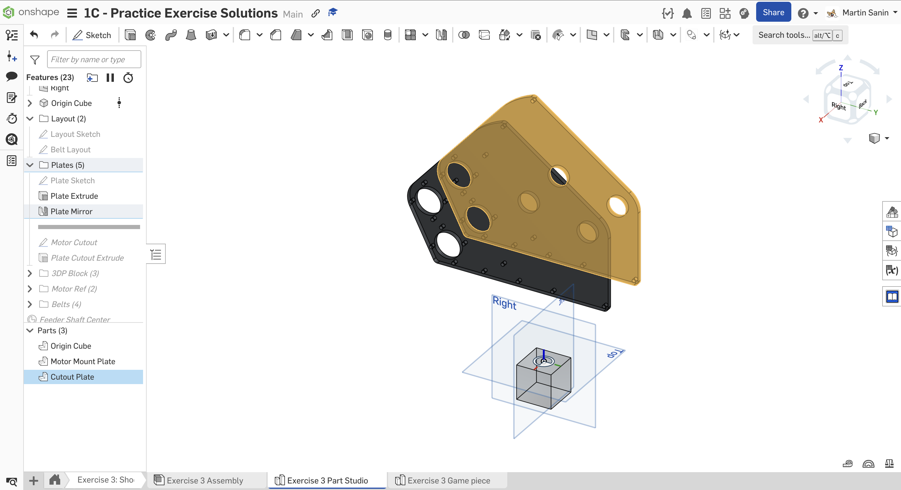
  将板件拉伸为 1/4" 厚，然后以右平面为镜像面进行镜像。这里使用镜像，是因为另一侧板件基本相同，只是多了一个用于电机的切口。

  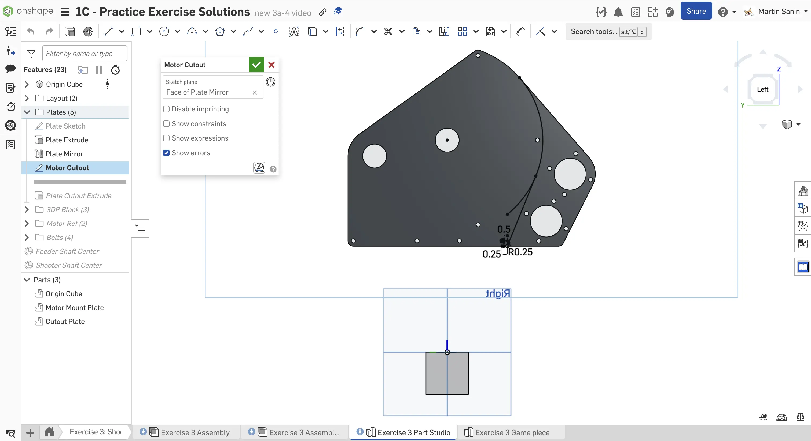
  绘制一个切除边界，从镜像板件上移除电机安装区域。确保开启 imprinting。你不需要绘制整个区域，因为板件外轮廓本身会用于拉伸。

  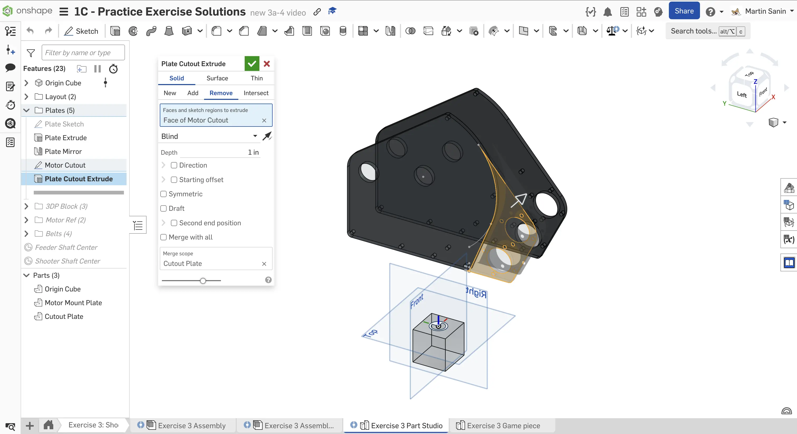
  拉伸镜像零件上的电机安装区域，从零件中切除这部分几何。

  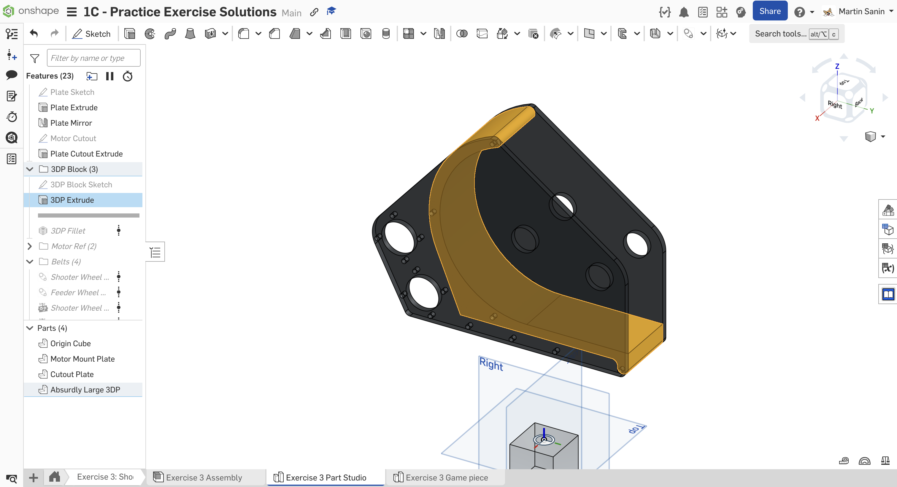
  建模位于两块板件之间的大型 3D 打印件。尽量利用布局草图或零件几何，减少需要标注的尺寸数量。使用 “Up to Face”（到面）拉伸，确保宽度保持参数化。

  
  使用 `Fillet All Edges` FeatureScript，为 3D 打印件的所有边添加半径 3/16" 的圆角。要选择该零件的面，可以使用 `Isolate`（隔离）工具，它会让当前未选中的其他零部件变为透明或隐藏。

  
  从 FRCDesignLib 插入一个块状电机。使用 `Transform`（变换）特征，将块状电机移动到电机孔位置。

  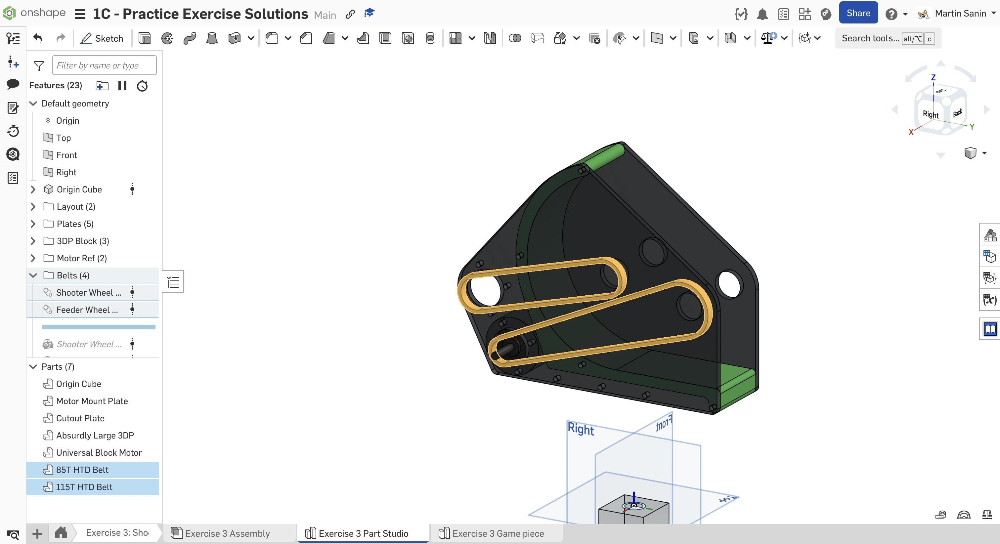
  添加 HTD 5mm 齿距同步带。仔细检查节线长度是否为 5 mm 的倍数，以确保同步带齿数为整数。

  
  使用 `Robot Shaft` FeatureScript 建模发射轮轴和供球轮轴。

  
  在布局草图上添加一个用于紧固供球轮的配合连接器。将该配合连接器的所有者设置为供球轮轴。这个配合连接器标记了两块板件之间的中心点，有助于后续装配。

  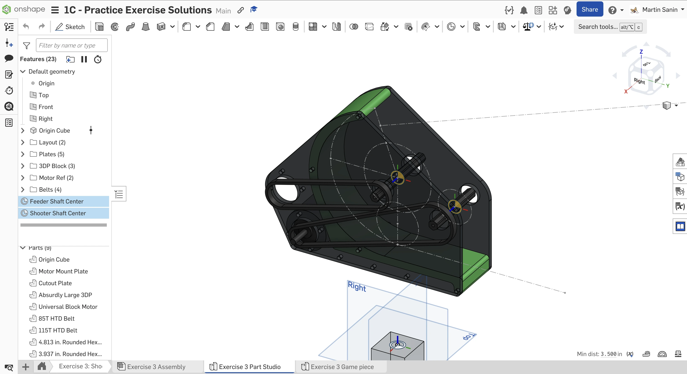
  重复前面的步骤，为发射轮轴添加配合连接器。确保选择发射轮轴作为配合连接器的所有者。

  
  给特征命名并整理到文件夹中，完成零件工作室。
</Slides>

## Assembly（装配体）说明

接下来，在你复制的文档中**进入 “Exercise #3 Assembly” 标签页**，并**按照幻灯片中的说明**完成本练习。

<Slides>
  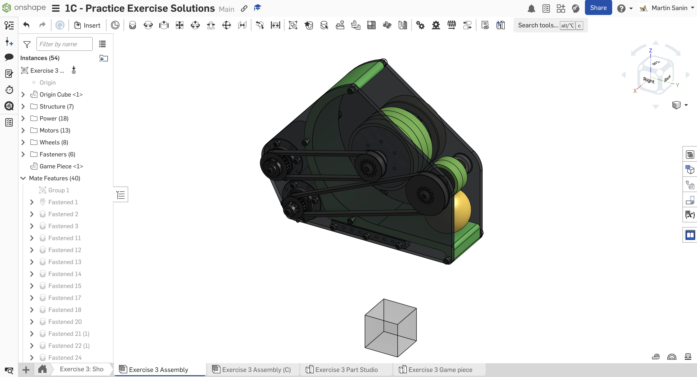
  最终装配体。

  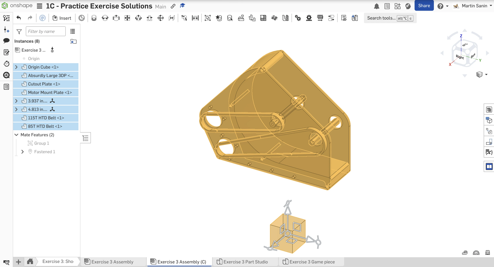
  插入所有零件工作室组件。将除轴和同步带之外的所有零部件组配合在一起。将 Origin Cube 紧固到原点。

  
  从 FRCDesignLib 应用中插入并紧固 4.5" 长的螺母条。请特别注意哪一侧紧固到板件上，因为螺母条相邻两侧的孔是错开的。

  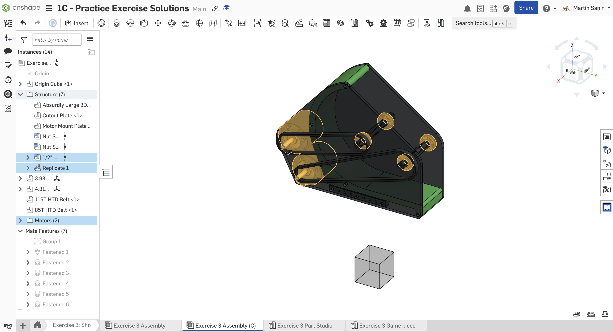
  插入并紧固两个 NEO 电机。插入、紧固并仿制轴承。

  
  插入并配置发射轮带轮：24T，1/2" 六角孔，带 TTB 嵌件。复制并粘贴该带轮和 TTB 嵌件，创建电机带轮。使用 3/16" 隔套，将发射轮带轮紧固到发射轮轴承上。然后，将电机带轮紧固到同步带上。最后，使用 `Isolate`（隔离）工具，将 8mm NEO 轴紧固到 1/2" 六角转接件上。

  
  插入并配置供球轮带轮：36T，带 TTB 1/2" 六角嵌件。将电机带轮配置为 18T，并使用 12T 20DP 齿轮嵌件。使用 1/16" 隔套，将供球轮带轮紧固到供球轮轴承上。然后，将电机带轮紧固到同步带上。最后，使用 `Isolate`（隔离）工具紧固 12T 电机小齿轮。

  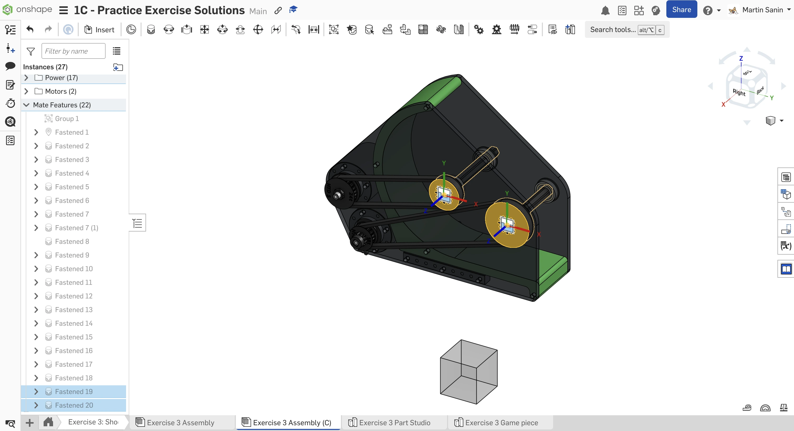
  将轴紧固到带轮上。

  
  将发射轮和供球轮插入并紧固到轴中心配合连接器上。然后，使用 `Measure`（测量）工具测量轴承与轮子之间的间隙。创建隔套填补轮子两侧的间隙。最后，使用 `Assembly Mirror`（装配体镜像）工具，以供球轮的配合连接器为基准镜像隔套和发射轮。

  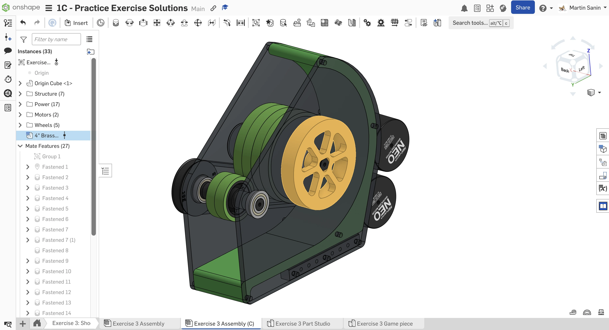
  将 4" SDS 飞轮插入并紧固到发射机构另一侧。

  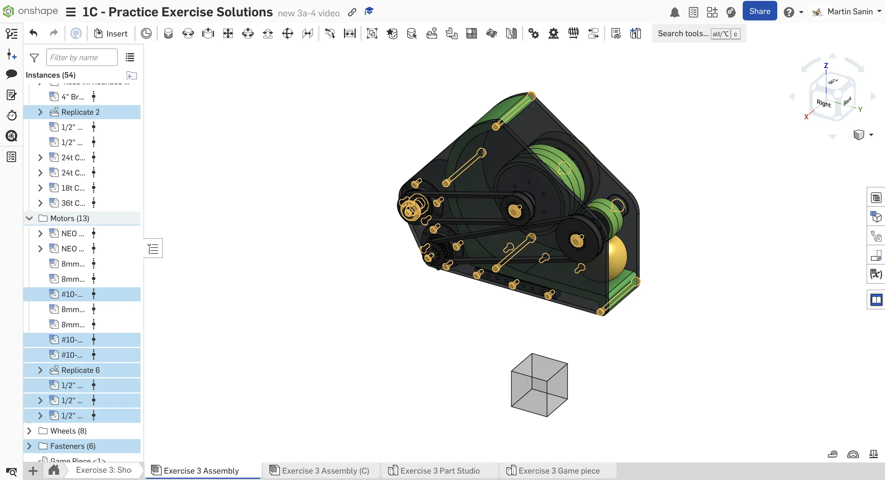
  插入、紧固并仿制所有所需紧固件和剩余五金件。

  
  将零件整理到文件夹中，并为仿制特征命名，完成装配体。你也可以插入球并调整位置，用于可视化检查。
</Slides>

<Aside type="tip" title="Tip（提示）：检查">
请确保由你自己，或队内更有经验的队员/导师来 [**检查你的 CAD（计算机辅助设计）！**](/zh/learning-course/stage1/1a/focusing-on-improvement) 你的装配体应包含 54 个实例。
</Aside>

## 隔离、隐藏和设为透明

`Isolate`（隔离）工具会隐藏除所选零件之外的所有其他零件，帮助你专注于特定零部件。
`Hide`（隐藏）工具会将所选零件从视图中移除，而 `Make transparent`（设为透明）则可以让你透过所选零件观察，在需要操作被遮挡的零部件时很有用。

与其删除或移动零件，更建议使用这些工具来访问任务所需的零件。如果你隐藏了零件，别忘了在完成后取消隐藏，方便下一个人继续使用！

<Aside type="tip" title="Tip（提示）：隔离、隐藏和设为透明">
<ContentFigure src="I1nFphxKVXc">隔离零件、隐藏零件，或将零件设为透明，都可以帮助完成装配。</ContentFigure>
</Aside>

<Aside type="tip" title="Tip（提示）：键盘快捷键">
和 Onshape 中的大多数其他工具和约束一样，隐藏/显示也有很好用的键盘快捷键组合。将光标悬停在某个零件上，或选中它后按 `y`，即可隐藏该零件。将光标悬停在同一位置并按 `shift+y`，即可取消隐藏该零件。
</Aside>

