---
title: "练习 5：翻转齿轮箱"
description: 建模一个翻转齿轮箱
---

从练习 5 开始，页面只会提供设计流程概览和关键细节。这是为了让你为阶段 2 做准备，因为阶段 2 的练习引导会更少。

请重点关注捕捉设计意图，并在零件工作室和装配体中保持最佳实践。按照答案文档中的工作流程操作。

在本练习中，你将建模一个双电机、两级翻转齿轮箱。这类齿轮箱被称为“翻转”，是因为输出轴方向与输入电机方向相反。在某些情况下，这种齿轮箱形式有助于满足空间布置限制。这个齿轮箱还兼作链条张紧机构，可以沿安装管滑动来调节链条张力。让链条易于张紧非常重要，这既能减少回程间隙，又能保持可维护性。

## Part Studio（零件工作室）说明

在你复制的文档中，**进入 “Exercise #5 Part Studio” 标签页**，并**参考答案文档**完成本练习的零件工作室。**下面的说明幻灯片**只提供总体流程和一些关键细节。

<Slides>
  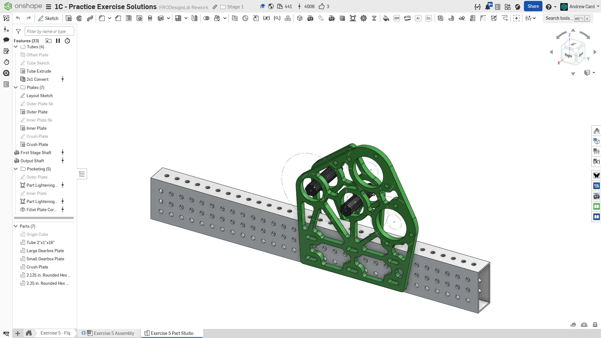
  最终零件工作室。

  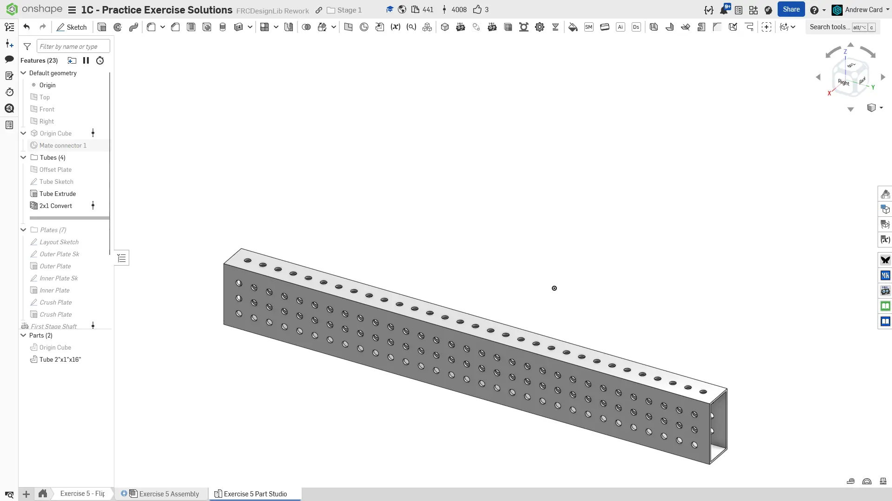
  先建模齿轮箱安装所在的管材。

  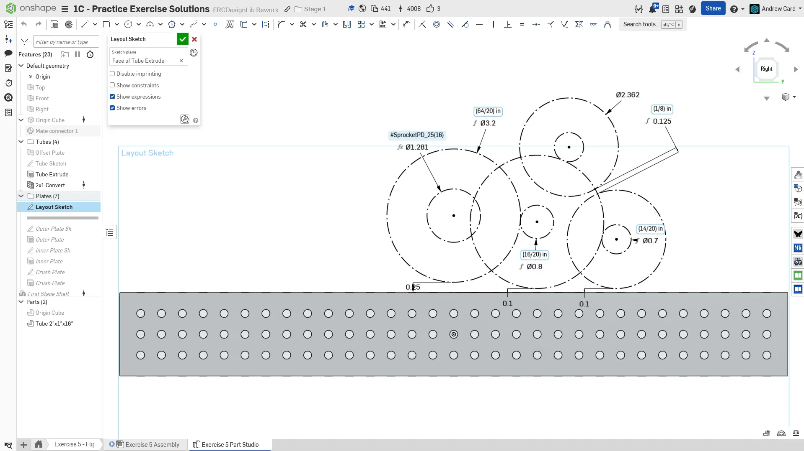
  在管材表面创建布局草图。记住，布局草图中只应包含必要信息。在本例中，只需要齿轮分度圆直径和电机外径。

  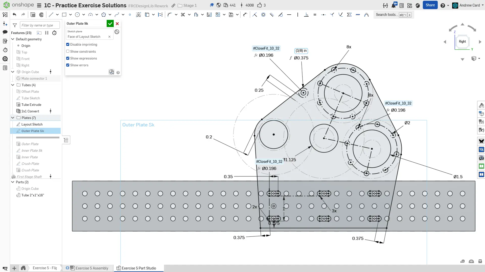
  绘制外侧板。固定电机只需要两个螺栓，并选择两个连线垂直于电机小齿轮与齿轮中心距线的孔。这样可以确保电机螺栓始终便于操作。底部安装螺栓建模为长圆槽，而不是普通圆孔。这样整个齿轮箱就可以沿管材滑动，用于张紧链条。

  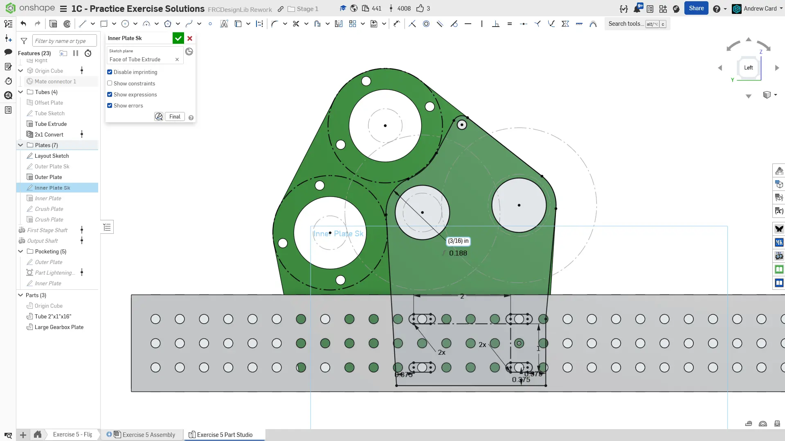
  绘制内侧板时，确认电机与内侧板之间留有间隙。特别注意所有边缘的相切关系，确保板件轮廓平滑。同时确保板件背面在大部分管材接触范围内保持平直。这个平面会由螺栓顶住，用来保持链条张紧。

  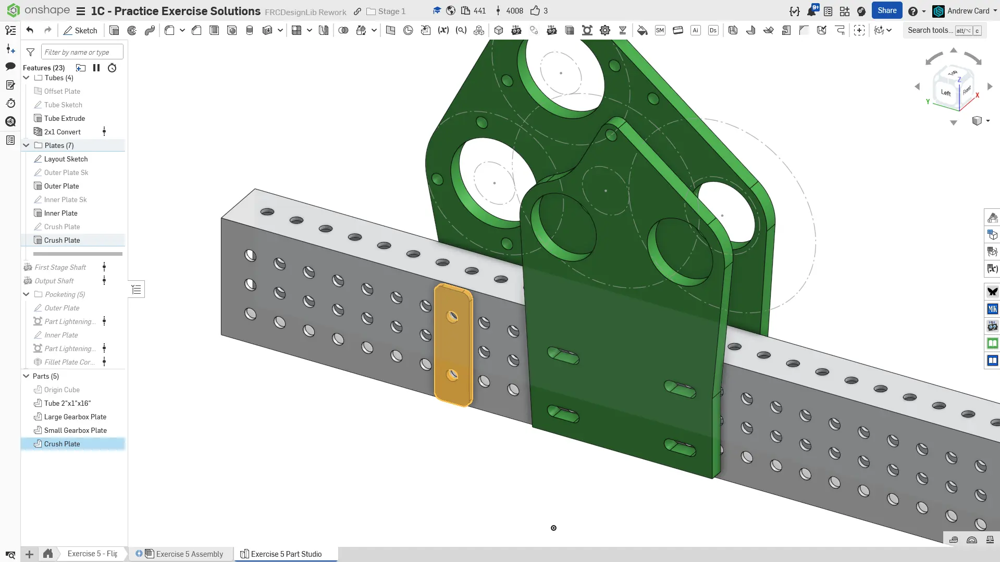
  在管材外侧建模一块小防压板。如上一练习所述，它可以分散螺栓作用力，防止管材在装配时被压塌。

  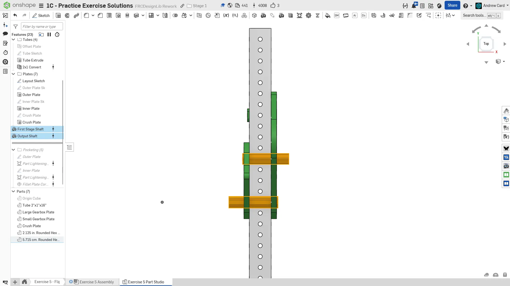
  使用 `Robot Shaft` FeatureScript（自定义特征脚本）创建齿轮箱轴。

  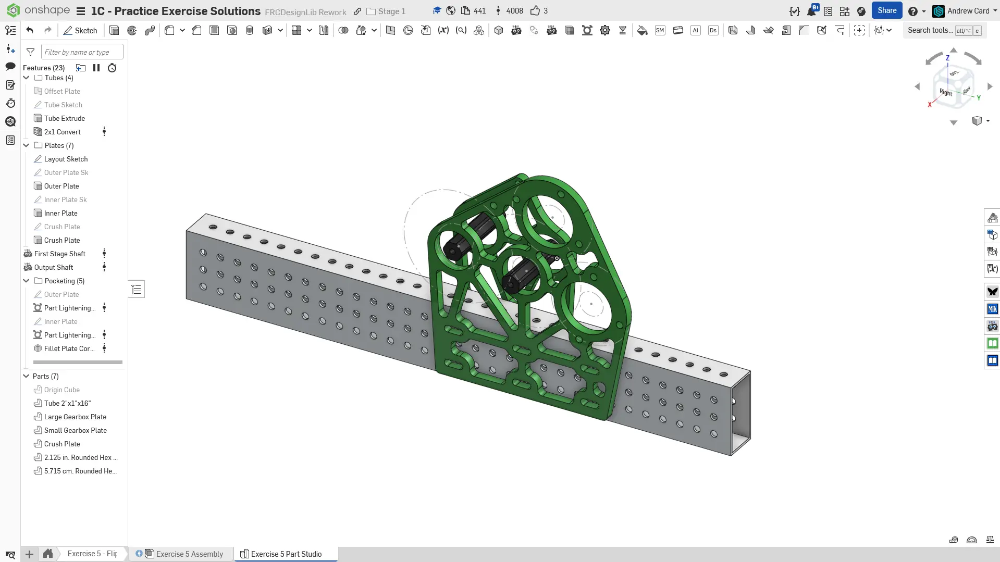
  对齿轮箱板进行减重开槽。

  
  整理零件并命名特征，为装配做准备。
</Slides>

## Assembly（装配体）说明

接下来，在你复制的文档中**进入 “Exercise #5 Assembly” 标签页**，并**参考答案文档**完成本练习的装配体。**下面的说明幻灯片**只提供总体流程和一些关键细节。

<Slides>
  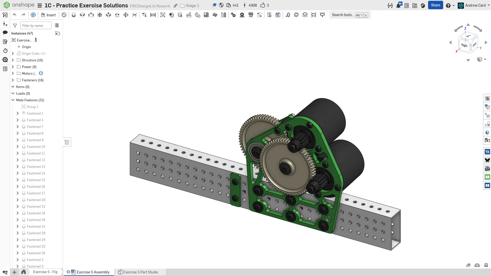
  最终装配体。

  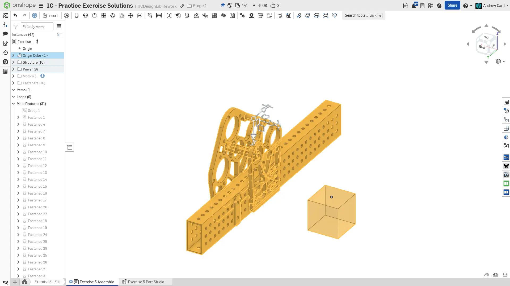
  将框架、齿轮箱板、齿轮箱隔套和轴添加到装配体中。和之前一样，将刚性零部件与 Origin Cube 组配合，并将 Origin Cube 配合到装配体原点。

  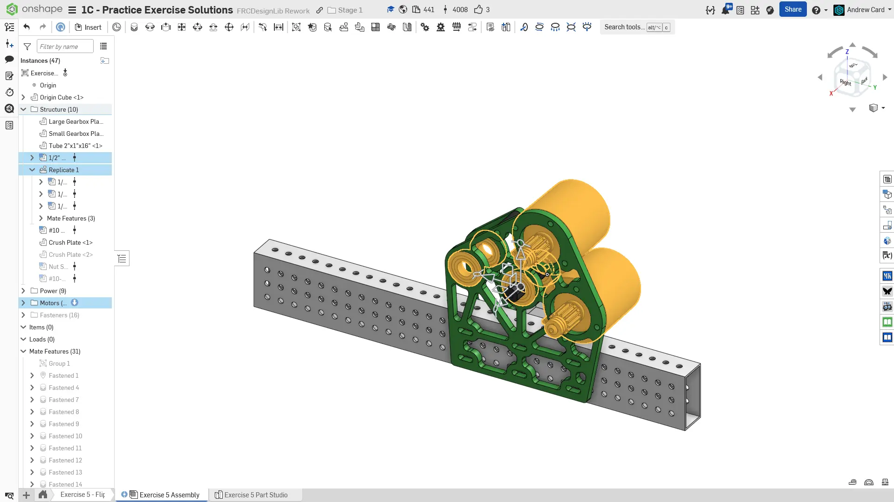
  插入并紧固电机和轴承。确保电机与正确的小齿轮和轴用隔套装配在一起。

  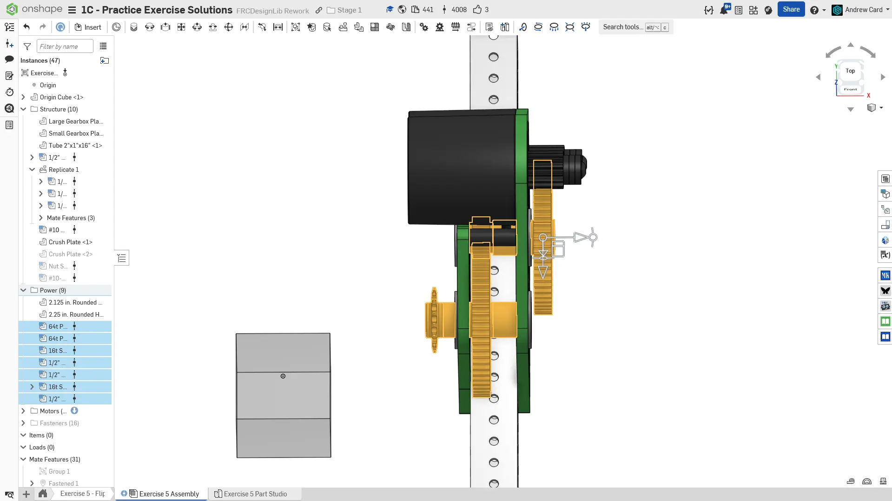
  插入并紧固动力传动零部件，包括齿轮、小齿轮、隔套和链轮。

  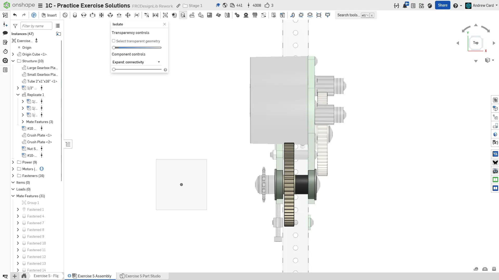
  为了减少零件数量，我们在齿轮每侧使用一个 1/2" 隔套，而不是两个 1/4" 隔套。实际装配时，只有一个隔套会容易得多，而且让齿轮精确居中在两个轴承之间并没有明显收益。

  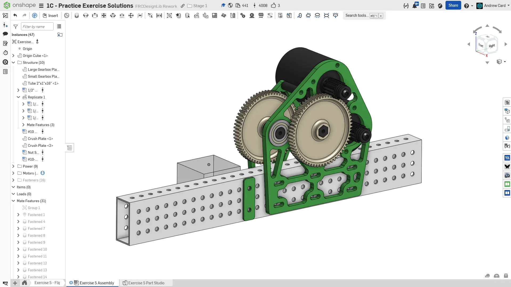
  复制防压板，并将它配合到管材另一侧。

  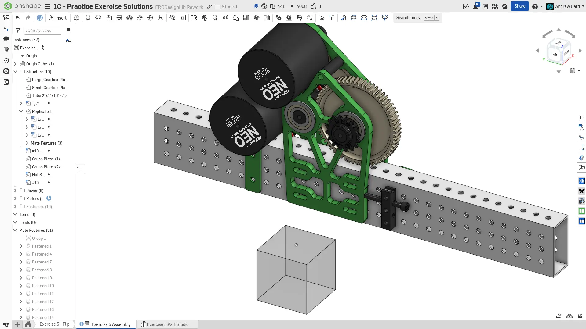
  将一条螺母条紧固到刚添加的防压板另一侧，并用一颗螺栓顶住齿轮箱板的平面。如前所述，这可以防止齿轮箱在链条作用力下滑动。

  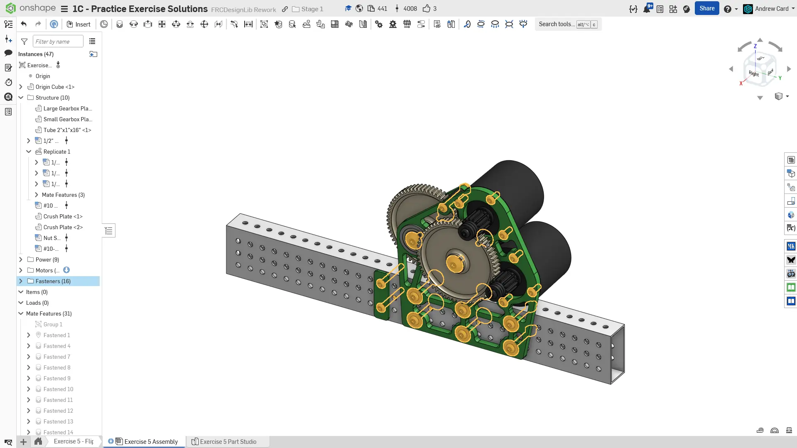
  向装配体添加紧固件。确保长圆槽孔上的所有紧固件都带有垫圈，以便将螺栓载荷合理分散到槽孔周围。螺栓头和螺母两侧都应有垫圈。

  
  最后，将零部件整理到文件夹中，并为仿制特征命名，完成装配体。
</Slides>

<Aside type="tip" title="Tip（提示）：检查">
请确保由你自己，或队内更有经验的队员/导师来 [**检查你的 CAD（计算机辅助设计）！**](/zh/learning-course/stage1/1a/focusing-on-improvement) 你的装配体应包含 30 个实例。
</Aside>

## 干涉检查

在 CAD 中发现错误，而不是等到现实中才发现！始终反复检查 CAD 模型中是否存在干涉等问题。多花 10 分钟验证 CAD 是否正确，可以避免错误零件被加工出来后造成数小时返工。

<Aside type="caution" title="Warning（警告）：干涉检查">
如果使用 Check Interference（检查干涉）工具检测到干涉，它会用红色高亮显示相交体积。
<ContentFigure src="../img/1c/flipped-gearbox/interference-check.webp" alt="干涉检查">Check Interference 工具检测到的电机与板件之间的干涉。</ContentFigure>
</Aside>

