---
title: "练习 6：方向反转"
description: 建模一个方向反转机构
---

在本练习中，你将建模一个带方向反转齿轮的动力传动。
这个机构包含一个 1:1 齿轮传动，用于反转电机输出方向。当你希望同一个电机驱动两根不同的轴，并让它们朝相反方向旋转时，这种设计会很有用。
建模时一定要注意布局草图和板件草图。

## 3D 打印、COTS 和定制铝隔套
到目前为止，你既使用过 `Spacer` FeatureScript（自定义特征脚本）生成的定制隔套，也使用过 FRCDesignLib 中的 COTS 3/8" 外径隔套（即 [WCP 铝隔套](https://wcproducts.com/products/aluminum-spacers)）。
使用 COTS 隔套或定制隔套各有优缺点，你应和队伍一起讨论选择。

对于有 3D 打印能力的队伍，3D 打印隔套是非常好的选择，它们便宜且容易制造。
如果你想使用铝隔套，但没有设备切割它们（例如车床），COTS 铝隔套也是不错的选择，因为可以提前备货。
不过，它们价格可能较高，而且只有特定长度。你可以通过按标准隔套长度进行设计，轻松避开这个问题。

<Aside type="example" title="Example（示例）：隔套原料">
<ContentFigure src="../img/1c/direction-swap/spacers.webp" alt="不同类型的隔套">隔套可以 3D 打印（左），购买预切割的 COTS 隔套（中），也可以用隔套原料在队内自行加工（右）。（图片来源：WCP）</ContentFigure>
</Aside>

建模时，建议对队内自行制造的隔套使用 `Spacer` FeatureScript（例如 3D 打印，或使用 [圆管原料](https://wcproducts.com/products/shaft-stock) 加工），对 COTS 隔套则使用 FRCDesignLib 中的可配置隔套。
这样可以清楚区分哪些零件是定制件，哪些是 COTS。

## Part Studio（零件工作室）说明

在你复制的文档中，**进入 “Exercise #6 Part Studio” 标签页**，并**参考答案文档**完成本练习的零件工作室。**下面的说明幻灯片**只提供总体流程和一些关键细节。

<Slides>
  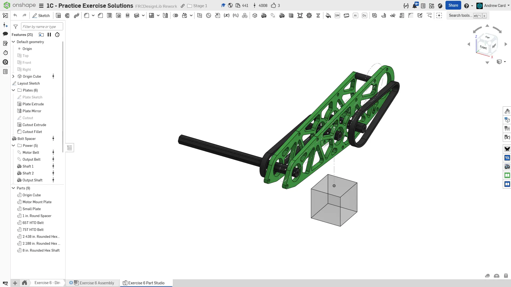
  最终零件工作室。

  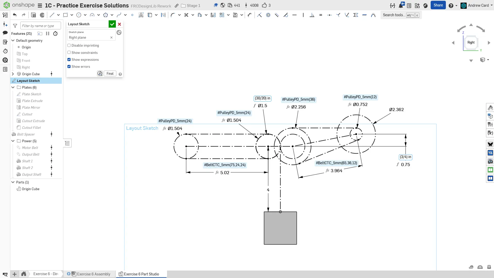
  先在右平面上创建布局草图。

  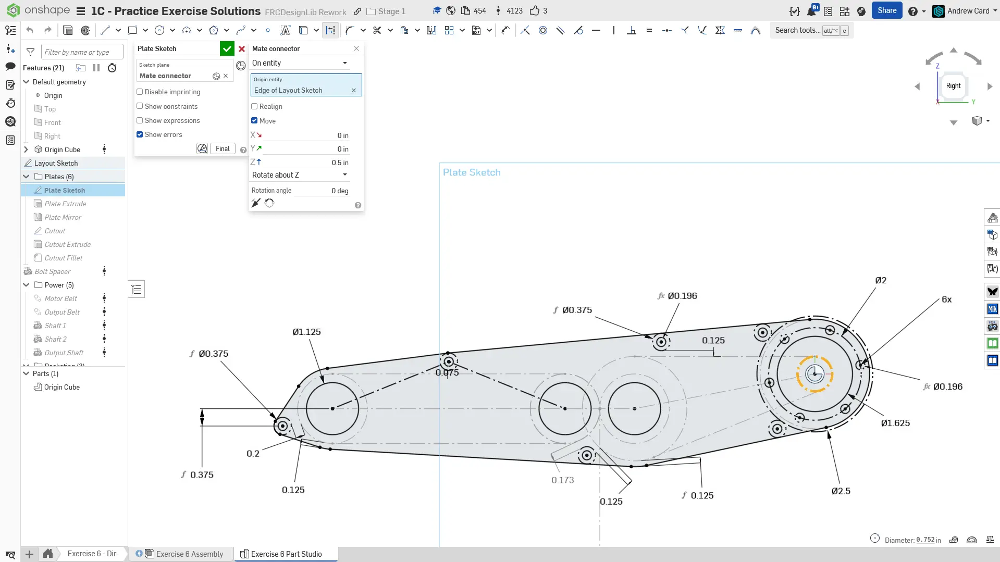
  使用一个相对右平面偏移 0.5" 的配合连接器作为草图平面，绘制板件。特别注意用于定义板件边缘的间隙。电机左侧两个隔套的位置由 3/8" 外径隔套与 2.5" 电机间隙圆之间的相切关系驱动。

  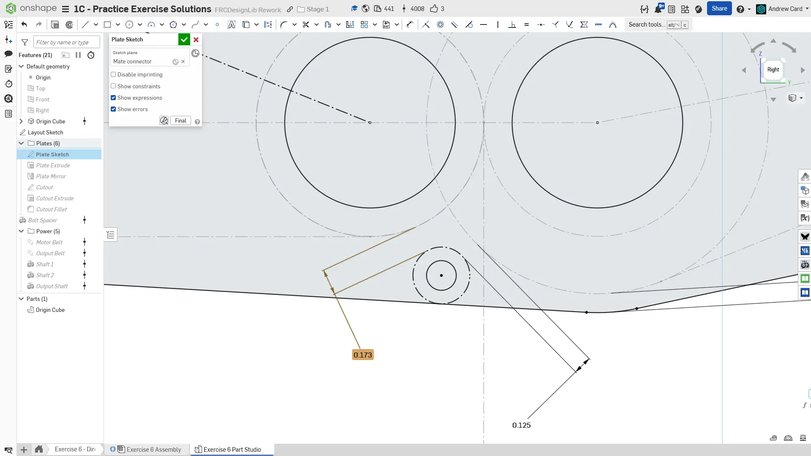
  使用 `Driven Dimension`（从动尺寸）显示左侧齿轮与隔套之间的距离，并验证是否有足够间隙。从动尺寸与驱动尺寸不同，它只报告所选元素之间的距离，并以浅灰色显示，表示它不定义草图几何。

  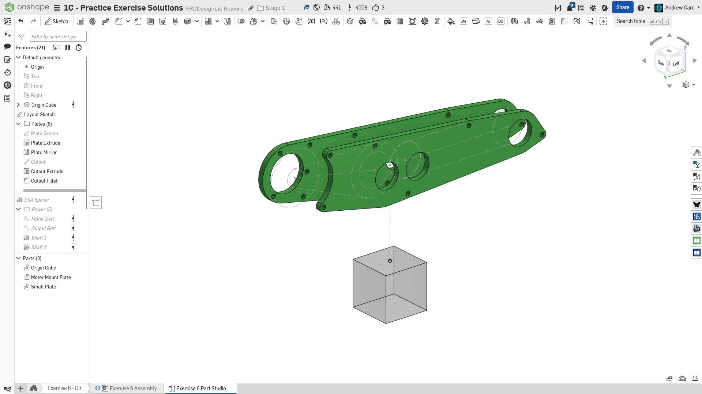
  以右平面为镜像面镜像板件，并添加电机切口。

  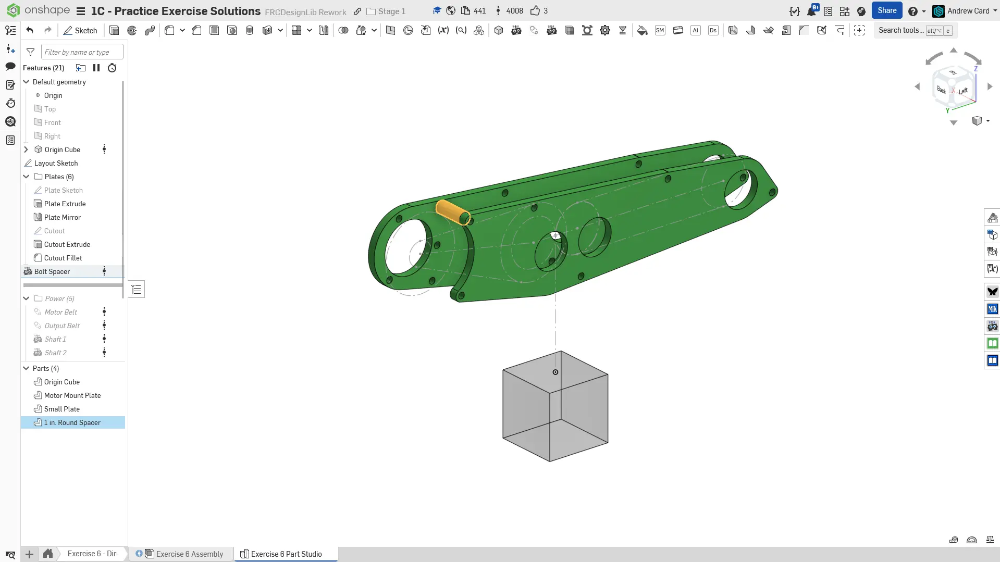
  如果你选择不使用 COTS 隔套，可以使用 `Robot Spacer` FeatureScript 创建板件隔套。

  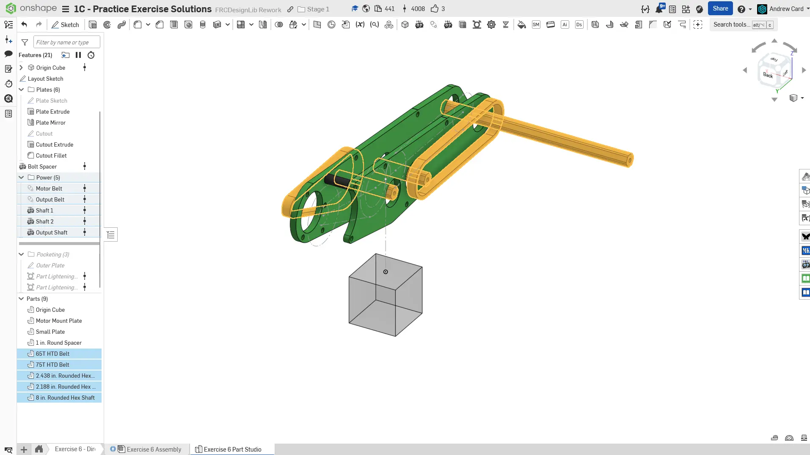
  建模所有轴和同步带。到这里，你应该已经比较熟悉 `Robot Shaft` 和 `Belt & Chain Gen` FeatureScript 的使用了。

  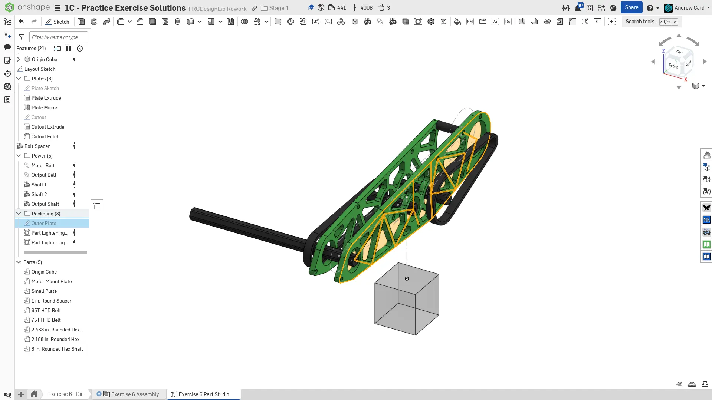
  对两块板件进行减重开槽。由于两块板件除了电机切口外完全相同，你可以使用同一个草图为两块板件开槽。只需要创建一个包含加强筋的草图。

  
  给特征命名并整理到文件夹中，完成零件工作室。相应地指定零件材料。
</Slides>

## Assembly（装配体）说明

接下来，在你复制的文档中**进入 “Exercise #6 Assembly” 标签页**，并**参考答案文档**完成本练习的装配体。**下面的说明幻灯片**只提供总体流程和一些关键细节。

<Slides>
  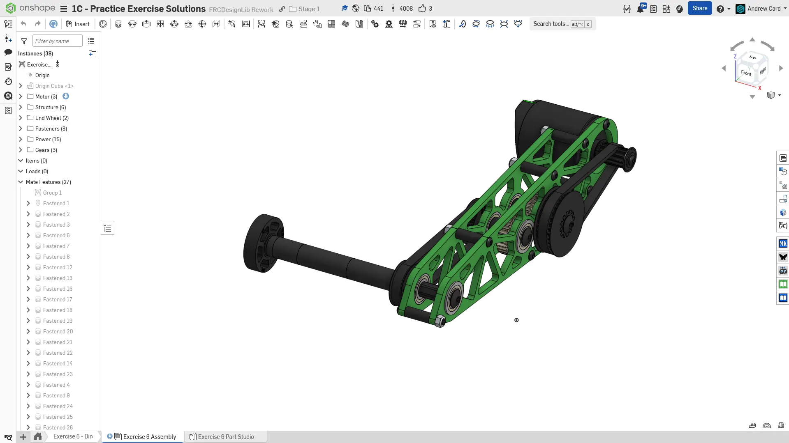
  最终装配体。

  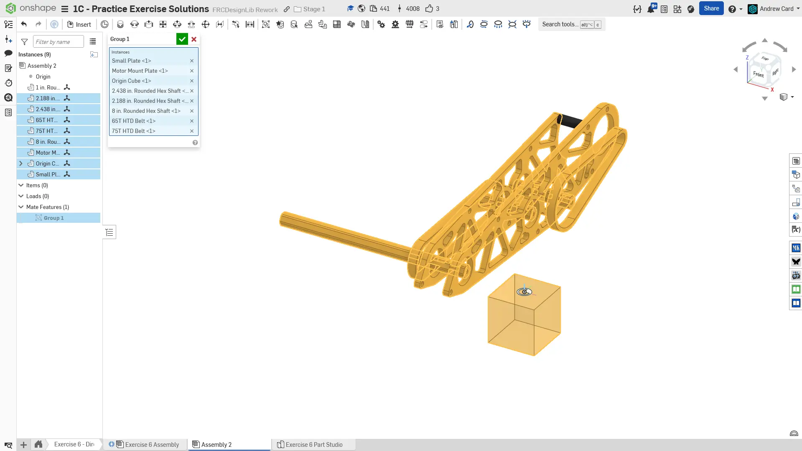
  将零件工作室零件添加到装配体中。和之前一样，将刚性零部件与 Origin Cube 组配合，并将 Origin Cube 配合到装配体原点。

  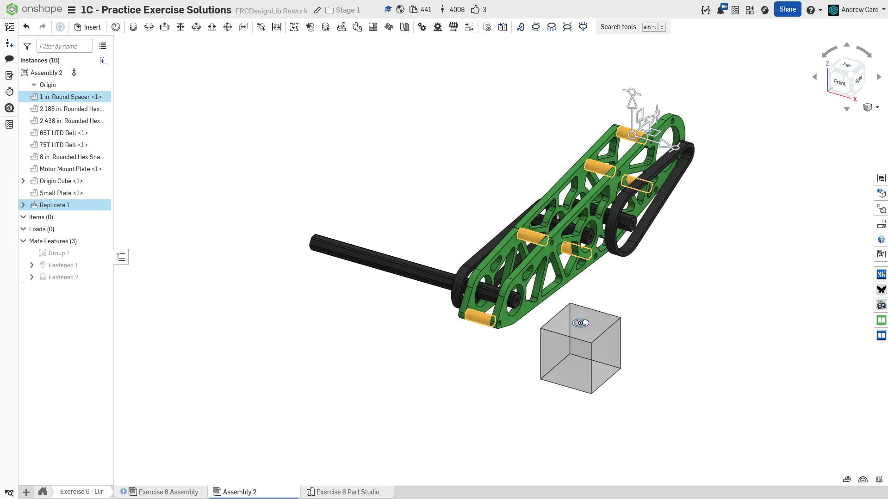
  将隔套紧固到板件上，并进行仿制。

  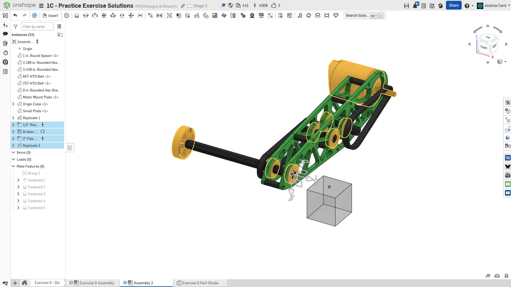
  插入、紧固并仿制轴承。同时从 FRCDesignLib 插入一个 2" 柔性轮和 Kraken X60 电机。

  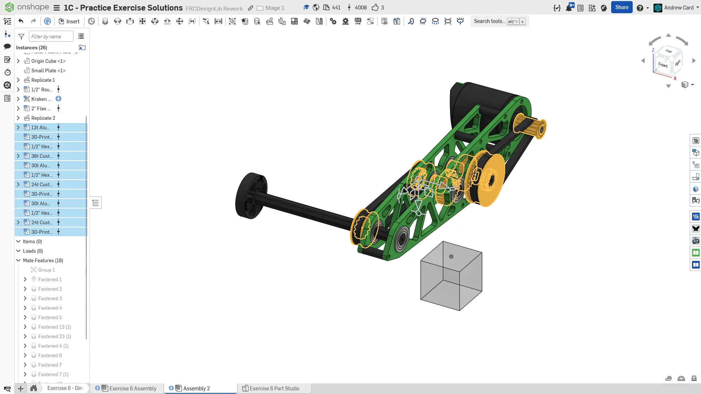
  插入并紧固带轮和隔套。对于带轮，可以使用 FRCDesignLib 中带 1/2" 六角嵌件的 3D 打印 HTD 带轮。同时将同步带紧固到位。

  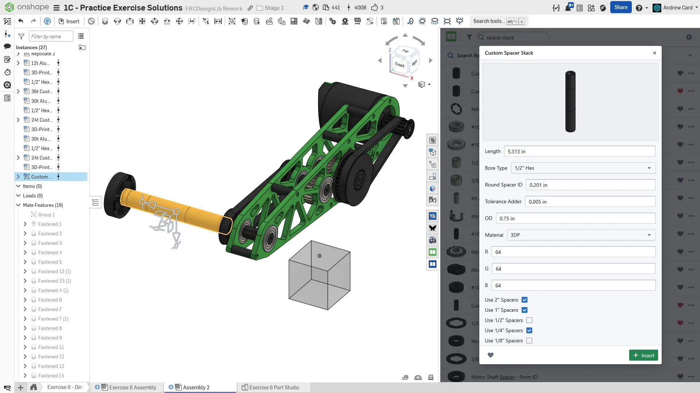
  从 FRCDesignLib 插入一个可配置隔套组。长度应为带轮与柔性轮之间的距离。隔套组很可能会显示错误。取消选择该隔套组中不存在的隔套长度即可清除错误。你也可以自行组合 COTS 隔套，或使用一个较长的定制隔套。

  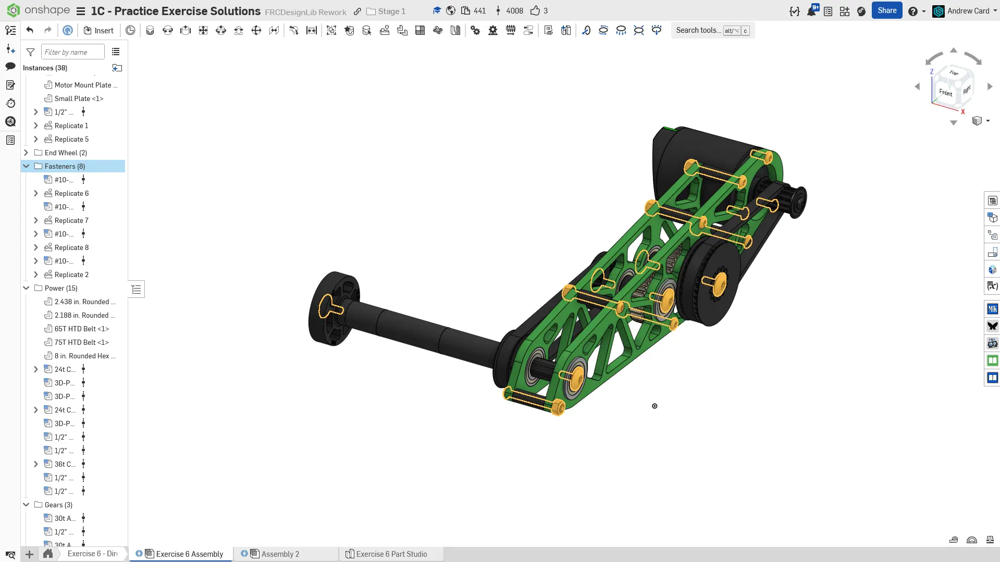
  添加并仿制所有所需紧固件，完成设计。

  
  最后，将零部件整理到文件夹中，并为仿制特征命名，完成装配体。
</Slides>

<Aside type="tip" title="Tip（提示）：检查">
请确保由你自己，或队内更有经验的队员/导师来 [**检查你的 CAD（计算机辅助设计）！**](/zh/learning-course/stage1/1a/focusing-on-improvement) 你的装配体应约有 40 个实例。
</Aside>

## 驱动尺寸和从动尺寸

在草图中，驱动尺寸用于定义和控制几何，显示为黑色并且可编辑。
相对地，从动尺寸显示为浅灰色，只反映现有几何而不改变它。这对于保持设计意图很有用，例如维持特定间隙或厚度。

要在两者之间切换，可以右键点击尺寸，并在上下文菜单中选择 “Driving/Driven”。当新增尺寸会导致草图过约束，或你需要在不改变几何的情况下检查尺寸时，这会很有用。

<Aside type="tip" title="Tip（提示）：切换驱动尺寸和从动尺寸">
右键点击尺寸，并在上下文菜单中选择 “Driving/Driven”。

<ContentFigure src="PuMO-vLOKvE" />
</Aside>

