---
title: "练习 7：竖直滚轮"
description: 建模竖直滚轮
---

在本练习中，你将建模一些竖直滚轮。这个机构使用可配置 Tube Roller System 装配体和一个 3D 打印电机隔套。建模时一定要注意布局草图和装配体配合。

## 使用 3D 打印减少零件数量
3D 打印可用于制作隔套块。
与其使用多个隔套连接两个零部件，我们可以选择使用一个 3D 打印块，把所有隔套合并成一个零件。这样可以减少零件数量，并让装配更简单。练习 4 的爬升钩中也使用了这个思路，用来减少隔套数量。

如果你有 3D 打印机，这会是一个不错的选择。

<ContentFigure src="../img/1c/vertical-rollers/3dp-spacer.webp" alt="3D 打印隔套块" width="40%">多个隔套可以合并成一个 3D 打印块，以减少零件数量。</ContentFigure>

## Part Studio（零件工作室）说明

在你复制的文档中，**进入 “Exercise #7 Part Studio” 标签页**，并**参考答案文档**完成本练习的零件工作室。**下面的说明幻灯片**只提供总体流程和一些关键细节。

<Slides>
  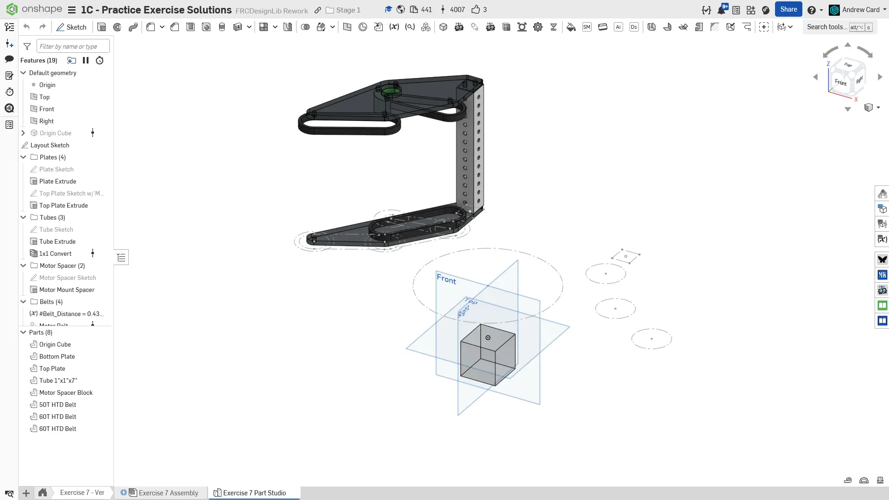
  最终零件工作室。

  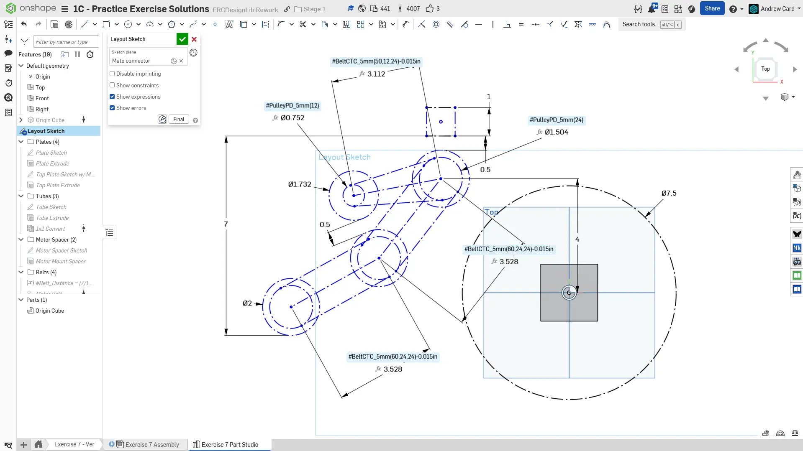
  先在一个相对原点向上偏移 3" 的配合连接器上创建布局草图。由于这里有多条同步带串联，我们从每个同步带中心距中减去 0.015" 来减少摩擦。这样会以增加回程间隙为代价提高效率，但对这个机构来说影响不大。

  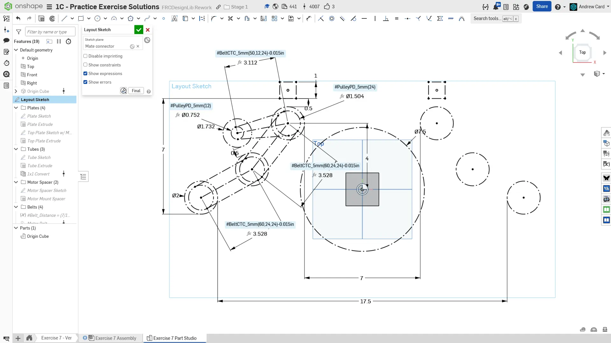
  使用 `Mirror`（镜像）草图工具，为滚轮和管材位置创建右侧参考。使用两组滚轮之间的距离来驱动滚轮位置。

  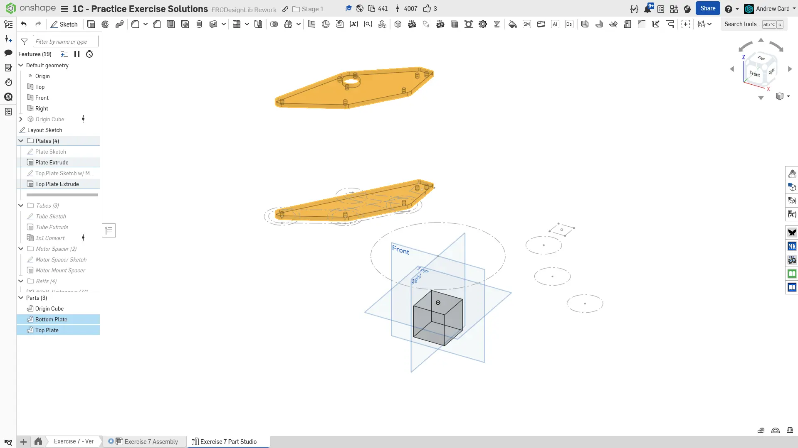
  创建底部板件。然后创建相对底部板件偏移 7" 的顶部板件。请仔细参考答案文档中的板件草图。注意，1x1" 管塞需要 4 个孔，孔位以 3/8" 间距形成正方形阵列。我们不需要全部 4 个孔，所以只使用其中 2 个。

  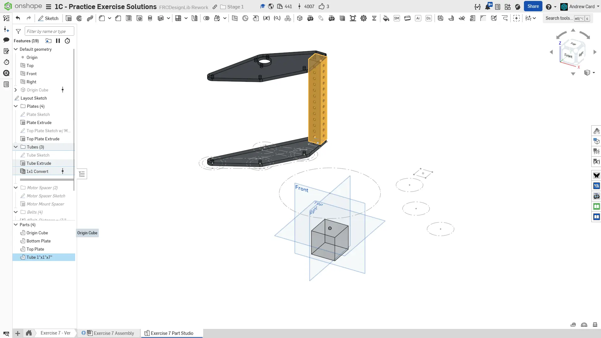
  绘制、拉伸并转换薄壁 1x1 管材。

  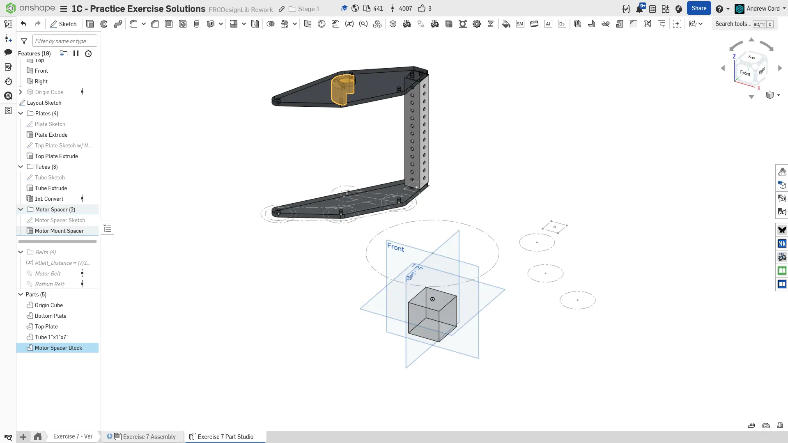
  建模 3D 打印电机隔套块，并将其拉伸为 1" 长。

  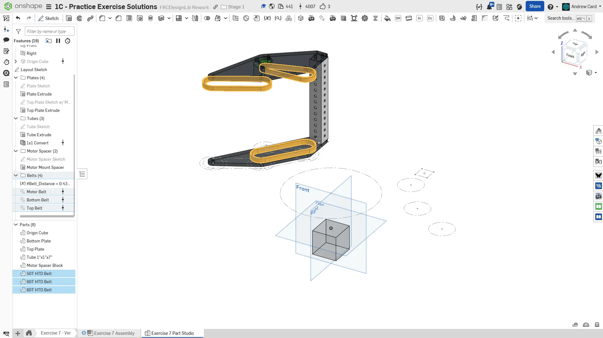
  建模同步带。

  
  给特征命名并整理到文件夹中，完成零件工作室。相应地指定零件材料。
</Slides>

## Assembly（装配体）说明

接下来，在你复制的文档中**进入 “Exercise #7 Assembly” 标签页**，并**参考答案文档**完成本练习的装配体。**下面的说明幻灯片**只提供总体流程和一些关键细节。

<Slides>
  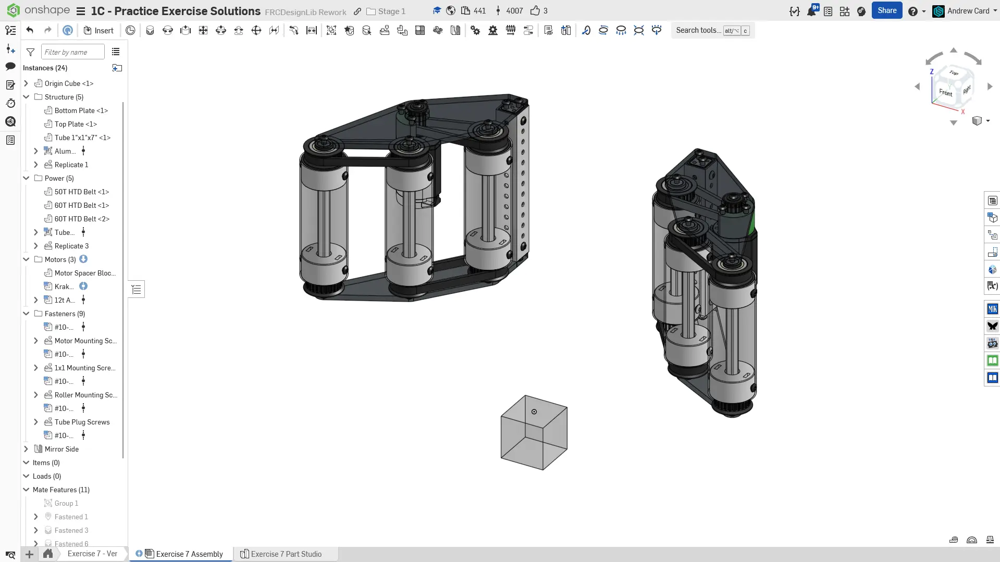
  最终装配体。

  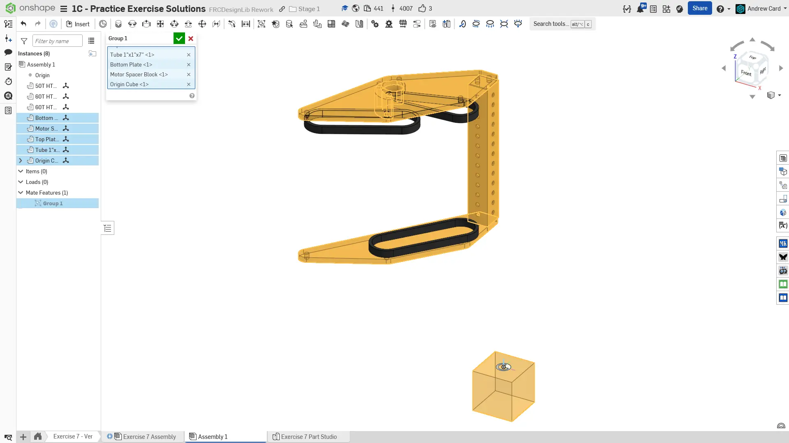
  将零件工作室零件添加到装配体中。和之前一样，将刚性零部件与 Origin Cube 组配合，并将 Origin Cube 配合到装配体原点。

  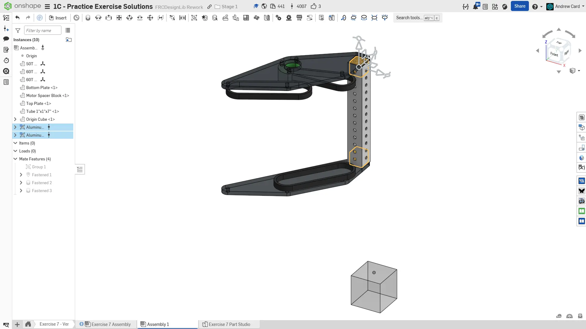
  将 1x1 管塞添加到竖直 1x1 管材上。

  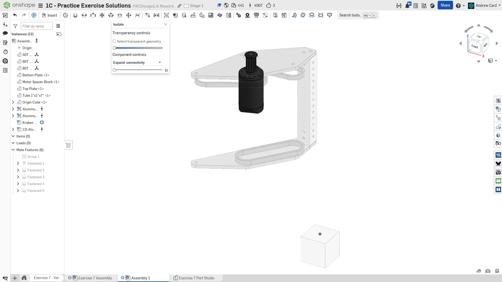
  向装配体中插入 Kraken X44 和 12T 带轮。将带轮配合到电机上，并将电机紧固到隔套上。

  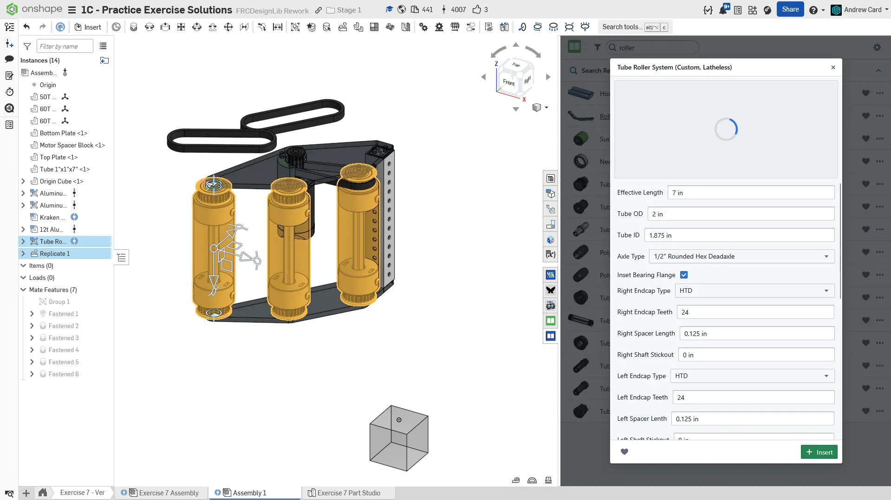
  从 FRCDesignLib 插入 “Tube Roller System” 装配体。将滚轮总长度设置为 7"，并在两端使用 24T 带轮。复制并紧固另外 2 个滚轮。

  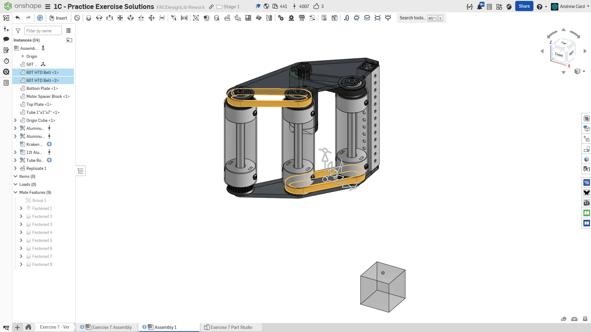
  将同步带紧固到滚轮带轮上。

  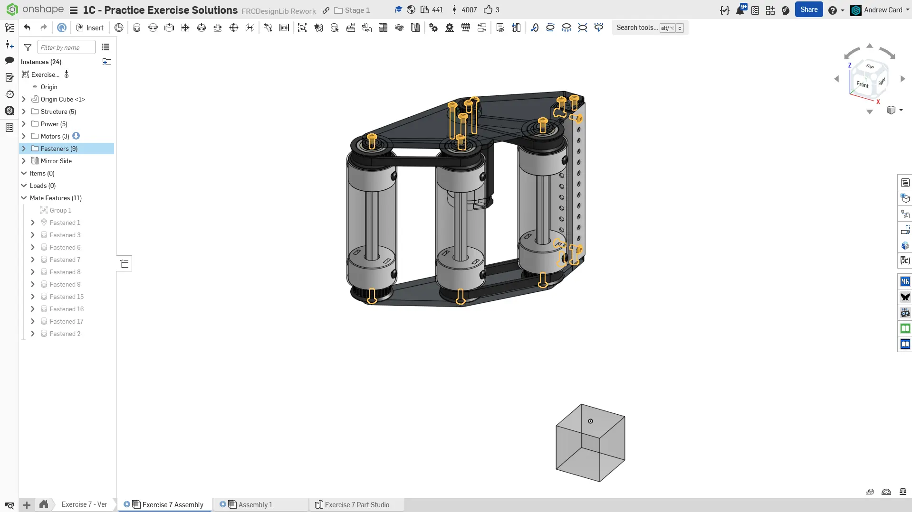
  插入、紧固并仿制所有所需紧固件。

  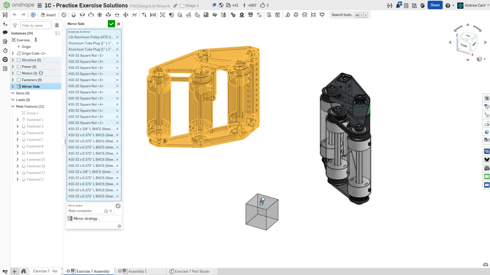
  使用 Assembly Mirror（装配体镜像）将左侧装配复制到右侧。确保所有项目的镜像策略都设置为 transform，这样就不会生成新零件。

  
  将实例整理到文件夹中，完成装配体。
</Slides>

<Aside type="tip" title="Tip（提示）：检查">
请确保由你自己，或队内更有经验的队员/导师来 [**检查你的 CAD（计算机辅助设计）！**](/zh/learning-course/stage1/1a/focusing-on-improvement) 你的装配体应大约包含 25 个实例。
</Aside>

