---
title: "练习 8：索引器居中机构"
description: 建模一个索引器居中机构
---

在本练习中，你将建模一个用于 9.5" 直径球的居中索引器，类似于 [1678 队 2022 年的索引器](https://www.youtube.com/watch?v=RiUaItTKomU)。这个机构包含同步带、链条、齿轮和管材防压块。建模时一定要注意板件草图。

## Part Studio（零件工作室）说明

在你复制的文档中，**进入 “Exercise #8 Part Studio” 标签页**，并**参考答案文档**完成本练习的零件工作室。**下面的说明幻灯片**只提供总体流程和一些关键细节。

<Slides>
  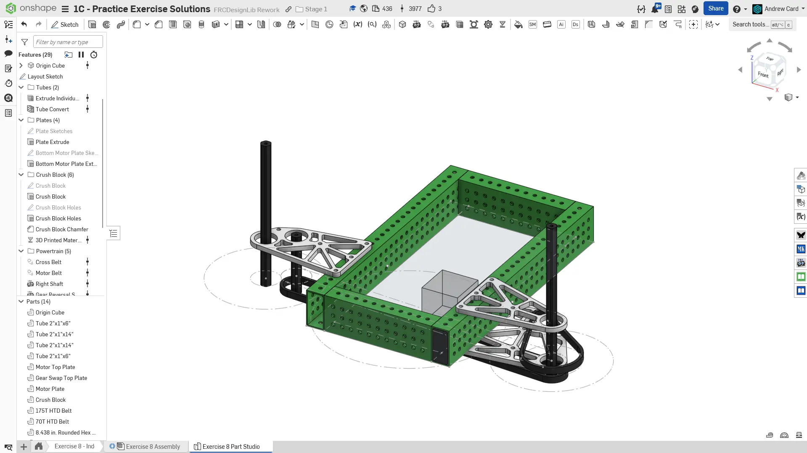
  最终零件工作室。

  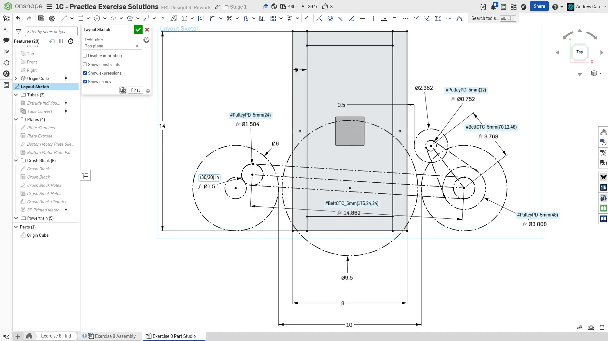
  先在顶平面上创建布局草图。和上一个练习一样，我们通过镜像索引器轮来定义滚轮之间的距离。

  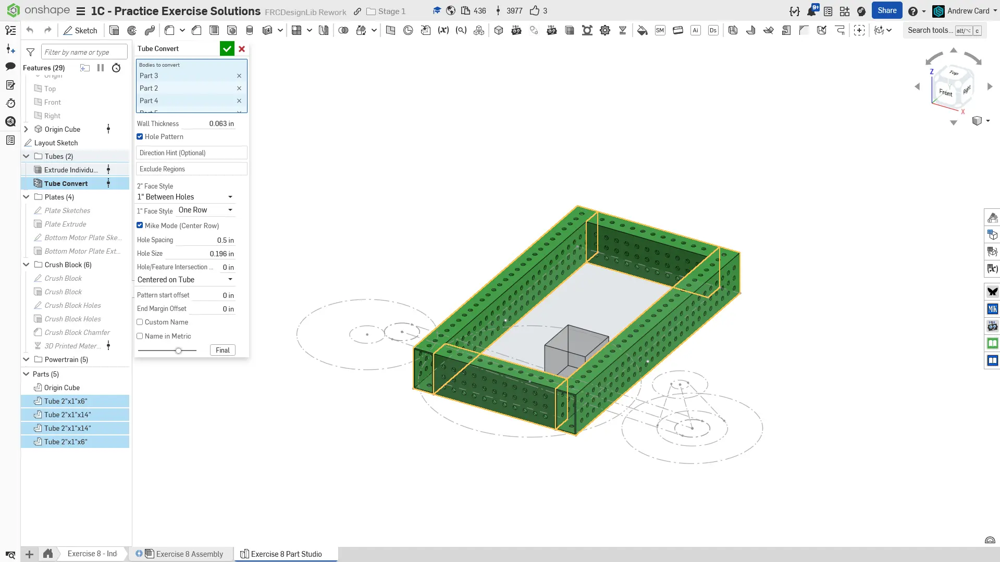
  使用 Extrude Individual 和 Tube Converter 建模薄壁 2x1 管材。

  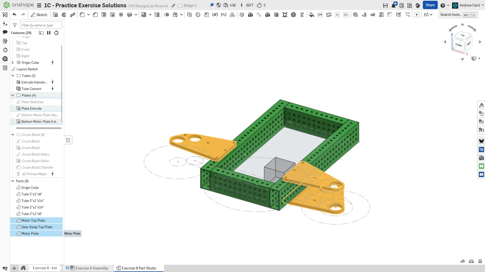
  建模顶部板件和底部板件。由于顶部板件位于同一平面，可以在同一个草图中建模。

  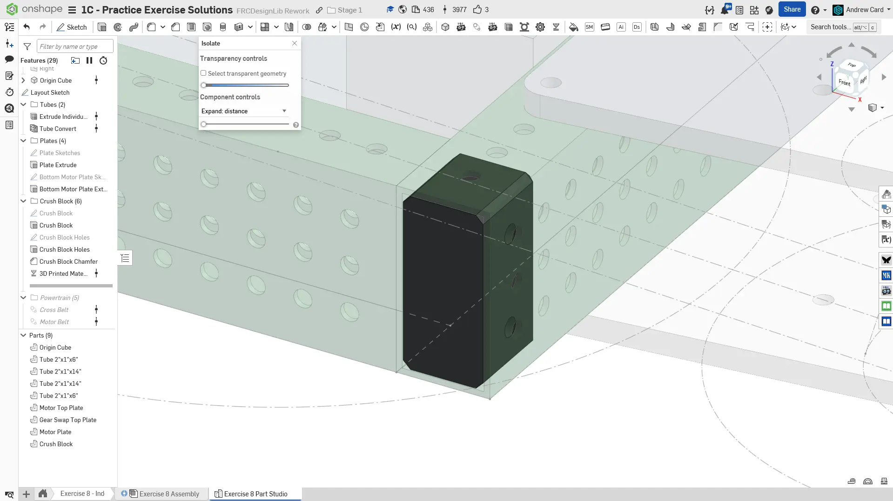
  建模一个基础防压块，使其伸入管材的深度足以覆盖第一排孔。确保添加侧向孔，让螺栓能够穿过。给边缘倒角，方便实际装配时安装。

  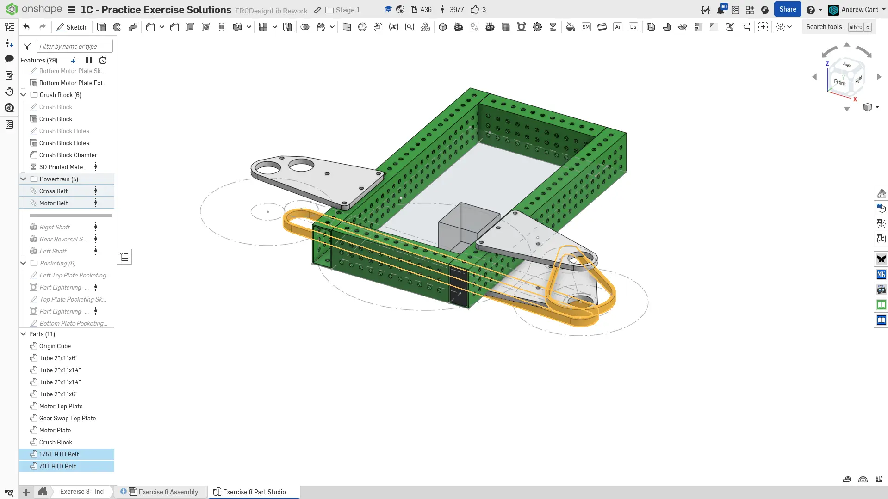
  使用 `Belt & Chain Gen` FeatureScript（自定义特征脚本）建模同步带。

  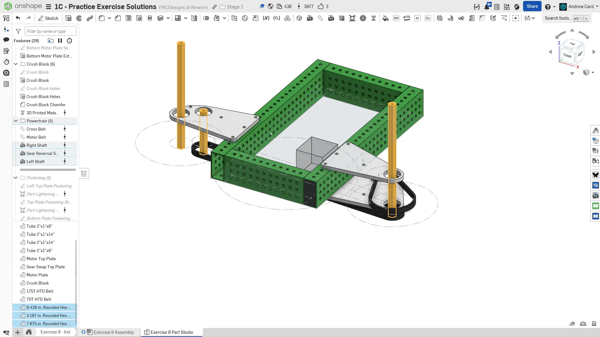
  使用 `Robot Shaft` FeatureScript 建模轴。本练习中较长轴的具体长度没有严格要求，按图示做得稍长一些即可。

  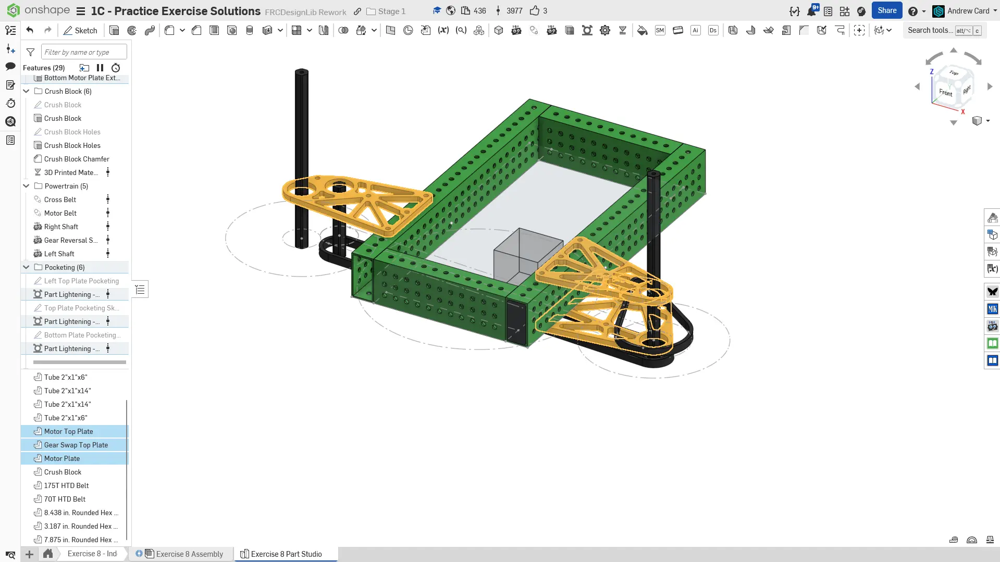
  使用 `Part Lighten` FeatureScript 对板件进行减重开槽。回想一下，你可以选择整个草图，从而自动选中所有加强筋。

  
  给特征命名并整理到文件夹中，完成零件工作室。相应地指定零件材料。
</Slides>

## Assembly（装配体）说明

接下来，在你复制的文档中**进入 “Exercise #8 Assembly” 标签页**，并**参考答案文档**完成本练习的装配体。**下面的说明幻灯片**只提供总体流程和一些关键细节。

<Slides>
  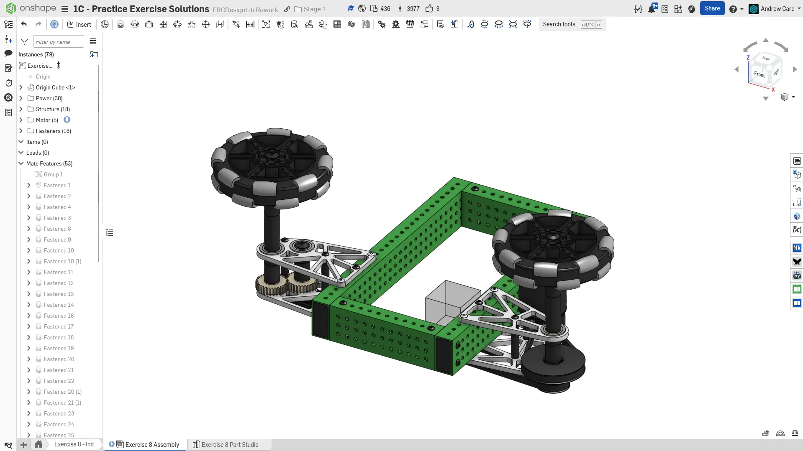
  最终装配体。

  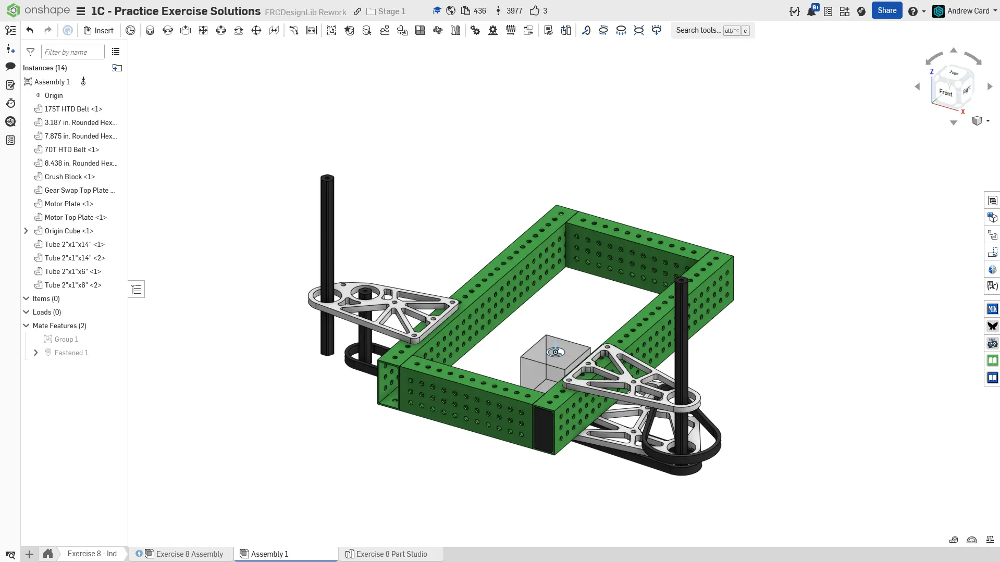
  将零件工作室零件添加到装配体中。和之前一样，将刚性零部件与 Origin Cube 组配合，并将 Origin Cube 配合到装配体原点。

  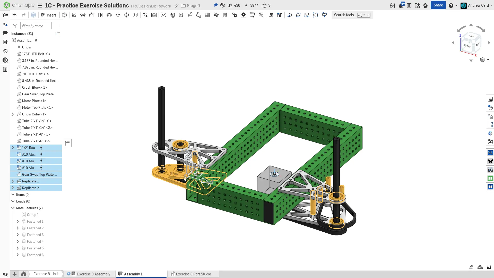
  插入、紧固并仿制 2" 长、3/8" 外径的板件隔套。插入、紧固并仿制 1.25" 长、3/8" 外径的电机隔套。复制底部齿轮板，并将其紧固到 2" 隔套上。插入、紧固并仿制 1/2" 圆角六角轴承。

  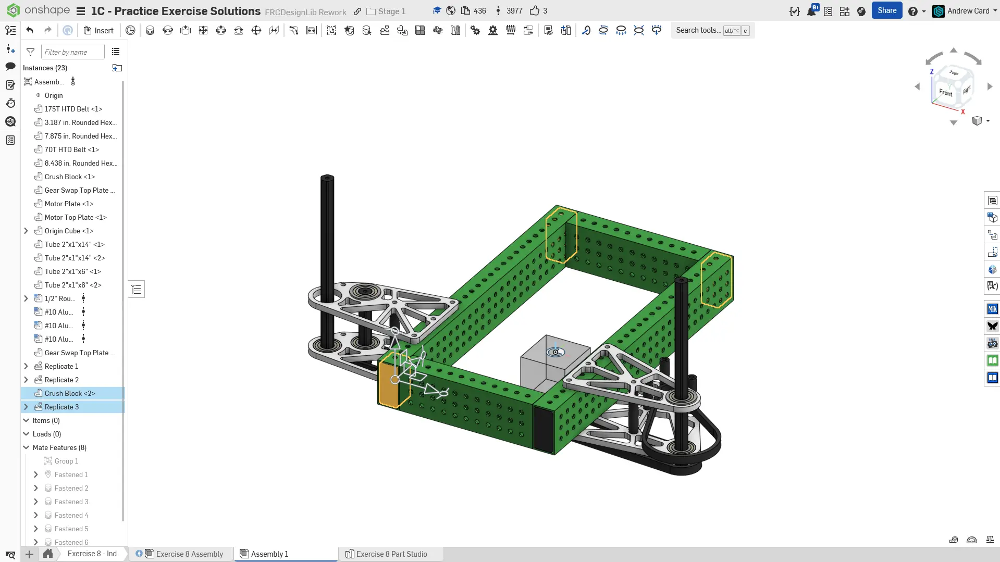
  将 3D 打印防压块复制、紧固并仿制到其他管材端部。

  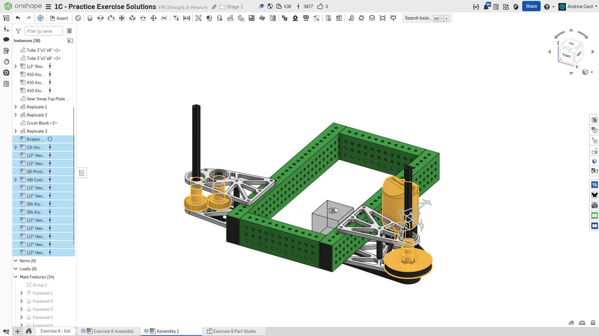
  从 FRCDesignLib 插入并紧固电机、电机带轮、带 1/2" 六角嵌件的 48T 3D 打印 HTD 带轮、30T 齿轮，以及可配置隔套组。将同步带紧固到带轮上。同时紧固轴。

  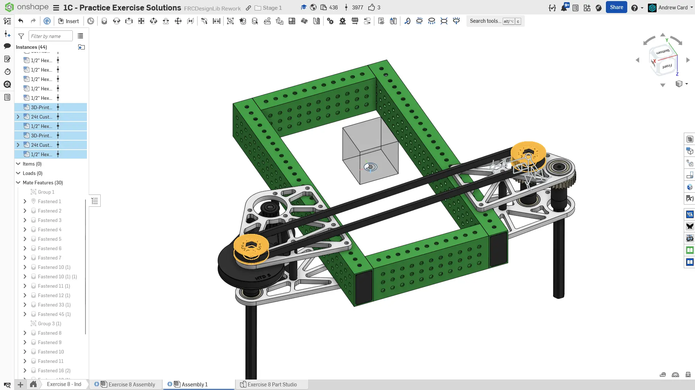
  插入并紧固底部同步带带轮。

  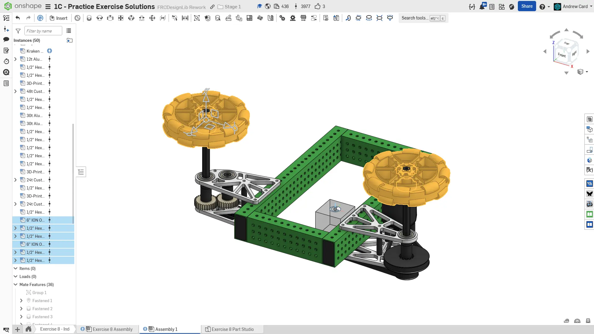
  从 FRCDesignLib 插入并紧固 6" REV 全向轮和 1/2" 六角 MAXHub。将轮毂紧固到轮子上，并将轮子组件紧固到长轴端部。

  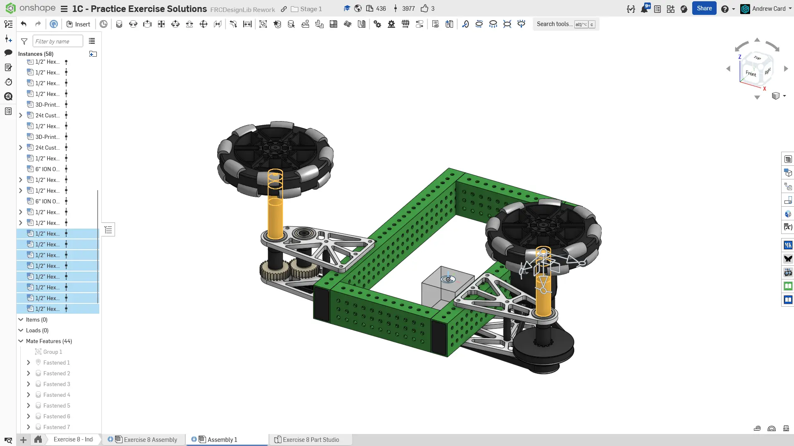
  插入、配置并紧固 1/2" 六角隔套，用于填充轮子与板件之间的间隙。根据偏好，这些可以是叠放的 COTS 隔套，也可以是单个定制隔套。

  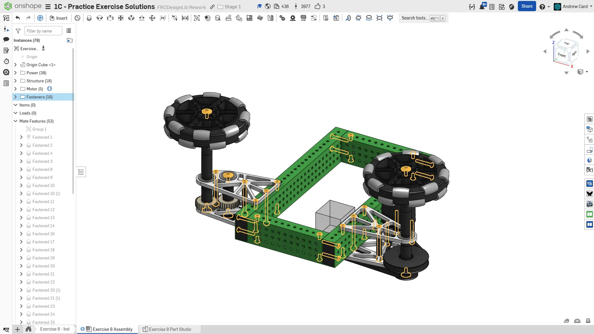
  插入、紧固并仿制所有所需紧固件。

  
  最后，将零部件整理到文件夹中，并为仿制特征命名，完成装配体。
</Slides>

<Aside type="tip" title="Tip（提示）：检查">
请确保由你自己，或队内更有经验的队员/导师来 [**检查你的 CAD（计算机辅助设计）！**](/zh/learning-course/stage1/1a/focusing-on-improvement) 如果所有内容都存在、建模正确并装配正确，你的装配体中应约有 80 个实例。
</Aside>

