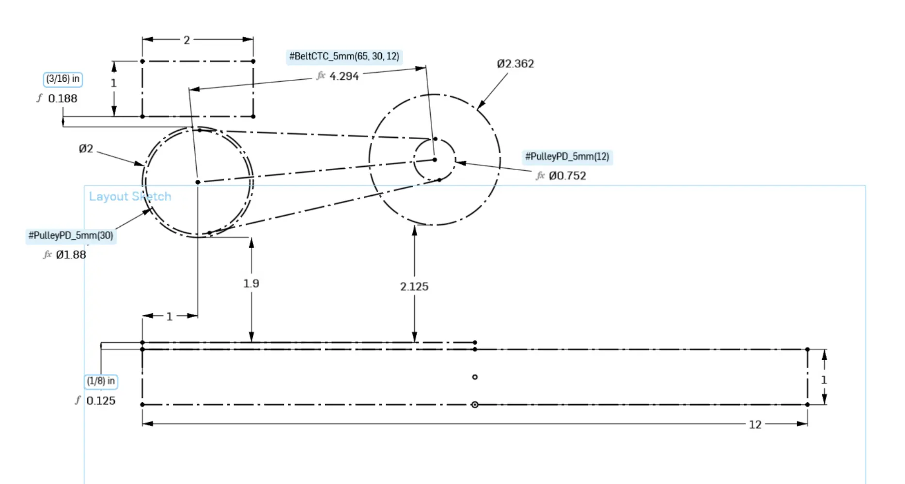
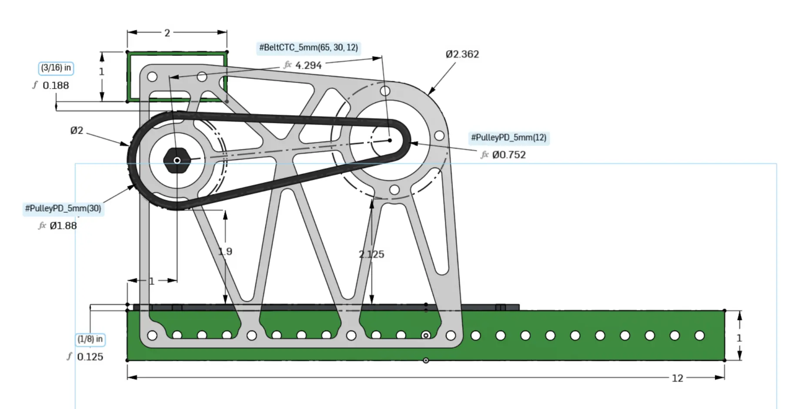
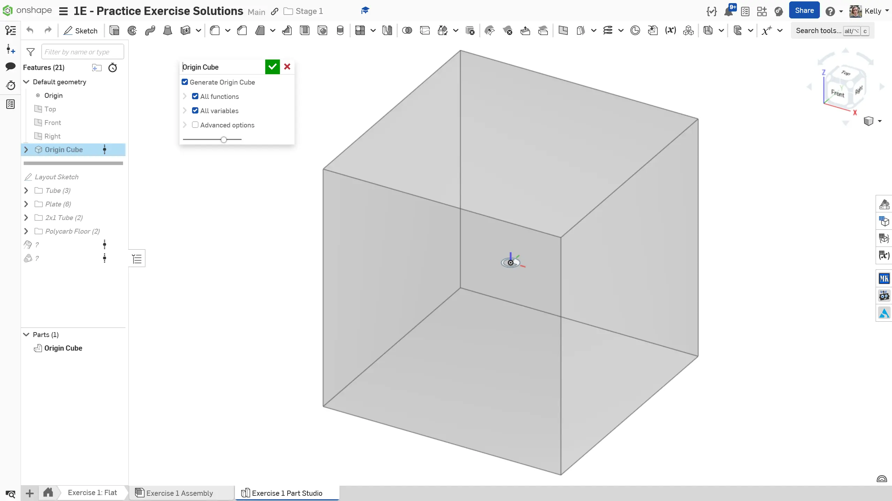
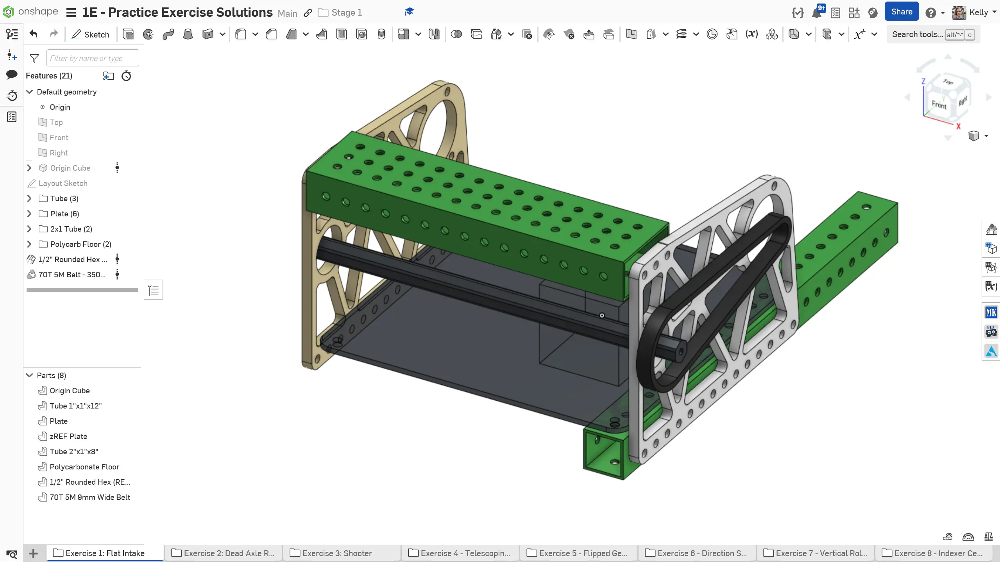

---
title: 练习机构介绍
description: 练习机构入门
---

欢迎来到阶段 1C 阶段！在本阶段，你将建模多种不同机构，用来练习 CAD（计算机辅助设计）技能和细节执行能力。在这个过程中，你会接触新的 COTS（现成商业零件）零部件，也会学习一些 Onshape 使用技巧，帮助你优化工作流程。

由于这些机构是专门为了练习技能和介绍概念而设计的，建模时并未结合完整机器人整机场景。
虽然这些机构包含一些优秀的设计方法，但它们不一定是完整系统。这些模型仅用于 CAD 练习，不建议直接用于实际的机器人上。

## 布局草图

请确保为每个机构使用布局草图，就像阶段 1B 练习中介绍的那样。布局草图在任何规模的设计中都很有用，它能让你在一个草图中定义关键尺寸，后续需要调整时会更方便。

<Aside type="tip" title="Tip（提示）">
把驱动设计的关键内容放进布局草图中（例如传动机构、策略物道具的路径、滚轮等），而具体零件细节则保留在各自的草图和特征中（例如为轴承孔和板件外轮廓单独创建一个用于拉伸的草图）。
</Aside>

<Slides>
  
  练习 1 的布局草图。注意，布局草图中只包含关键几何细节。

  
  练习 1 的侧视图。注意布局草图如何确定机构的几何形状。
</Slides>

<Aside type="note" title="Note（备注）">
后续当你开始在整机机器人建模中实际运用布局草图时，会进一步深入讲解布局草图的相关思路。
</Aside>

## 保持原点一致

正如阶段 1 前面几个小节所述，你应该让 Part Studio（零件工作室）和 Assembly（装配体）之间的原点保持一致。你将使用 [`Origin Cube` FeatureScript（自定义特征脚本）](https://cad.onshape.com/documents/321c197a842fc5f1a29e6621/w/fc3cdd5ca7edcd93e02f13cc/e/2b321cb91b74224b9c14b433) 来实现这一点。**请确保 Origin Cube 始终是任何零件工作室中的第一个特征。** 下面的幻灯片演示了如何使用 Origin Cube。

<Slides>
  
  将 Origin Cube FeatureScript 放在零件工作室的第一个特征位置。

  
  建模你的机构。

  
  将零件工作室插入装配体。将所有静态零件与 Origin Cube 零件使用分组配合（Group Mate）连接在一起，然后把 Origin Cube 上的配合连接器紧固到装配体原点。
</Slides>

按照这些步骤操作，可以让装配体原点绑定到一个永远不会改变或消失的零件上。即使零件工作室中的内容发生变化，其他零件相对于 Origin Cube 的位置也会与零件工作室保持一致。到了阶段 2 及之后，这对于机械臂、升降机构等可移动的机构装配体时会特别有用。

