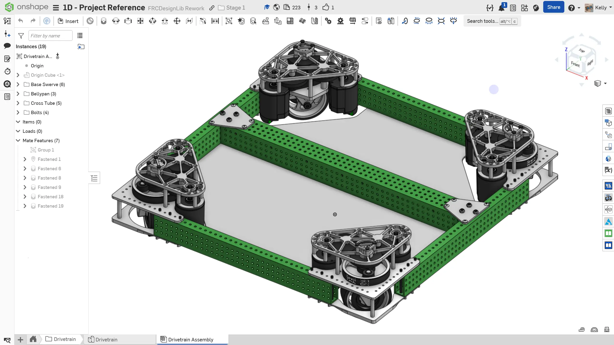
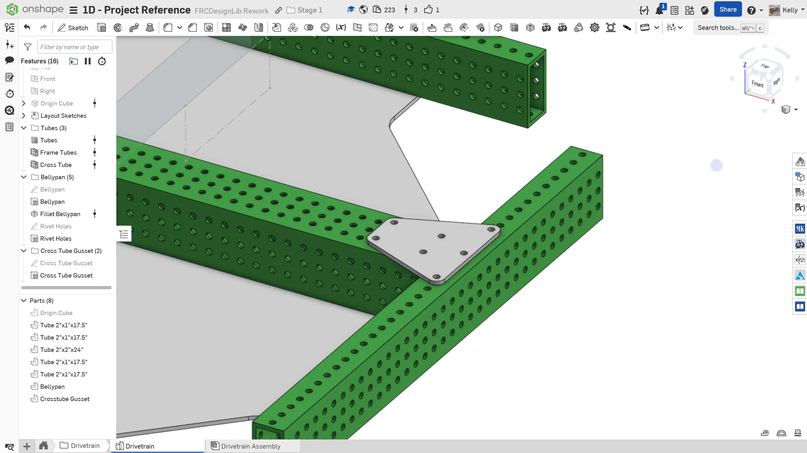
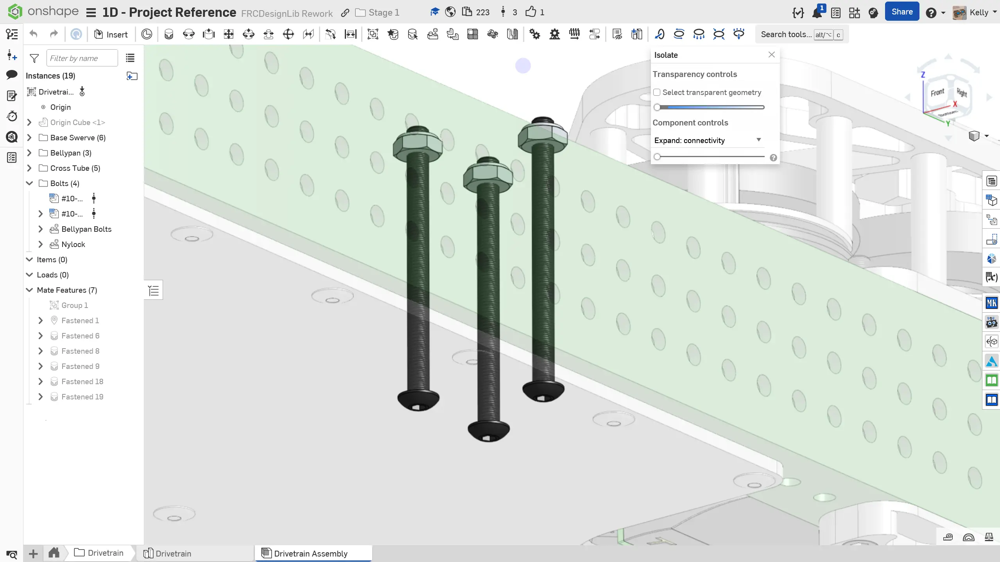

---
title: 添加更多组件
description: 向设计中添加额外组件
sidebar:
  order: 6
---

## 添加更多组件

当你在零件工作室中建模更多零件时，可以用与之前类似的方式将它们插入装配体。点击插入后，立即点击绿色勾选。然后编辑你最初创建的 `Group`（组配合），并将该零件添加到组中。这样可以确保新增零件始终停留在它在零件工作室中建模的位置。

接下来添加一块加强板，将 2"x2" 管材连接到 2"x1" 管材上。

### 说明

首先，在 `Drivetrain` 文件夹中**进入 `Drivetrain` Part Studio（零件工作室）**。**按照幻灯片中的说明**添加加强板。

<Aside type="tip" title="Tip（提示）：手动定义安装孔">
当你从管材投影孔位，或使用加强板 FeatureScript 时，如果 Tube Converter 或管材长度发生变化，这些参考很容易失效。尽量从管材边缘标注手动定义的孔位，或只投影一个孔再使用线性阵列，以减少后续发生变化时需要修复的内容。

<ContentFigure src="../img/1d/define-holes.webp" alt="手动定义的安装孔" width="60%" border />
</Aside>

<Slides>
  
  完成后的底盘装配体。

  
  根据图示孔位，绘制并拉伸一块 1/8" 厚的加强板，用于将横管连接到框架顶部。

  
  将加强板插入装配体，并将它添加到 Group（组配合）中。

  
  在每侧底板上的三个孔中添加 2-1/2" #10-32 螺栓，使它们穿过另一侧的加强板孔。在加强板孔位上添加尼龙锁紧螺母。正如你在 1C 中学到的，这有助于防止铆钉随时间松动并脱落。

  
  编辑仿制特征，将铆钉添加到加强板上。

  
  使用 Origin Cube 上的配合连接器，将加强板、螺栓和铆钉镜像到底盘另一侧。

  
  完成后的底盘装配体。

</Slides>

确保将装配体中的实例整理到文件夹中（例如框架、舵轮模块），并为用到的阵列和仿制特征命名。这会帮助你之后在装配体中查找零部件。

<Aside type="tip" title="Tip（提示）：检查">
请确保由你自己，或队内更有经验的队员/导师来 [**检查你的 CAD（计算机辅助设计）！**](/zh/learning-course/stage1/1a/focusing-on-improvement/)

你的装配体重量应约为 37.2 lbs。

你的标签页管理器中应包含以下标签页和文件夹：

<ContentFigure src="../img/1d/tab-manager.webp" alt="标签页管理器视图" />
</Aside>

### 细节层级

需要注意的是，虽然建模机器人硬件的每一个细节（螺栓、铆钉、螺母）有助于采购和实际装配，但这并非严格必要。时间是宝贵资源，尤其是在建造季，所以你应该把时间投入到回报最大的地方。

关于 Onshape 装配体最佳实践的更多细节，可以查看 [装配最佳实践页面](/zh/best-practices/assembly-setup/)。
