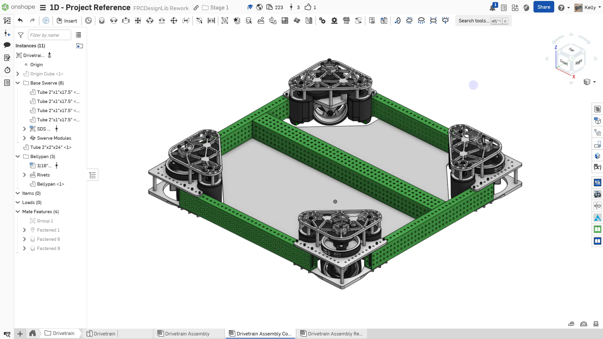
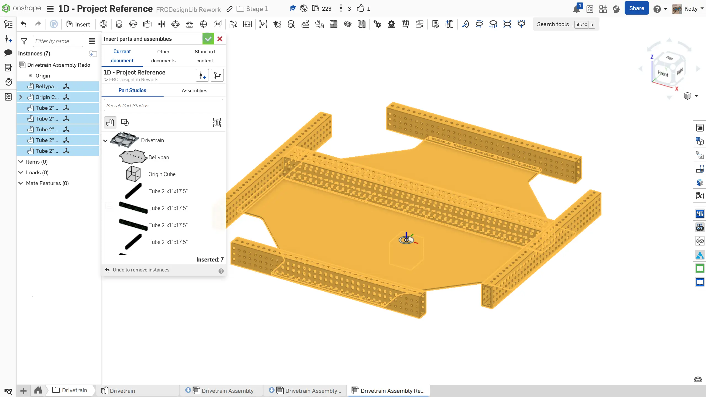
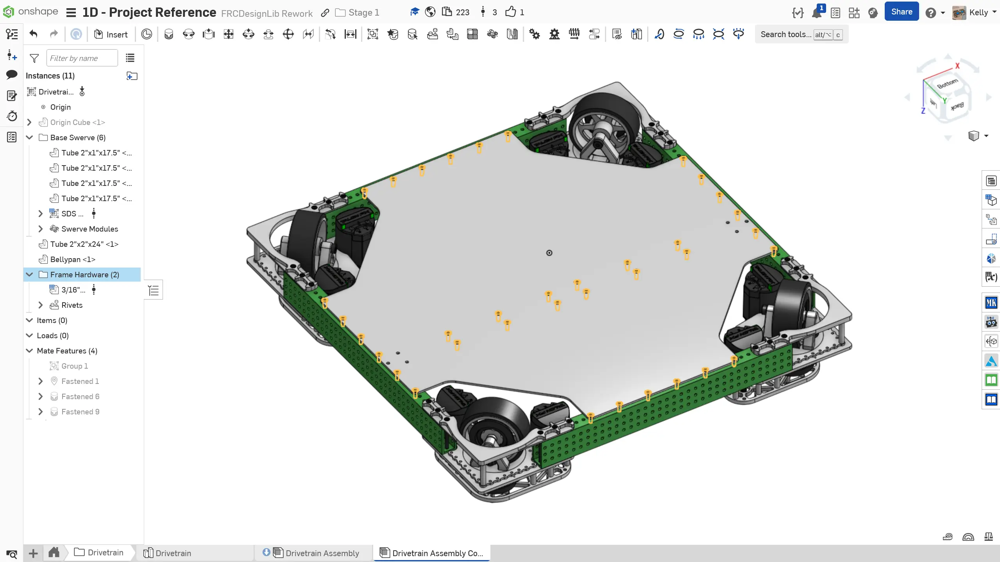

---
title: 装配体
description: 装配体建模
sidebar:
  order: 5
---

## 装配体

现在零件工作室已经完成，你可以创建底盘装配体了。

和上一阶段的练习一样，在插入并组配合所有零件后，你应将 Origin Cube 紧固到装配体原点。这样可以让零件工作室原点和装配体原点对齐。

### 说明

首先，在 `Drivetrain` 文件夹中**创建一个名为 `Drivetrain Assembly` 的新 Assembly（装配体）标签页**。**按照幻灯片中的说明**完成装配体。

<Slides>
  
  装配体。

  
  将零件工作室零件添加到装配体中。和之前一样，将刚性零部件与 Origin Cube 组配合，并将 Origin Cube 配合到装配体原点。

  
  从 FRCDesignLib 将简化版 MK4i 模块插入装配体，并将它配合到位。

  
  使用 Circular Pattern（圆形阵列）装配体工具完成模块装配。

  
  从 FRCDesignLib 插入、紧固并仿制 3/16" Aluminum Blind Rivet (WCP)（.125" - .250" Grip Length）到腹板孔位上。注意，每侧都要保留图中所示的三个孔为空，等加强板建模并添加后再加入螺栓。

  
  最后，将零部件整理到文件夹中，并为仿制特征命名，完成装配体。

</Slides>

### 铆钉夹持长度

如 1A 中所述，从零件库中选择要插入的铆钉时，你会注意到它们有一个**夹持长度**配置。铆钉的夹持长度指它能够紧固在一起的材料总厚度。务必选择合适的夹持长度，否则铆钉可能容易脱落，或无法将材料正确紧固在一起。

<ContentFigure src="../img/1d/pop-rivet-steps.webp" alt="抽芯铆钉安装步骤" border>图片来源：https://animalia-life.club/qa/pictures/types-of-pop-rivets</ContentFigure>
