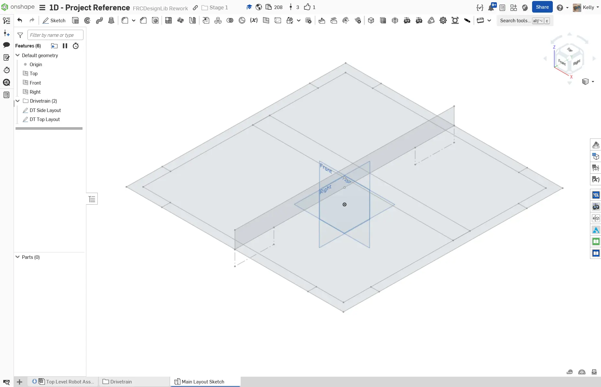
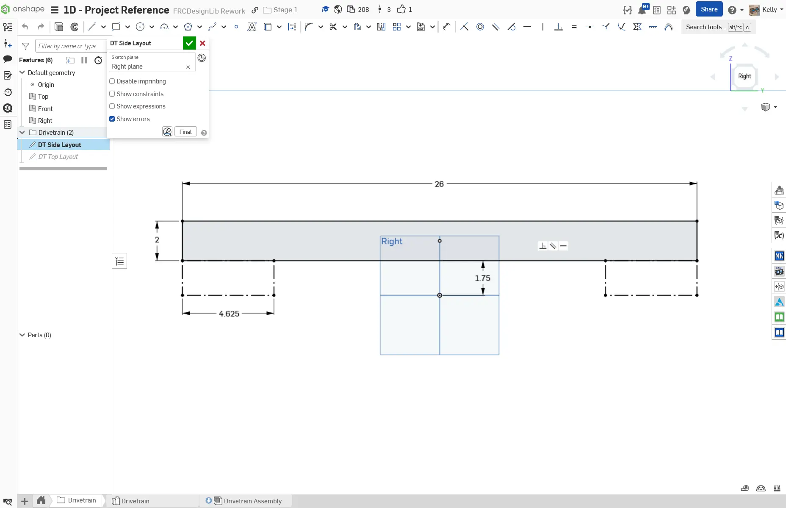
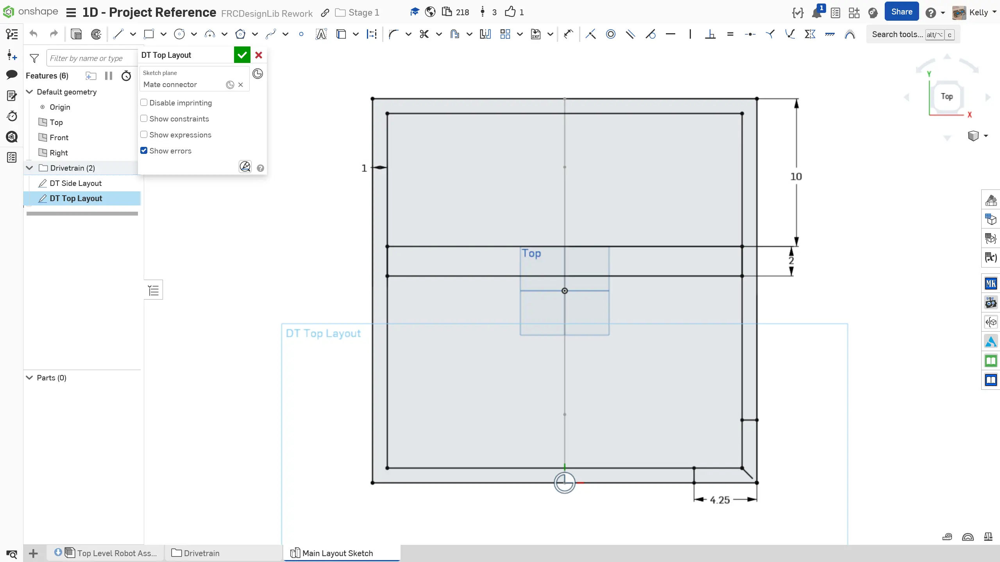

---
title: 布局草图
description: 创建布局草图
sidebar:
  order: 3
---

## 底盘布局草图

首先，你将创建底盘的布局草图。它会决定驱动管材的尺寸和位置。这个布局会从底盘的侧视图和俯视图绘制。你的舵轮底盘尺寸将设为 26" x 26"。

### 说明

首先，**创建一个名为 `Stage 1D Robot` 的新 Onshape 文档**，并在其中**创建一个名为 `Main Layout Sketch` 的新 Part Studio（零件工作室）**。然后，使用 `Origin Cube` FeatureScript（自定义特征脚本）创建原点立方体。**按照幻灯片中的说明**完成布局草图。

<Slides>
  
  最终布局草图。

  
  在右平面上绘制底盘侧面轮廓。我们将管材放在距离地面 1.75" 的位置，这是 MK4i 模块从地面到管材底部的偏移量。然后绘制车轮间隙框，表示车轮占用的区域。对于 MK4i 模块，这个框的宽度为 4.625"。

  
  使用侧面布局竖直线底部的配合连接器创建顶部布局草图。利用自动生成的配合连接器作为草图平面，是一个非常有用的技巧。按下视图立方体上的 “Top” 按钮切换到俯视图。

  
  绘制底盘的俯视外轮廓。将矩形设为正方形，并让边长等于侧面布局中管材的长度。这样可以确保俯视布局尺寸始终与侧面布局匹配，从而让设计保持参数化。注意，尽管这个草图没有尺寸标注，它仍然是完全定义的。

  
  要绘制管材，先画一个比上一个正方形小 1" 的正方形。它表示组成外框架的四根 2"x1" 管材。然后绘制 2"x2" 管材的顶部轮廓。在右下角绘制两条线，每条线都相对边缘偏移 4.25"。这是 MK4i 模块所需的偏移量，其他模块会有所不同。

  
  为了给四根管材都应用切口，我们使用 Circular Pattern（圆形阵列）草图工具，将这些线复制到四个角。使用圆形阵列时，我们先定义实例数量，再定义旋转轴。

  
  最后，为草图命名，并在特征树中将它们整理到文件夹中。你的所有草图都应完全定义。

</Slides>

如前所述，这种自顶向下建模方法非常强大，因为它能让你把最重要的尺寸集中捕捉在一个地方。不过，也要注意不要在布局草图中加入过多细节。你会在整个阶段 2 中继续练习布局草图，并在阶段 3 中结合多文档实践，用它们设计整台机器人。
