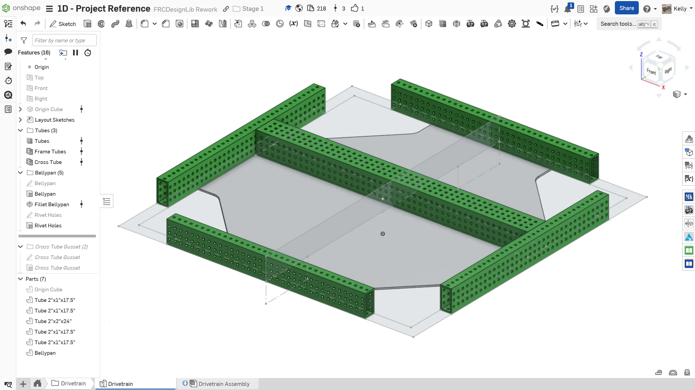
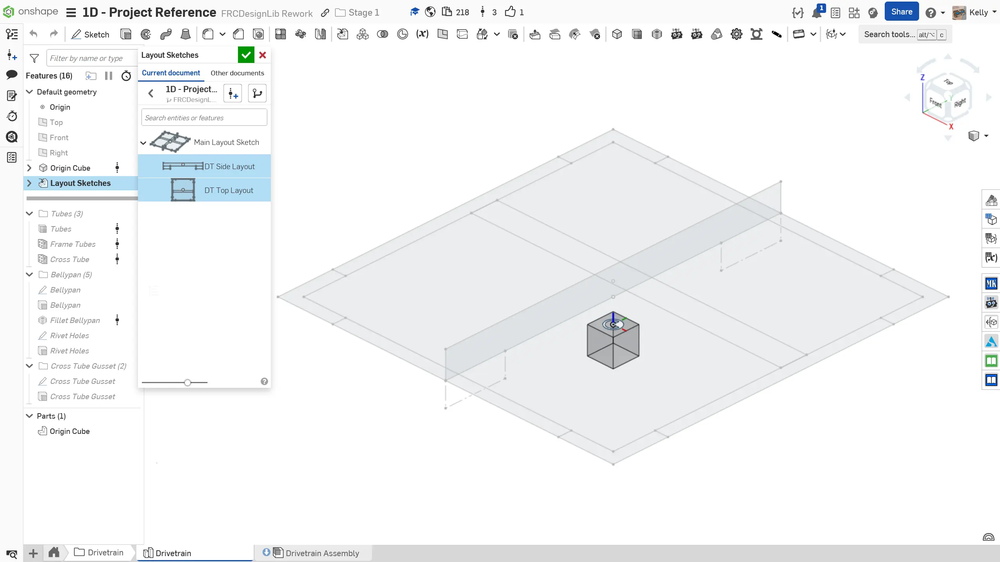
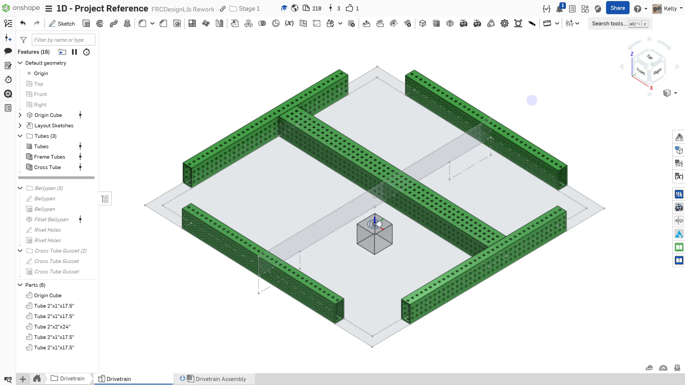
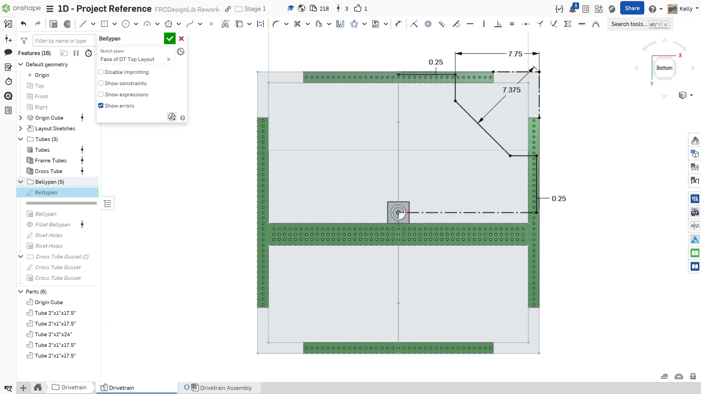
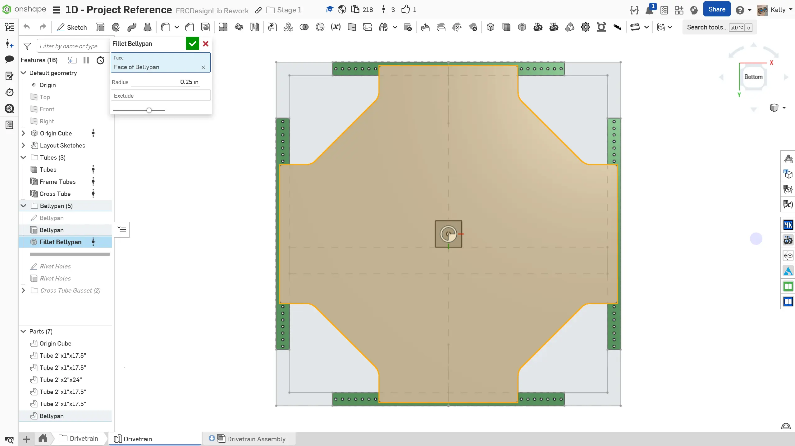
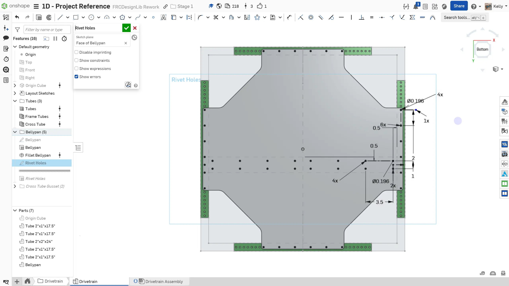

---
title: 零件工作室
description: 零件工作室建模
sidebar:
  order: 4
---

## 派生布局草图和零件建模

现在你已经创建了布局草图，可以开始建模单个零件了。零件的关键尺寸，例如管材长度，会由布局草图驱动。这样一来，只要布局草图中的底盘尺寸发生变化，管材就会自动更新。

### 说明

首先，**在文档中创建一个名为 `Drivetrain` 的新文件夹标签页**。然后，在 `Drivetrain` 文件夹中**创建一个名为 `Drivetrain` 的新 Part Studio（零件工作室）**。**按照幻灯片中的说明**完成零件工作室。记住，Origin Cube 应该是零件工作室中的第一个特征。

<Slides>
  
  零件工作室。

  
  先插入 Origin Cube。然后，使用 Derived（派生）工具，从 Main Layout Sketch 零件工作室插入你之前绘制的布局草图。如果布局草图发生变化，这个特征会自动更新。

  
  使用 Extrude Individual 和 Tube Converter FeatureScript（自定义特征脚本）建模管材。为了保证强度，2"x1" 管材应使用 1/8" 壁厚，而 2"x2" 管材可以使用 1/16" 壁厚。

  
  从底板的一个角开始。这里切掉角部，为舵轮模块留出空间。

  
  使用 Fillet（圆角）草图工具，在切口的两个内角上添加半径 1" 的草图圆角。

  
  接着，使用 Circular Pattern（圆形阵列）草图工具阵列出另外三个角。将底板拉伸为 1/8" 厚。

  
  选择底板底面，使用 Fillet All Edges FeatureScript 为底板剩余边缘添加半径 0.25" 的圆角。

  
  为底板添加安装孔。结合使用 Linear Pattern（线性阵列）和 Circular Pattern（圆形阵列），阵列 0.196" 铆钉孔和螺栓孔。如 1C 练习 1 中所学，螺栓可用于防止铆钉随时间松动。

  
  将这些孔拉伸切入底板。如果草图绘制正确，你不需要逐个选择每个孔。

  
  最后，为草图命名，并在特征树中将它们整理到文件夹中。另外，将底板材料设置为 6061 铝，并为零件命名。

</Slides>

### 派生特征

在本小节中，你学习了 `Derived`（派生）特征。这个特征非常强大，可以将一个零件工作室中的零件导入到另一个零件工作室中，用作建模参考。不过，要注意不要过度使用这个功能，因为它会显著拖慢零件工作室。

### 特征树整理

到这里，你应该已经越来越熟悉 Onshape 建模和 FeatureScript 的使用了。工作过程中务必及时整理特征树，让它保持有序、易用。你可以在 [特征树最佳实践](/best-practices/feature-tree-setup/) 页面了解更多特征树整理方法。
