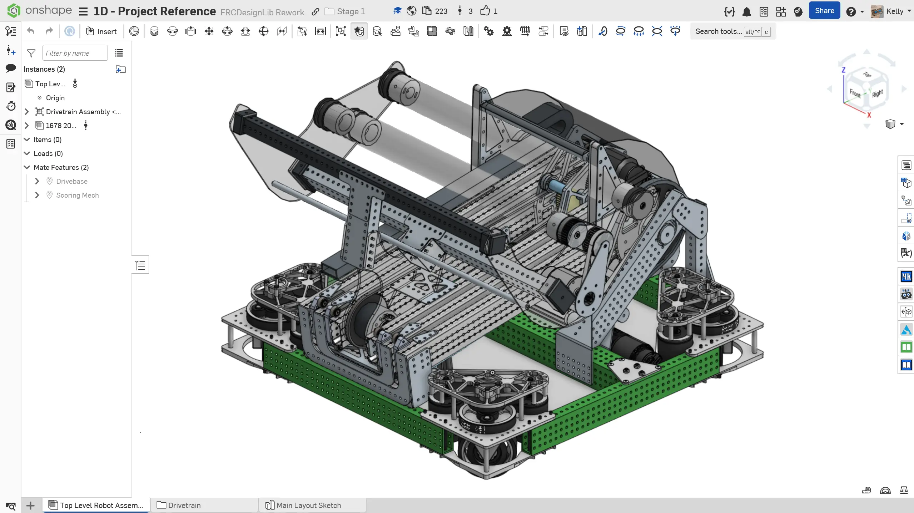

---
title: 顶层装配体
description: 创建顶层装配体
sidebar:
  order: 7
---

## 机器人顶层装配体

现在你已经有了底盘，可以创建一个_机器人顶层装配体_。机器人顶层装配体位于装配层级的最顶端。用这种方式组织装配体，可以让 CAD（计算机辅助设计）装配和真实机器人装配都保持清晰有序。

你将创建一个与底盘配套的机器人顶层装配体。你要添加的机构来自 [1678 队 2023 年机器人](https://www.thebluealliance.com/team/1678/2023) 的得分机构。可以从这里访问该得分机构 CAD：

<LinkButton href="https://cad.onshape.com/documents/28a750426de8e2bc17d5b900/w/8e79c6217ae2ce07ff57d900/e/a4d266d03289620078d13a80" external center>1678 2023 得分机构文档</LinkButton>

### 说明

首先，**在 `Main Layout Sketch` 零件工作室上方创建一个新的装配体标签页**，并将其命名为 **`Top Level Robot Assembly`**。**按照幻灯片中的说明**完成机器人顶层装配体。

<Slides>
  
  完成后的机器人顶层装配体。

  
  插入底盘装配体，并将 Origin Cube 紧固到装配体原点。你可能需要取消隐藏 Origin Cube 才能进行配合。

  
  将得分机构链接粘贴到 Insert（插入）菜单文本框中，插入 1678 队 2023 年得分机构装配体。然后，将它的 Origin Cube 紧固到装配体原点。你可能需要隐藏底盘的 Origin Cube，才能访问装配体原点进行配合。

  
  完成后的顶层装配体。

</Slides>

<Aside type="tip" title="Tip（提示）：检查">
你的标签页管理器现在应如下所示：
<ContentFigure src="../img/1d/tab-manager-2.webp" alt="包含顶层装配体的标签页管理器" />
</Aside>

机器人顶层装配体就是这些内容！使用 Origin Cube 可以非常轻松地将多个装配体配合在一起。在后续阶段，你会学习如何借助 Origin Cube 创建可动装配体（机械臂、升降机构等）。如果你感兴趣，可以在 [这里](/zh/best-practices/assembly-setup/#插入零件的流程) 提前了解。
