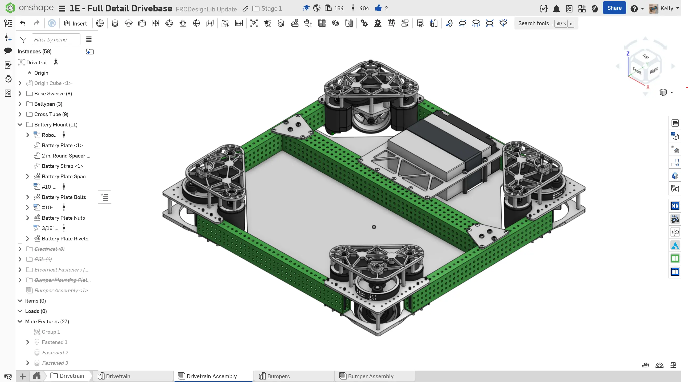
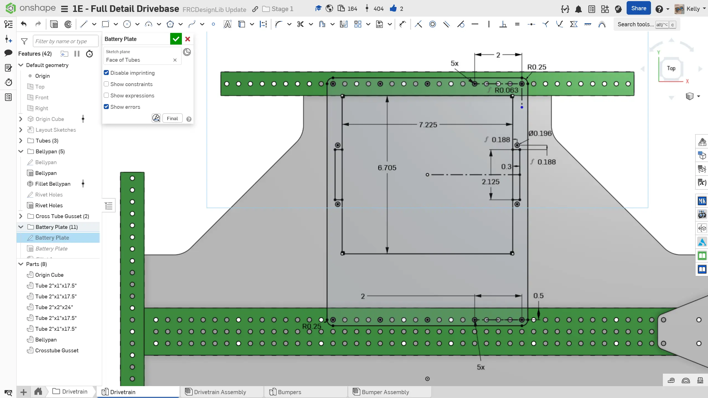
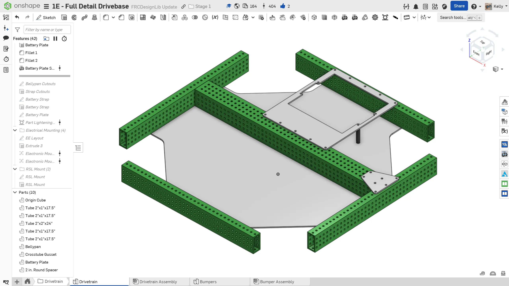
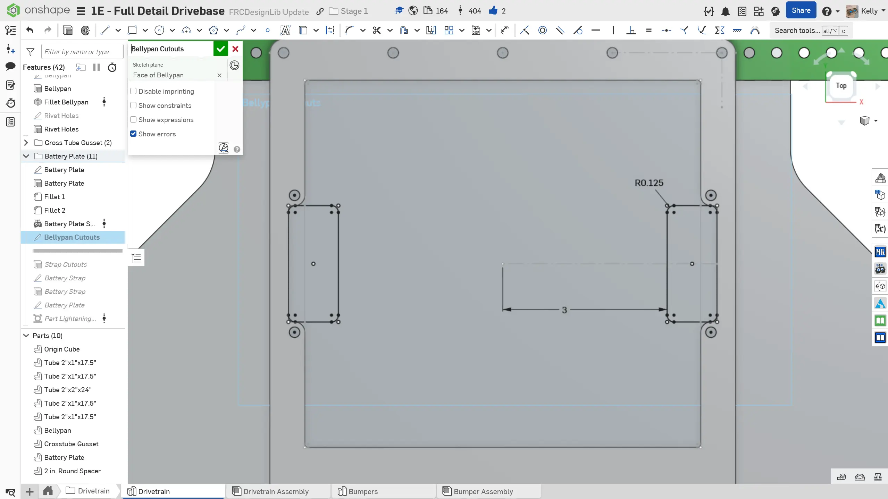
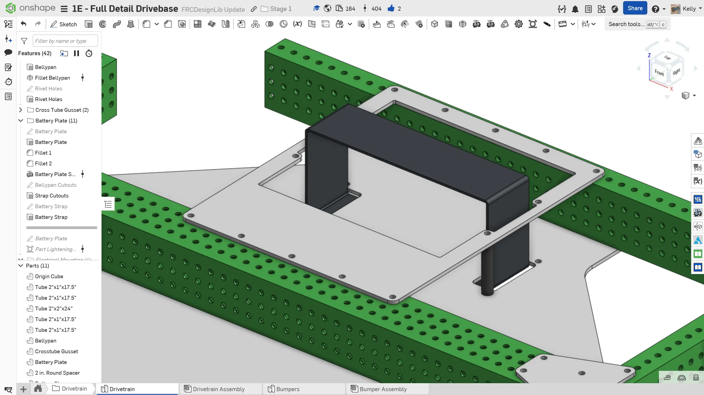
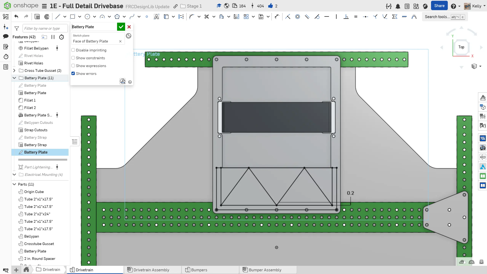

---
title: "练习 1：电池固定架"
description: 建模一个电池固定架
---

## 练习 1：电池固定架

在参考设计中，电池水平放置在底板上。它通过一条 2" 宽的绑带固定，绑带绕过电池和底板，将电池固定到位。

### 说明

**为你的底盘添加一个电池固定架。** 你可以参考下面的说明幻灯片获得灵感。

<Slides>
  
  完成后的电池固定架，包括安装孔、底板上的绑带切口和绑带。

  
  电池和电池安装板的布局。为了容纳内角带 1/16" 半径圆角的电池，切口尺寸应约为 6.705" x 7.225"。

  
  这块板件可以使用 1/8" 厚铝板。同时添加直径 3/8" 的隔套，用于连接到底板。

  
  在底板上添加安装孔和电池绑带切口。

  
  可选：建模电池绑带。

  
  可选：对电池固定架进行减重开槽。建议使用 0.2" 宽加强筋。

  
  将电池固定架、隔套和电池插入装配体。别忘了整理特征树、为零件命名、指定零件材料，并整理装配体文件树。

</Slides>
