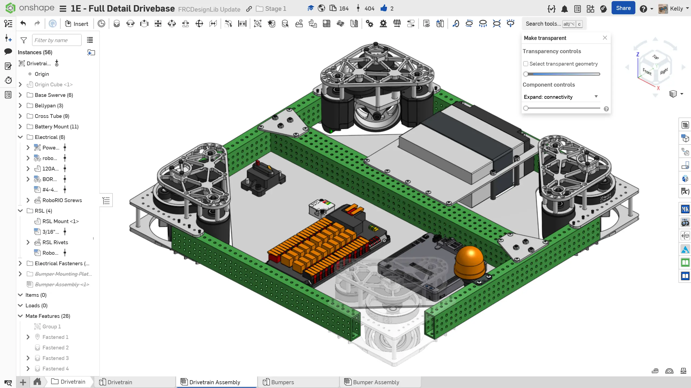
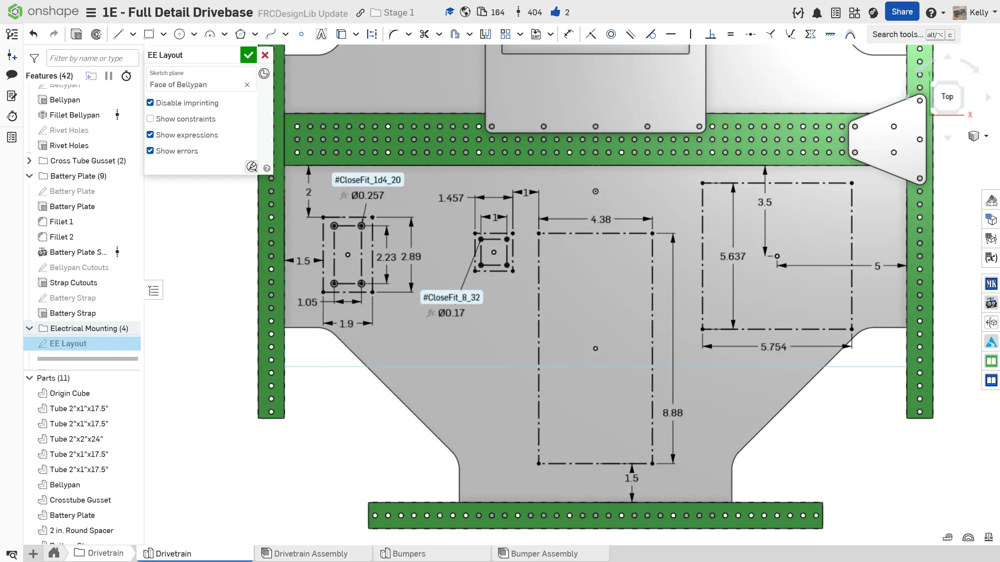

---
title: "练习 2：安装电子元件"
description: 在机器人上安装电子元件
---

## 练习 2：安装电子元件

在参考设计中，Power Distribution Hub (PDH)、主断路器和 RoboRIO 安装在底板上。[`Electronic Mounting` FeatureScript（自定义特征脚本）](https://cad.onshape.com/documents/95c00401c440b44ad8799ef5/w/1f1ebce01a3b8eb6fa102975/e/83cfa4ae1a46ea05581445c9 "Electronic Mounting FeatureScript Onshape 文档") 对生成电子元件安装孔非常有用。如果你无法精确加工电子元件安装孔，VHB 胶带（Kit of Parts 中会提供）也可以作为牢固固定电子元件的不错选择。

### 底板安装说明

**为你的底盘添加一些电子元件安装位。** 你可以参考下面的说明幻灯片获得灵感。

<Slides>
  
  完成后的电子元件安装。

  
  绘制 PDH 和 RoboRIO 的矩形外轮廓。同时添加主断路器以及你队伍所使用 IMU（Pigeon 2.0、Canandgyro 等）的外轮廓和孔位。这些尺寸可以在供应商网站的 PDF 文件中找到，也可以通过测量 FRCDesignLib 中的 CAD 模型获得。

  
  使用 `Electronic Mounting` FeatureScript 添加 PDH 和 RoboRIO 安装孔。可选：将 PDH 的孔径覆盖为 0.159"，如果实际加工时攻丝，就可以让安装螺栓直接拧入底板。

  
  从 FRCDesignLib 插入电子元件，并添加所有必要紧固件。PDH 使用 #10-32 螺钉，RoboRIO 使用 #4-40 螺钉，断路器使用 1/4-20 螺钉，Pigeon 2.0 使用 #6-32 螺钉，Canandgyro 使用 #8-32 螺钉。

</Slides>

<Aside type="tip" title="Tip（提示）：简化模型">
建议使用简化版电子元件模型来提升装配体性能。你可以在 [装配最佳实践页面](/best-practices/assembly-setup/ "装配最佳实践页面") 阅读更多关于简化模型的内容。简化版舵轮模块模型也可以用来减少卡顿。
</Aside>

### 机器人信号灯 (RSL)

每台机器人还必须安装 Robot Signal Light (RSL，机器人信号灯)。一个简单的安装位置是底盘框架侧面。通常只需要一个 RSL，并且它需要“站在距离机器人至少一侧 3 ft.（约 100 cm）处时容易看到”。务必查看最新版比赛手册，确认最新的 RSL 安装规则。

**为你的阶段 1D 底盘添加 RSL 安装位。** 你可以参考下图获得灵感。

<ContentFigure src="../img/1e/elec/elec-rsl.webp" width="50%" alt="由 1/8 英寸厚聚碳酸酯板制成的 RSL 安装件" border>由 1/8" 厚聚碳酸酯板制成的 RSL 安装件。经典 RSL 的安装孔直径为 1"。经典款和新款 RSL 模型都可以在 FRCDesignLib 中找到。</ContentFigure>

### 无线电

每台机器人也必须安装无线电。无线电应按照 Vivid Hosting 的 [无线电安装指南](https://frc-radio.vivid-hosting.net/getting-started/usage/mounting-your-radio "Vivid Hosting 无线电安装指南") 安装在机器人上。

<ContentFigure src="../img/1e/elec/elec-radio.webp" width="50%" alt="无线电安装" border />
