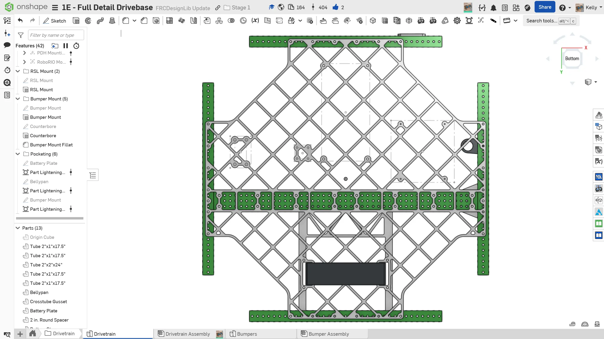
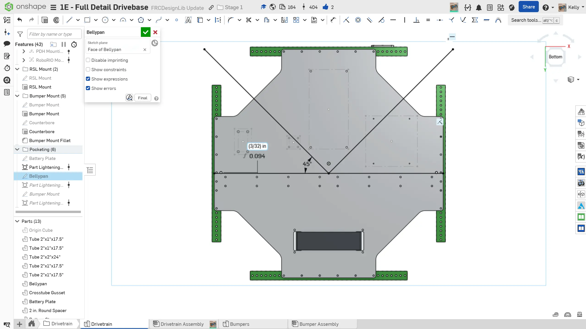
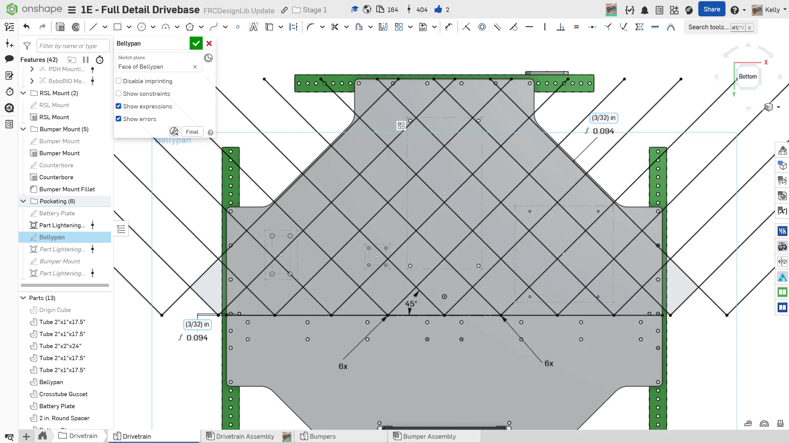
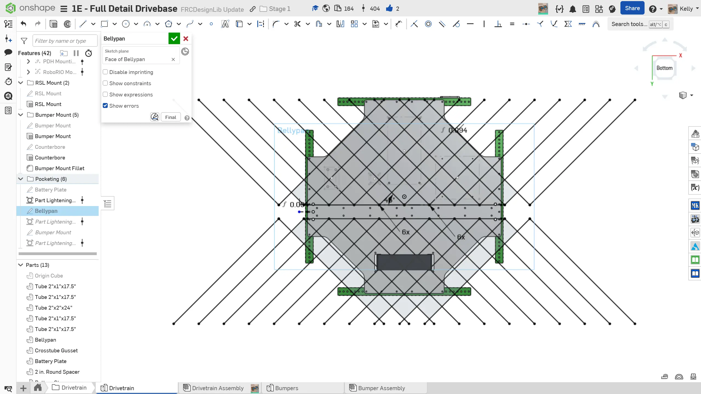

---
title: "练习 3：底板减重开槽"
description: 创建底板减重开槽
---

## 练习 3：底板减重开槽

有些队伍可能会选择对底板进行减重开槽，以减轻重量并让布线更方便。开槽后的底板大约可以减轻 3-4 lbs。不过，如果你们自己加工底板，这会显著增加加工时间；如果从加工服务商（例如 [Fabworks](https://fabworks.com/ "Fabworks 钣金加工服务")）购买底板，则可能增加成本。你应该和队伍一起仔细权衡这些取舍。

### 说明

**如果你选择为底盘底板进行减重开槽**，可以**按照幻灯片中的说明操作**，其中会使用 `Part Lighten` [FeatureScript](/zh/resources/featurescripts "FeatureScript 页面")。你也可以使用 `Vent` 或 `Part Lighten` [FeatureScript](/zh/resources/featurescripts "FeatureScript 页面") 来为底板开槽。不同 FeatureScript 的工作流程可能略有不同，但总体思路相同。推荐使用菱形图案，因为它强度较好，也更容易建模。

<Slides>
  
  已减重开槽的底板。

  
  绘制两条互相垂直、相对竖直方向偏转 45 度的线，以及一条相对横向方管边缘略微偏移的线。

  
  对这些斜线进行线性阵列，直到它们完全覆盖底板上半部分。这些线将形成主要加强筋。

  
  将上半部分加强筋镜像到底板下半部分。

  
  连接所有可能因安装孔离加强筋太远而形成的孤岛区域。视频展示了一种可行工作流程，让你在添加加强筋时也能看到减重特征的最终效果。

  
  使用减重开槽 FeatureScript 为底板开槽。推荐设置为 0.15" 宽加强筋和 3/16" 刀具半径。

</Slides>
