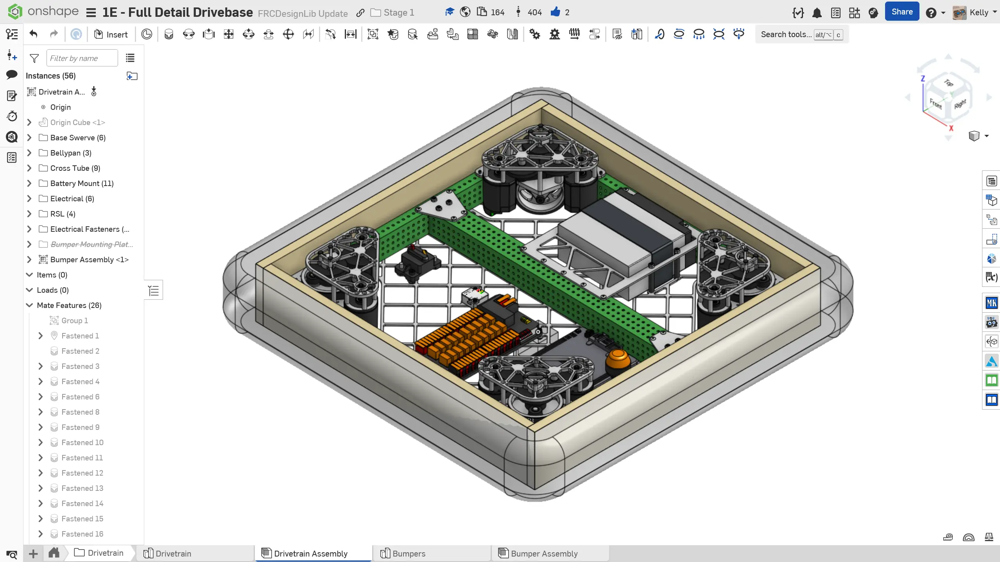
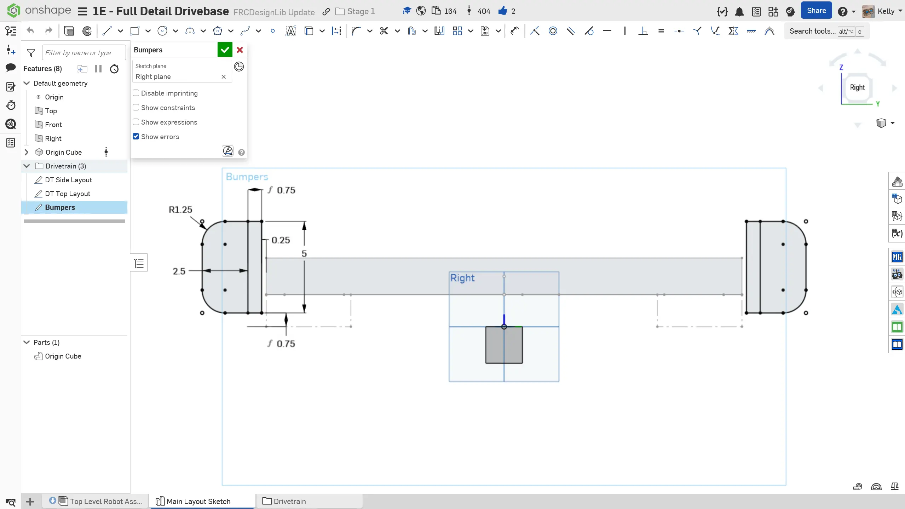
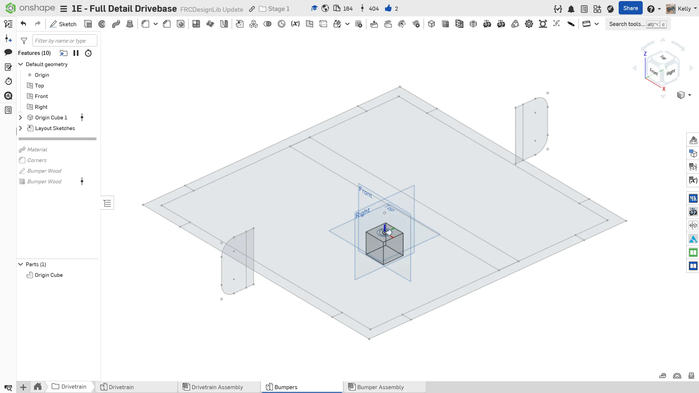
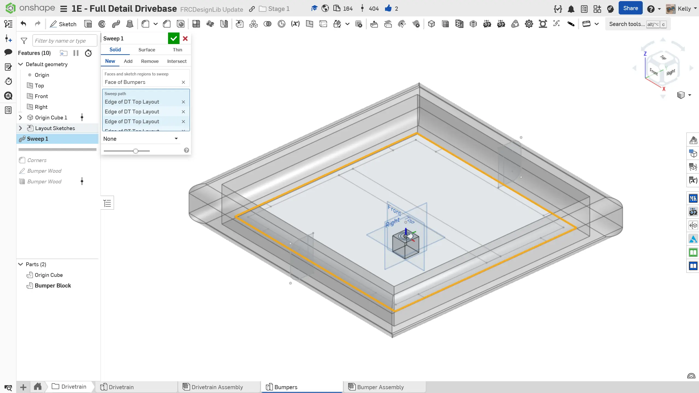
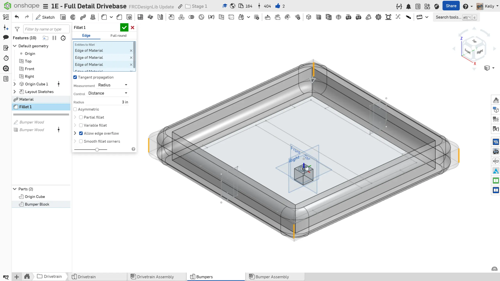
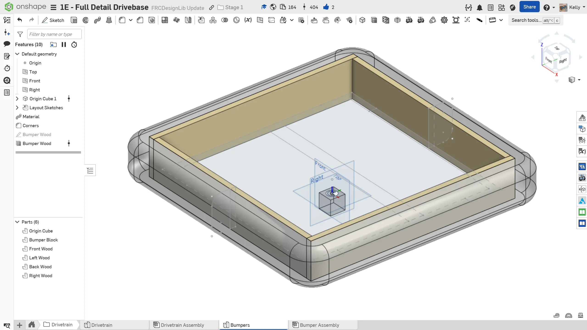
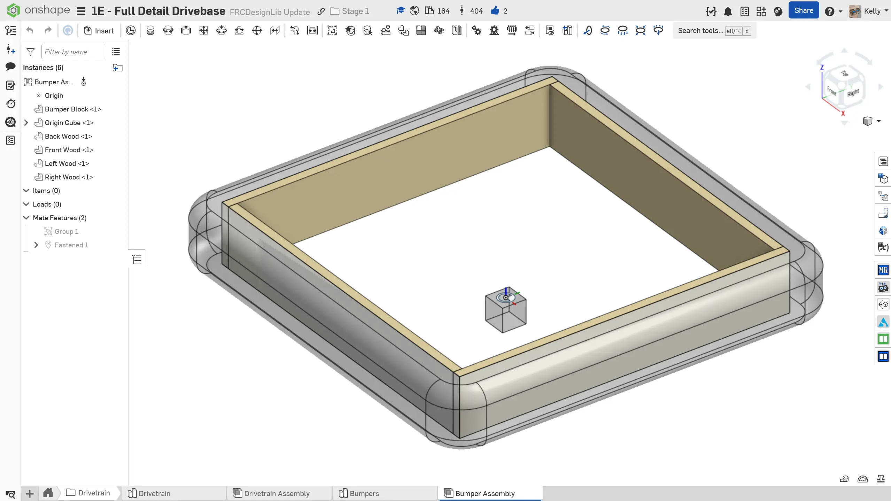

---
title: "练习 4：保险杠"
description: 建模保险杠
---

## 练习 4：保险杠
保险杠结构会在每年的 FRC 比赛手册中说明。过去，保险杠要求由两根直径 2.5" 的泡沫管和一块 5" 高、3/4" 厚的胶合板背板组成。请参考最新版比赛手册，确认最新的保险杠规则。保险杠缺口和离地间隙规则每年都可能不同。

### 保险杠模型
建议将保险杠放在新的 Part Studio（零件工作室）和 Assembly（装配体）中，以保持特征树和装配树整洁。最低细节层级应至少包含保险杠的块状模型。有些队伍可能会选择建模保险杠木板、木板孔位、木板角码以及其他细节，以辅助制造。你应该和队伍其他成员沟通，确定所需的细节层级。

### 说明

**为你的底盘添加保险杠。** 你可以参考下面的说明幻灯片获得灵感。

<Slides>
  
  完成后的保险杠装配体已插入底盘装配体。

  
  在 Main Layout Sketch 零件工作室中创建一个新草图，用于绘制保险杠轮廓。建议保险杠离地间隙为 3/4"，保险杠与框架之间留 1/4" 间隙。

  
  在底盘文件夹中为保险杠创建一个新的零件工作室。插入 Origin Cube，并从 Main Layout Sketch 派生底盘和保险杠草图。

  
  沿底盘顶部布局草图的边缘扫掠保险杠轮廓，创建保险杠块状模型。

  
  可选：在角部添加圆角。圆角尺寸应根据你们队伍包覆保险杠泡沫管的方式确定。

  
  可选：建模保险杠木板。这对制造可能很有帮助。

  
  在底盘文件夹中创建保险杠装配体，并插入所有组件。别忘了将所有组件组配合，并将 Origin Cube 的配合连接器配合到原点。

  
  将保险杠装配体插入底盘装配体。

</Slides>

将保险杠零件工作室和装配体与底盘分开，可以让底盘特征树更整洁；在顶层装配体中也更容易隐藏/显示保险杠，因为你可以一次性显示或隐藏整个保险杠装配体。
