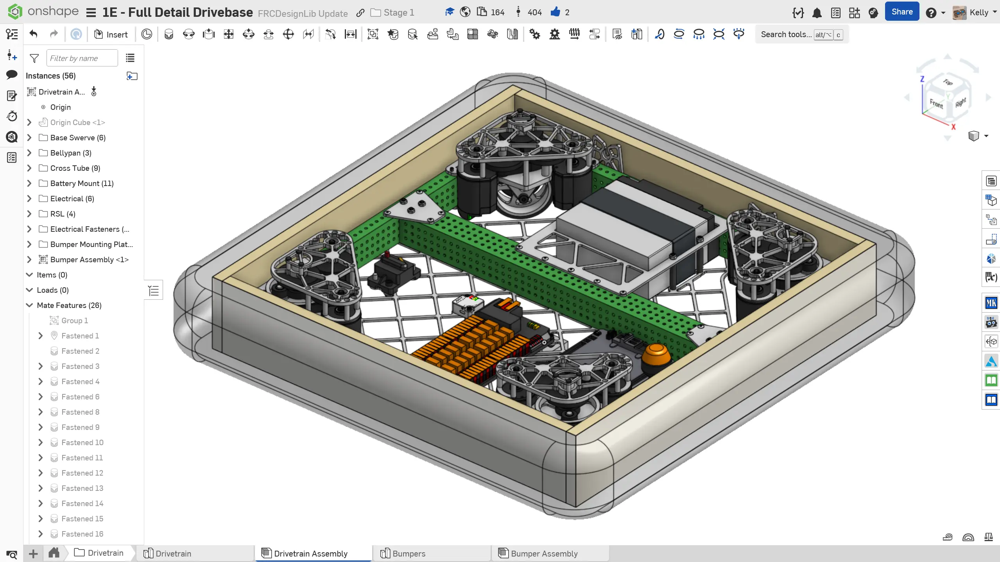
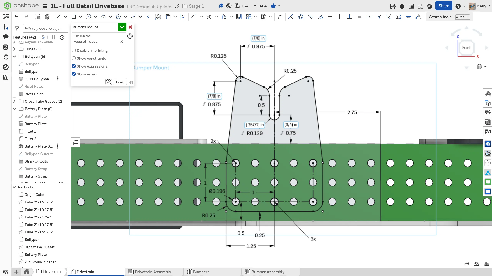
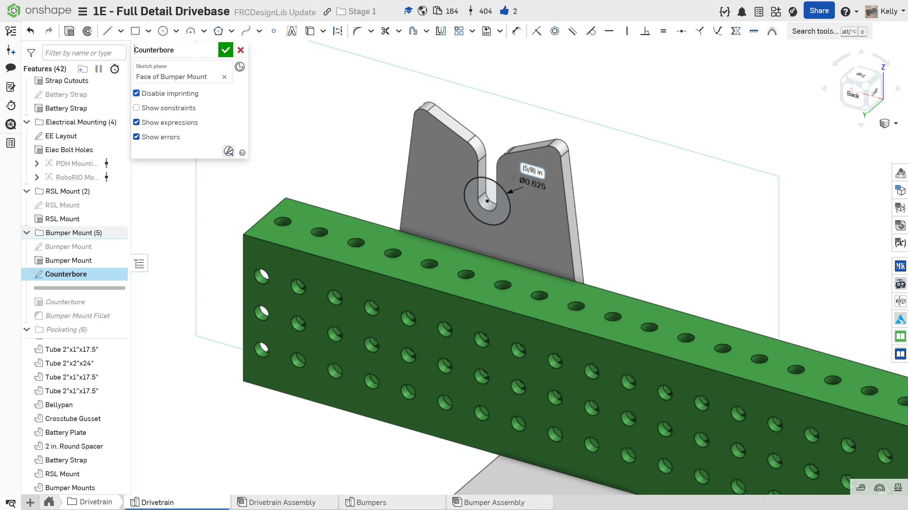
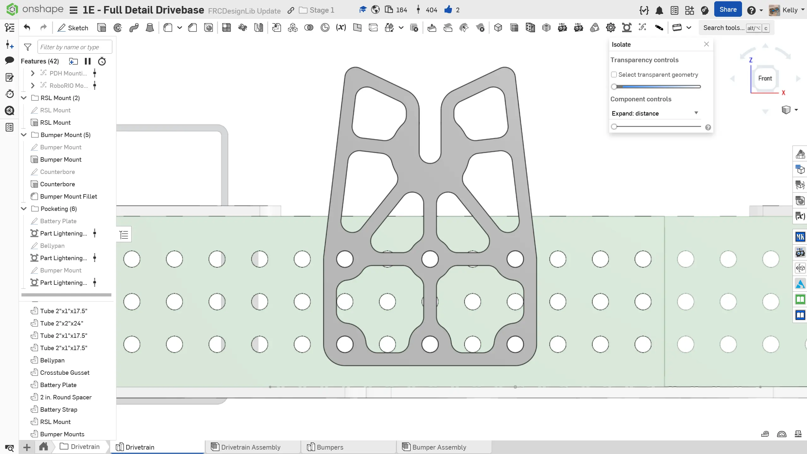
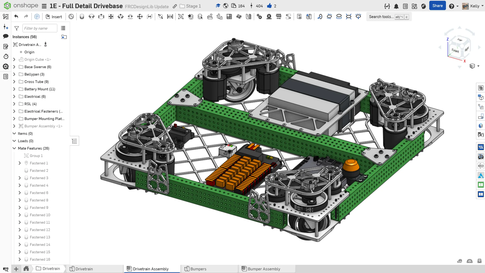

---
title: "练习 5：保险杠安装"
description: 在机器人上安装保险杠
---

## 练习 5：保险杠安装

和电池安装类似，可靠的保险杠安装也经常被忽视。虽然一个牢固的保险杠安装系统不一定能帮你赢下比赛，但糟糕的保险杠安装系统确实可能让你输掉比赛。保险杠安装不良可能导致 [保险杠损坏](https://youtu.be/9mawtTD6v7M?si=RyM0fE6GrR4QlMEU&t=78 "3647 保险杠损坏")、更长的保险杠更换时间，甚至可能让你的 [保险杠脱落](https://youtu.be/pBUKxWKGV-Q?si=hmJtt9N6C7vGLFpL&t=42 "保险杠脱落")。

在参考设计中，使用的是螺纹柱保险杠安装系统。

<Aside type="example" title="Example（示例）：螺纹柱保险杠安装系统">
<ContentFigure src="../img/1e/bumper-mount/stud-mount.webp" alt="螺纹柱保险杠安装系统剖视图" width="40%">螺纹柱保险杠安装系统剖视图。螺纹柱连接到保险杠木板上，螺母将保险杠牢牢压紧在框架上。</ContentFigure>
</Aside>

### 说明

**为你的底盘添加所需的保险杠安装件。** 你可以参考下面的说明幻灯片获得灵感。

<Slides>
  
  完成后的保险杠安装件。

  
  建模保险杠安装件。这个零件应使用 3/16" 厚铝板。螺纹柱会落入槽中。

  
  为拧在螺纹柱上的螺母添加凹槽。这个螺母会让保险杠紧贴框架。凹槽用于固定螺母，并防止保险杠向上抬起。

  
  对安装件添加圆角，并可选进行减重开槽。建议使用 0.15" 宽加强筋和 1/8" 刀具半径。

  
  插入安装件并将其添加到 `Group` 中。再复制三个安装件，并将它们配合到底盘装配体上。如果你的队伍使用多段式保险杠（例如两个 C 形保险杠），可能需要添加更多安装件来固定保险杠。

  
  底盘装配体中完成后的保险杠安装件。

</Slides>
