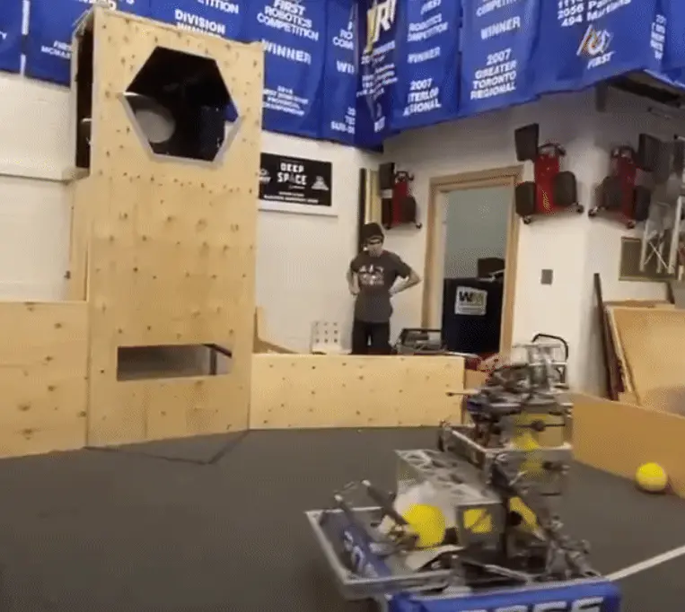
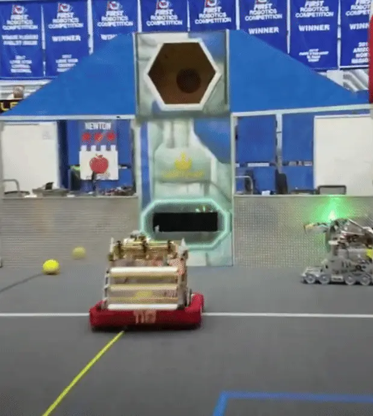

---
title: 出射速度
description: 理解发射机构中的出射速度
---

## 出射速度

### 表面速度

比赛物体的出射速度主要由飞轮的表面速度控制。表面速度由轮子的每分钟转速（RPM）和直径决定。增大直径通常更高效，因为它可以用更低的 RPM 达到相同的表面速度。常见选择是直径 4 英寸的轮子。在所有变量中，RPM 以及可选的发射角度，是软件中唯一可以控制的因素。

对于飞轮发射机构，通常会使用两个 CIM 级别的无刷电机。

### 转动惯量

一次只发射一个比赛物体时，常见的飞轮轮子选择包括 Stealth 轮、Colson 轮和实心滚轮。这些选项既能储存足够能量以实现稳定发射，也具有较好的耐用性。应避免使用柔性轮或包胶胎面轮，因为它们在高速下容易膨胀或失效，导致性能不稳定。

每次发射比赛物体时，比赛物体会被加速到接近轮子的速度，飞轮则会损失能量并减速。当连续发射多个比赛物体时，这可能导致两次发射之间出现延迟。增加飞轮质量可以提高其 [转动惯量](https://en.wikipedia.org/wiki/Moment_of_inertia)，从而减少每次发射造成的能量损失，缩短两发之间的恢复时间。代价是初始加速到目标速度所需的时间会更长。

<Slides>
  
  2056 队通过使用高转动惯量发射轮实现快速连续发射

  
  118 队通过使用高转动惯量发射轮实现快速连续发射
</Slides>

通过合理降低电机输出转速，或增加额外电机，可以改善加速时间和恢复时间。

### 参考设计

在参考设计中使用了两个 Kraken X60 电机，不过任何 CIM 级别的无刷电机都可以满足需求。

<ContentFigure src="../img/2a/motorsAndFlywheels.webp" alt="两个 Kraken 电机驱动发射机构" width="40%"/>

### 飞轮计算器

用于确定最佳传动比的一个实用工具是 [ReCalc 飞轮计算器](https://www.reca.lc/flywheel)。这个工具会根据输入参数计算加速时间、恢复时间和估算弹丸速度。你可以调整发射机构目标 RPM、传动比和飞轮质量来优化性能，同时确保在这个游戏中弹丸速度保持在 12 m/s 以上。对于这个发射机构设计，[相关计算](https://www.reca.lc/flywheel?currentLimit=%7B%22s%22%3A40%2C%22u%22%3A%22A%22%7D&efficiency=90&flywheelMomentOfInertia=%7B%22s%22%3A24.688%2C%22u%22%3A%22in2%2Albs%22%7D&flywheelRadius=%7B%22s%22%3A4%2C%22u%22%3A%22in%22%7D&flywheelRatio=%7B%22magnitude%22%3A1%2C%22ratioType%22%3A%22Reduction%22%7D&flywheelWeight=%7B%22s%22%3A3.086%2C%22u%22%3A%22lbs%22%7D&motor=%7B%22quantity%22%3A2%2C%22name%22%3A%22Kraken%20X60%2A%22%7D&motorRatio=%7B%22magnitude%22%3A1.33333%2C%22ratioType%22%3A%22Reduction%22%7D&projectileRadius=%7B%22s%22%3A2%2C%22u%22%3A%22in%22%7D&projectileWeight=%7B%22s%22%3A5%2C%22u%22%3A%22oz%22%7D&shooterMomentOfInertia=%7B%22s%22%3A16.056%2C%22u%22%3A%22in2%2Albs%22%7D&shooterRadius=%7B%22s%22%3A4%2C%22u%22%3A%22in%22%7D&shooterTargetSpeed=%7B%22s%22%3A3000%2C%22u%22%3A%22rpm%22%7D&shooterWeight=%7B%22s%22%3A2.007%2C%22u%22%3A%22lbs%22%7D&useCustomFlywheelMoi=0&useCustomShooterMoi=0) 使用 ReCalc 完成，最终选择为 4 英寸发射轮采用 4:3 减速传动，并使用两个 4 英寸黄铜飞轮。

<Aside type="note" title="Note（备注）">
由于同步带效率高且维护需求低，减速传动或增速传动应优先使用同步带完成。在飞轮上使用大于 24 齿的带轮，并确保足够的啮合齿数，以最大化能量传递并防止跳齿。
</Aside>
