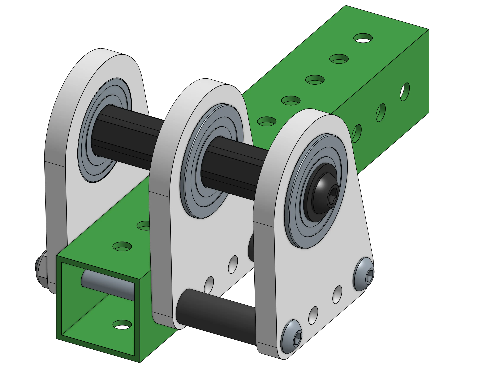
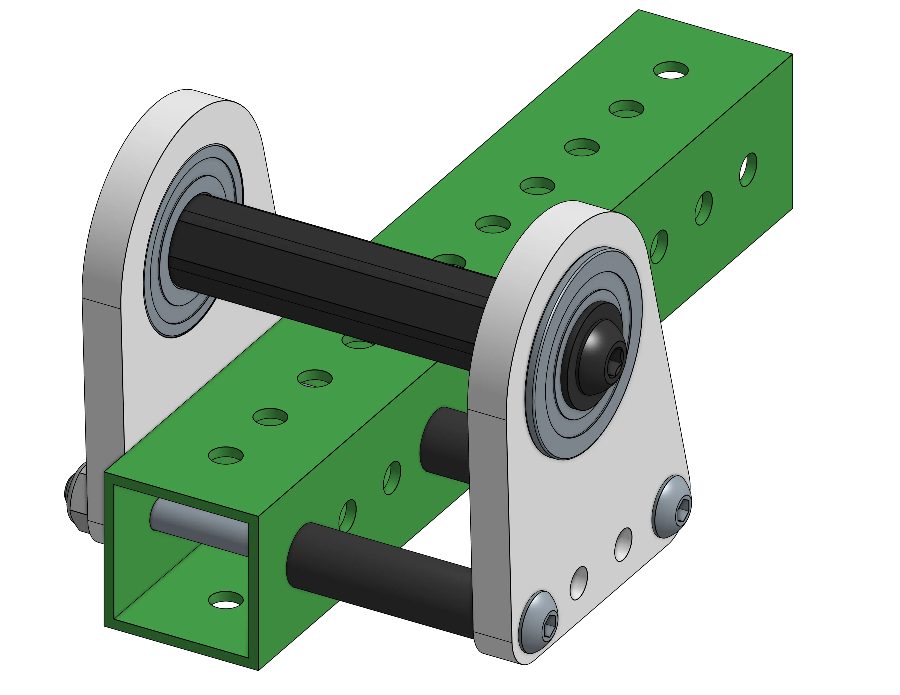

---
title: 摩擦与效率
description: 理解发射机构中的摩擦与效率
---

## 摩擦与效率

摩擦会把能量转化为热量，并给电机增加不必要的负载，从而降低效率。过大的摩擦可能会让飞轮无法达到目标速度，造成发射不稳定，还可能导致电机过热或损坏。

### 减小摩擦

以下做法都可以帮助减小摩擦。

#### 同步带张紧
通过略微缩短中心距（0.01-0.02"）来稍微降低同步带张力，可以提高效率。

#### 隔套
在轴上零件和轴承之间使用隔套。零件不应接触轴承外圈，以避免摩擦。

<ContentFigure src="../img/2a/hexspacers.webp" alt="COTS 1/2 六角 Delrin 隔套" width="40%"/>

#### 轴支撑
不要使用超过 2 个固定轴承点来支撑一根轴，避免过约束。即使很小的未对齐，也可能在轴承处造成很大的摩擦。

<Aside type="example" title="Example（示例）">
<Slides>
  
  轴中间有一个固定轴承，导致轴被过约束的示例。

  
  使用两个固定轴承正确约束轴的示例。
</Slides>
</Aside>

#### 弯曲的轴
弯曲的轴会降低效率。避免过长悬臂，并确保轴承正确对齐，可以防止轴弯曲。让带轮尽量靠近轴承。

#### 公差累积
尽量减少公差累积。公差累积通常发生在多个零件相互连接时，并可能引入摩擦。可以通过提高加工精度或减少连接数量来改善。一般来说，最好让同步带传动保持在同一块板件上。在这个设计中，轴承孔和中心距都由同一块加工板件决定，有助于减少公差累积。

#### 更大的轮子
更大的发射轮意味着在相同表面速度下所需 RPM 更低，这会降低整个系统中的摩擦。此外，让电机通过减速传动工作，并避免长时间接近最高转速运行，也对电机更好。

#### 最后手段
如果有必要，可以给发射机构再加一个电机。如果摩擦稍微偏大，而你又需要一个不需要太多调整就能工作的方案，这是最简单的处理方式。

<Aside type="note" title="Note（备注）">
这些减小摩擦的建议适用于所有动力传动系统。
</Aside>
