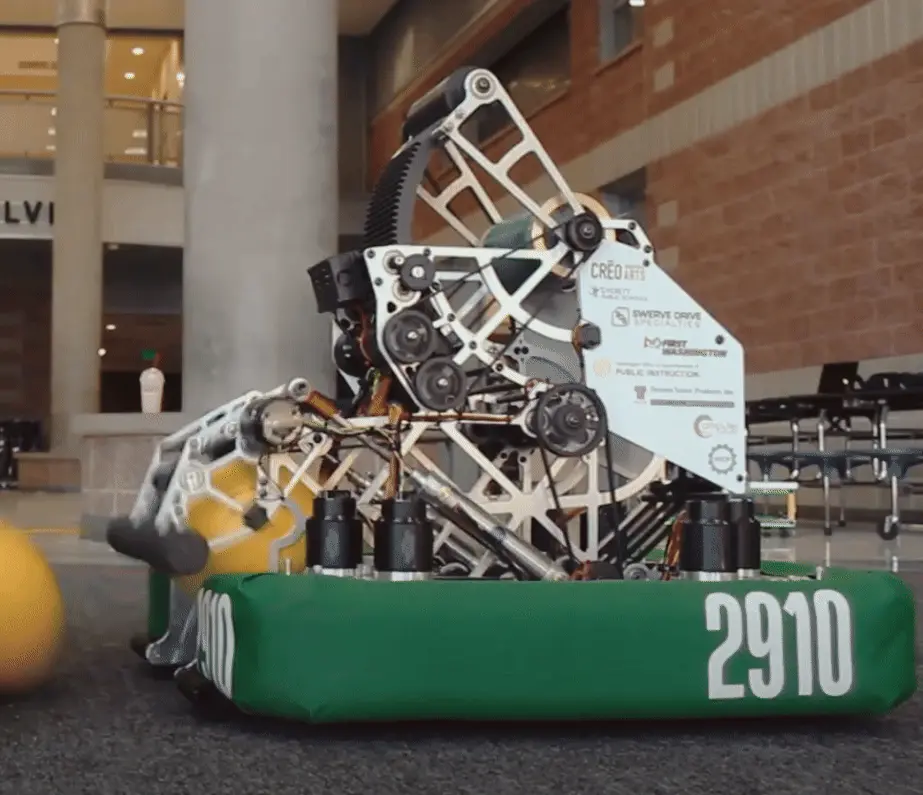
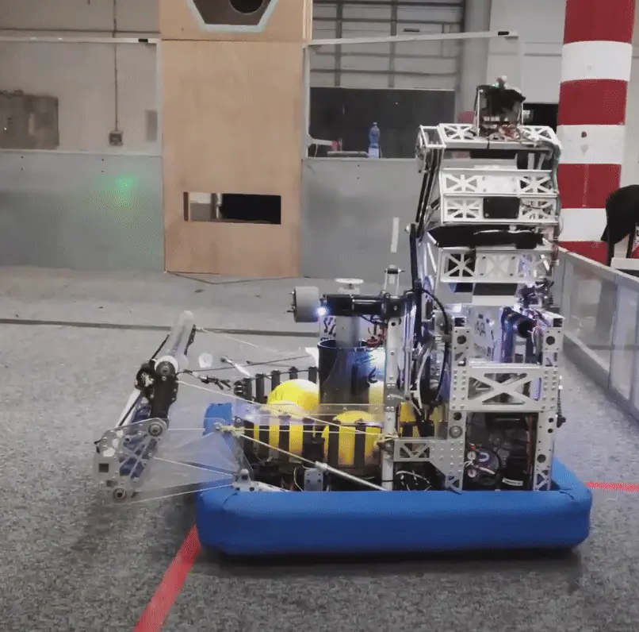
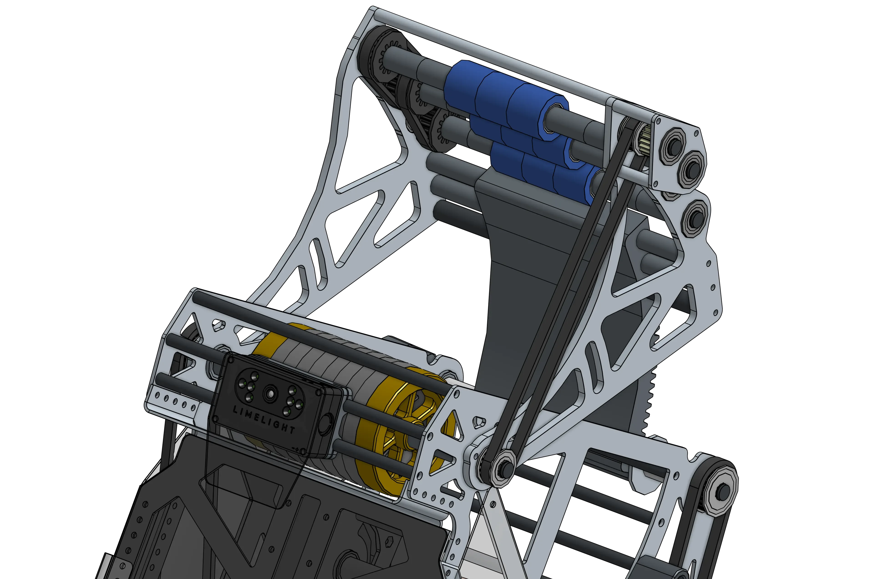
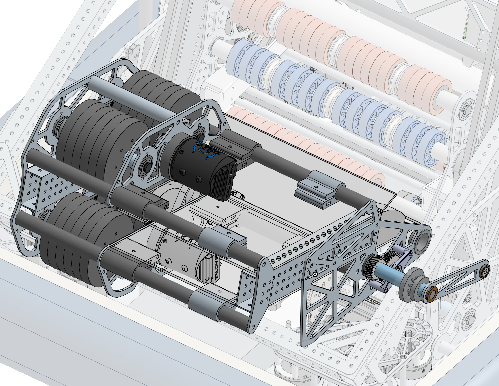

---
title: 基础发射机构介绍
description: 基础发射机构设计入门
---

欢迎来到阶段 2！这一部分将介绍 FRC 机构设计，重点包括 CAD 技能、最佳实践和关键工程概念。每个项目指南都会解释设计决策和判断标准，并减少逐步操作说明，帮助你逐渐独立完成 CAD 建模。

## 发射机构

在 FRC 比赛中，如果需要向高处得分，但机器人又不能直接伸到得分位置，通常会使用发射机构。飞轮是最常见的得分方式，如下所示。

虽然大多数发射类比赛都是发射球体，但球类发射机构和非球形物体（圆盘或圆环）发射机构的基本原理大致相同。

<Slides>
  
  FRC 2910 队 2021 年机器人发射比赛物体

  
  FRC 1690 队 2021 年机器人发射比赛物体
</Slides>

### 飞轮发射机构

发射比赛物体最常见的方式是使用飞轮发射机构。其他方式（例如投石机式结构或冲击式机构）通常更难达到所需的精度和发射频率，而且依赖的概念也不同于飞轮发射机构。

<Slides>
  
  1678 队 2022 年飞轮发射机构 - 发射直径 9.5" 的充气球

  
  1678 队 2024 年飞轮发射机构 - 发射直径 14" 的泡沫圆环
</Slides>

[这个视频](https://youtu.be/QZKDnRvLhrA) 以慢动作很好地展示了球如何从发射机构中被推出。

更多发射机构示例和深入解析可以在 [球类发射机构页面](/mechanism-examples/shooter/) 找到。等发射机构设计页面完成后，设计手册中也会提供更深入的讲解。
