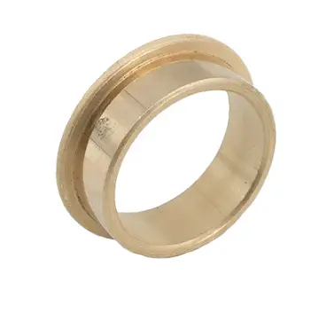
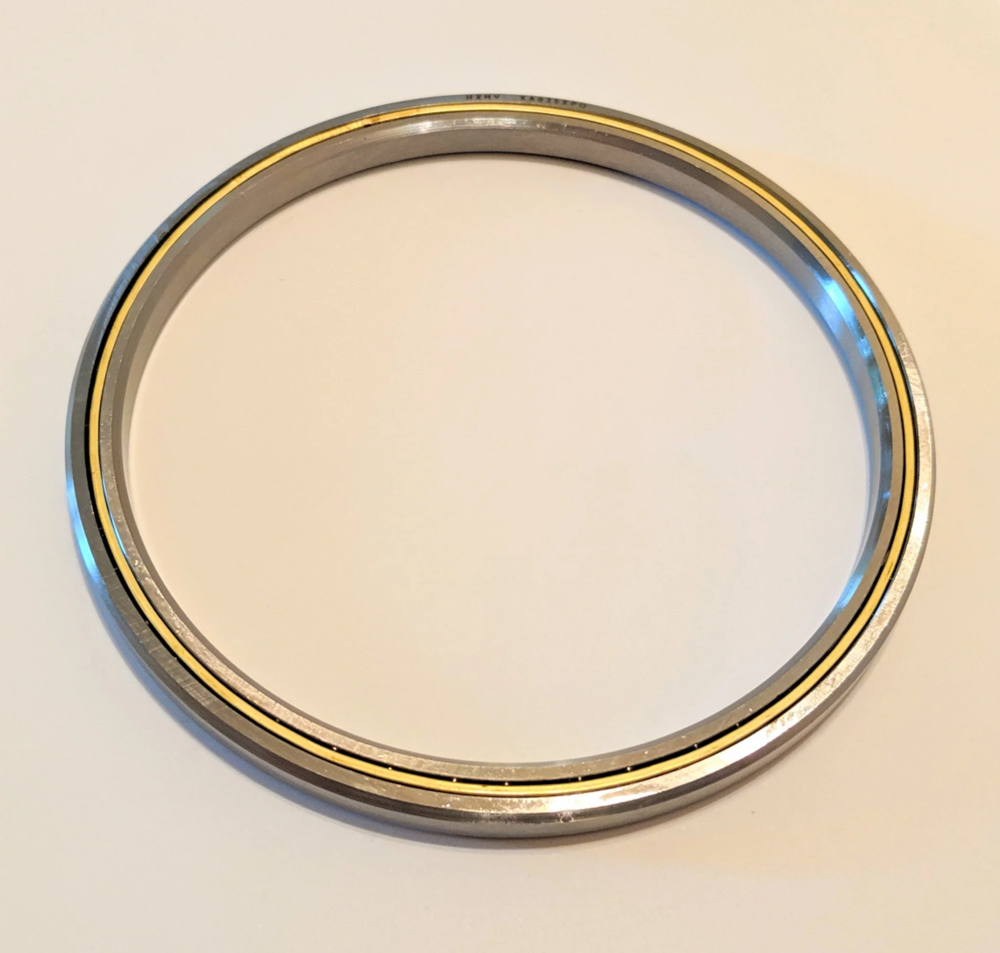

---
title: 摩擦
description: 理解转轴机构中的摩擦
---

## 摩擦

由于机构围绕轴旋转，因此必须尽量减小摩擦。可以使用衬套或轴承来实现这一点。衬套能够在较低转速下承受更高载荷，而轴承更适合较高转速和较低载荷；不过，大型死轴也可以使用尺寸更大的轴承。

<Slides>
  
  台阶衬套

  
  有时用于大型死轴的大型 X 接触轴承
</Slides>

### 参考设计

这个参考设计在转轴处使用内径 7/8"、外径 1.125" 的衬套。该设计需要承受较高载荷，因此选择 7/8" 管材作为转轴。它较大的外径使其强度高于 1/2" 六角轴或 3/4" 管材，同时又比挤压花键轴占用更小空间。衬套的外径为 1.125"，因此能够适配大多数 COTS 板式链轮上的 1.125" 轴孔。
