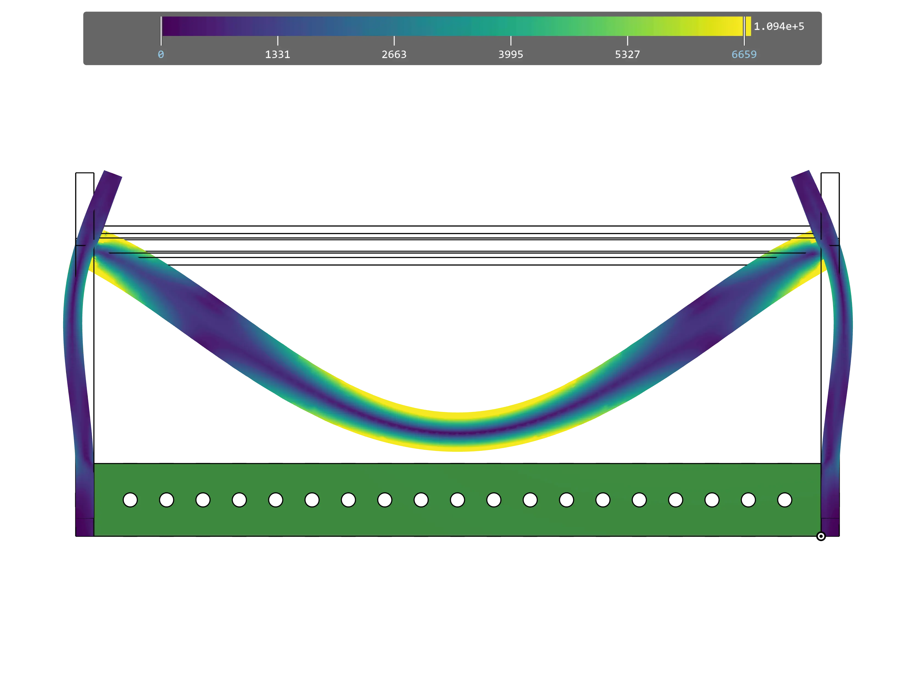
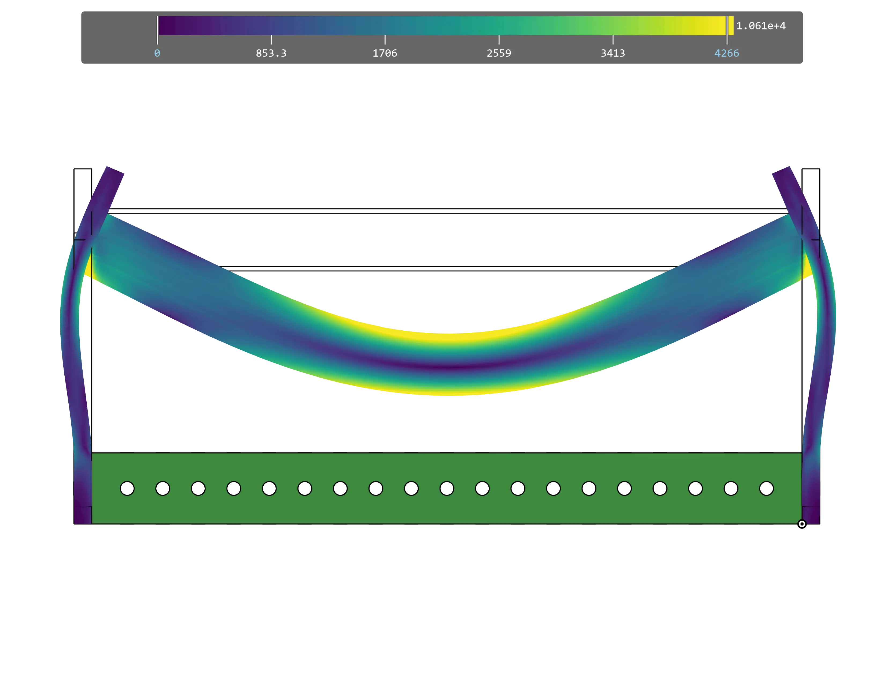
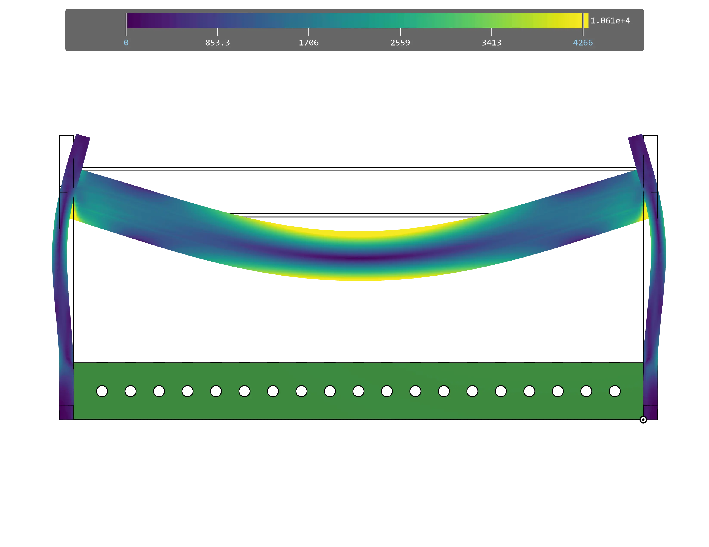
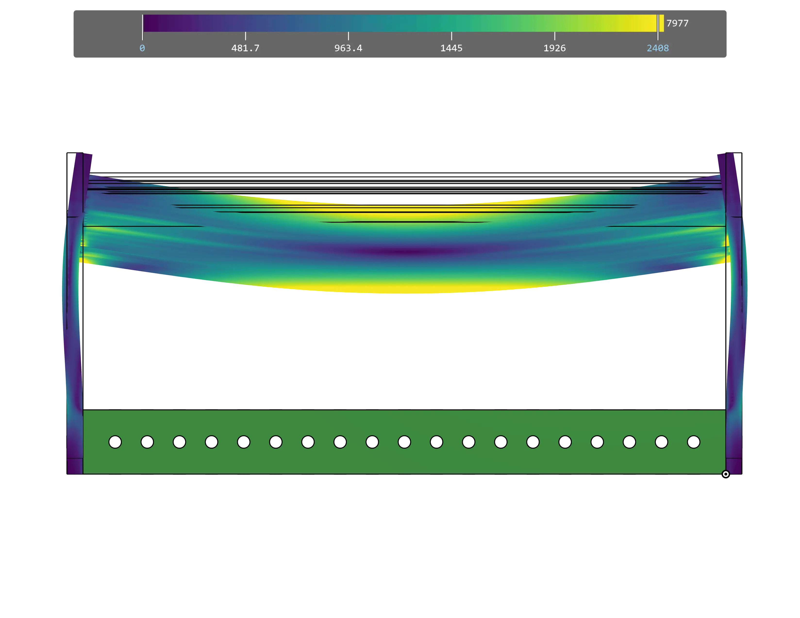
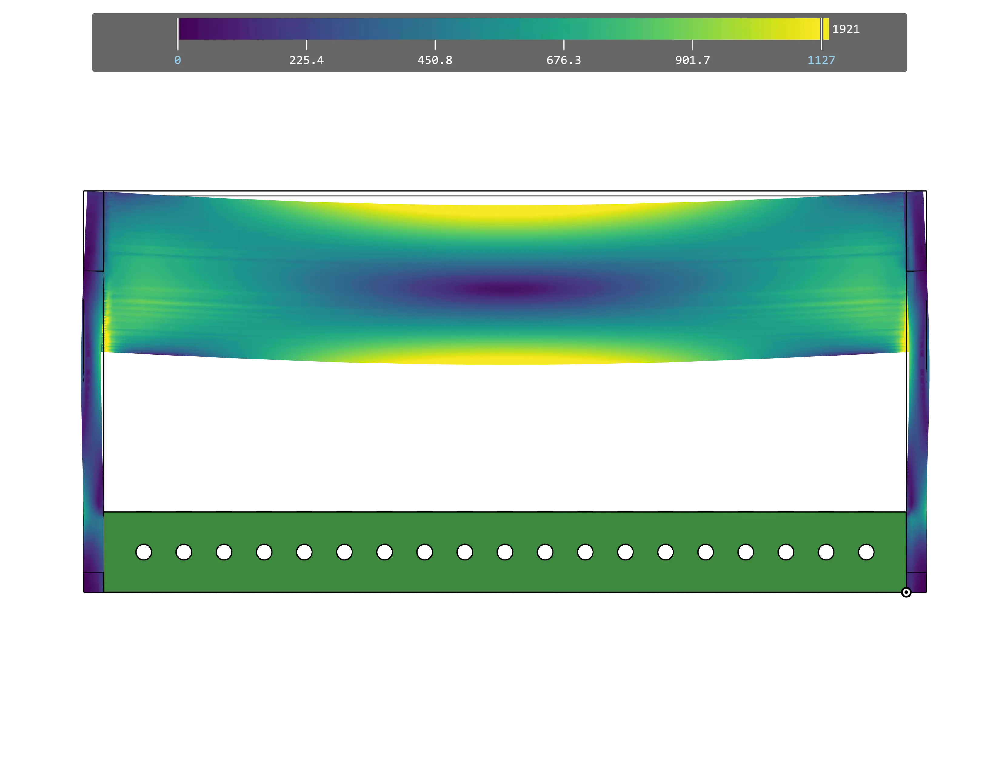

---
title: 强度
description: 理解转轴机构中的强度
---

## 强度

评估转轴机构强度时，主要需要考虑刚性（抵抗弯曲的能力）和抗扭能力。死轴不负责传递动力，并且可以紧固到其余结构上，因此通常能比活轴提供更好的结构强度。

直径较大的圆管（例如 3/4" 和 7/8"）具有更好的强度重量比和抗扭能力，因此通常优于 1/2" 六角轴。选择 3/4" 和 7/8" 管径的主要原因，是这些尺寸有外径 1.125" 的衬套可用，因此可以适配几乎所有 COTS（现成商业零件）链轮。在某些低负载应用中，也可以使用活轴。

<Aside type="tip" title="Tip（提示）">
点击浏览幻灯片，观察每种轴在相同载荷下的弯曲程度。**变形量被放大了 100 倍**。
</Aside>

<Slides>
  
  1/2" 六角轴

  
  3/4" 管材

  
  7/8" 管材

  
  SplineXL

  
  2" 管材
</Slides>

### 参考设计

参考设计使用外径 7/8" 的圆管作为机械臂转轴，在强度和尺寸之间取得了良好平衡。
