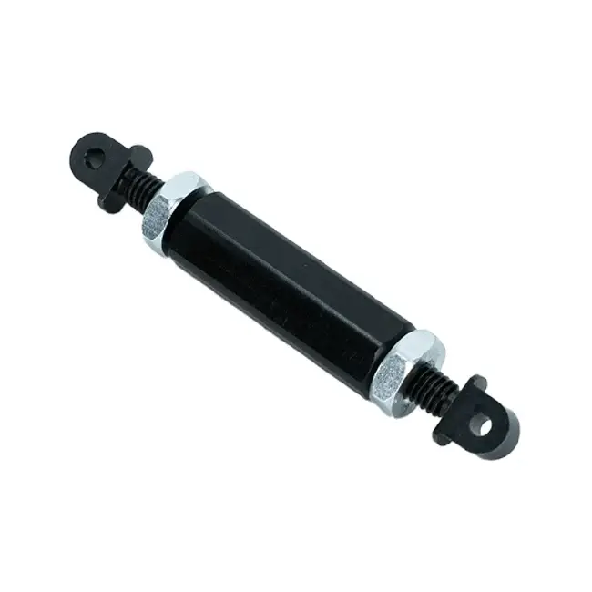
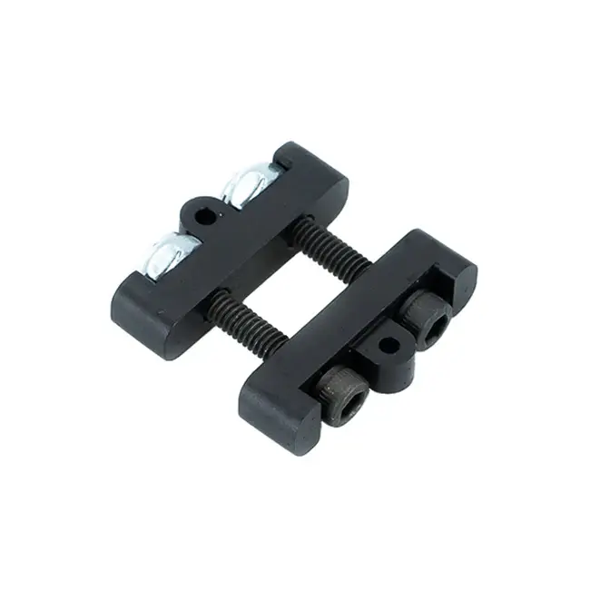

---
title: 张紧
description: 转轴机构中的张紧
---

## 张紧

为了补偿整个赛季中链条的伸长并减小回程间隙，需要使用主动张紧系统。如果链条长度足够，花篮螺栓和 Spartan 张紧器等**直列式张紧器**是最简单的链条张紧方式。

如果没有足够空间放置直列式张紧器（链条移动过多时，张紧器可能会碰到任一链轮），可以采用其他方法，例如通过可滑动或可旋转的齿轮箱或级段来移动其中一个链轮的位置。

<ContentFigure src="../img/2b/chaintensioncut.webp" gif width="60%" alt="带花篮螺栓张紧器的链条和链轮">使用花篮螺栓张紧器运动的链条和链轮。花篮螺栓位于链条下半段。</ContentFigure>

<Slides>
  
  花篮螺栓张紧器

  
  Spartan 张紧器
</Slides>

### 参考设计

这个设计预留了足够的链条长度，因此简单的直列式 Spartan 张紧器就能良好工作。
