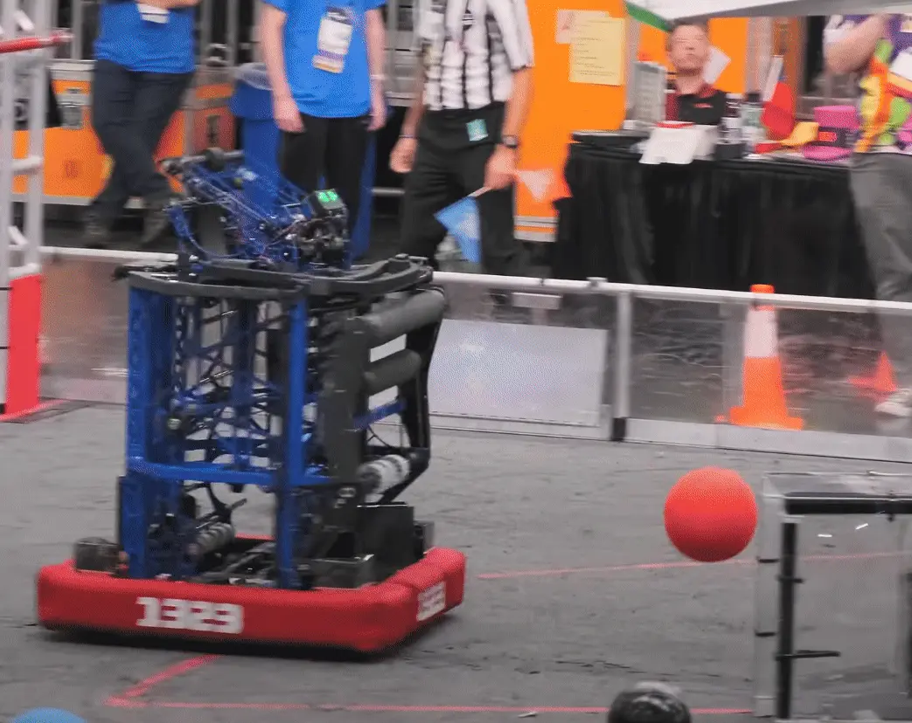

---
title: 下翻式拾取机构介绍
description: 下翻式拾取机构项目入门
---

## 越过保险杠式拾取机构

FRC 中常见的一种比赛物体拾取机构形式（具体取决于伸展规则）是 Over-the-Bumper（OTB，越过保险杠）拾取机构。这类机构从地面拾取比赛物体，让其贴近并越过保险杠，进入另一个子系统。它们常见于 2019、2020、2022、2023 和 2024 年等往届比赛。

### 下翻式拾取机构

OTB 拾取机构主要有两种类型。一种是“下翻式”，由一组带滚轮的机械臂组成，可以向下翻出并再次收回；另一种是四连杆机构，它能让拾取机构以更接近水平而非竖直的姿态收纳。本阶段将设计一个适用于 2022 年比赛的下翻式拾取机构（灵感来自 4414 HighTide 队 2023 年的下翻式拾取机构）。

<Slides>
  
  1323 队 2022 年下翻式拾取机构运行中

  
  1678 队 2022 年四连杆拾取机构运行中
</Slides>

[1323 队 2022 年拾取机构的比赛录像](https://www.youtube.com/watch?v=pSQX5c7G8yg) 展示了一个执行良好的下翻式拾取机构。

更多 OTB 拾取机构示例和深入解析，可以在 [下翻式拾取机构页面](/mechanism-examples/intake/slapdown/) 和 [四连杆拾取机构页面](/mechanism-examples/intake/linkage/) 找到。机构基础页面尚未完成，但完成后也会是一项很有帮助的资源。
