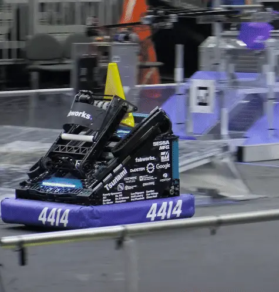

---
title: 级联升降机构介绍
description: 级联升降机构项目入门
---

## 升降机构

升降机构在 FRC 中十分常见，用于以紧凑的直线运动方式移动其他机构。它通常用于让机构到达更高位置、伸出框架外周较远距离，甚至攀爬场地元素。升降机构通常根据其“绕绳方式”分类。升降机构的绕绳系统让电机能够把运动传递到各个级段。FRC 升降机构通常采用“级联式”或“连续式”绕绳。

<Slides>
  
  2468 队的级联升降机构

  
  4414 队的连续式升降机构
</Slides>

观看以下比赛视频，了解 [2468 队 2023 年机器人上的级联绕绳升降机构](https://www.youtube.com/watch?v=RAFjZgB_72w) 和 [4414 队 2023 年机器人上的连续绕绳升降机构](https://youtu.be/PKPuqpe1Wlg) 如何运行。

### 使用 COTS 零件

典型升降机构需要购买或加工大量自定义金属零件，因此可能超出加工能力较弱队伍的能力范围。不过，一旦了解其工作原理并完成过设计，你也许就能用较少的加工能力和时间制造一个升降机构。由于级联绕绳升降机构有较多 COTS（现成商业零件）可用，且所需加工较少，本项目将重点介绍级联绕绳升降机构，而不是连续绕绳升降机构。

### 级联升降机构

级联升降机构的特点在于各级段的运动方式。在级联绕绳系统中，每个升降级段相对于其上一级段移动相同距离。

<ContentFigure src="../img/2d/cascade.webp" gif alt="级联运动">级联运动</ContentFigure>

### 对比

| **类别** | **级联绕绳** | **连续绕绳** |
|--------------|---------------------|------------------------|
| 级段数量 | 可以制作超过 3 级的级联升降机构，但绕绳设计会变得更困难，尤其是在宽度受限时。 | 添加额外级段相对简单 |
| 级段运动顺序 | 由于所有级段同时运动，与连续绕绳相比，升降机构处于中等伸展范围时重心会更高。 | 级段根据级段间摩擦和移动各级段所需的力依次上升。如果结构正确，内侧级段应先移动。 |
| COTS | 有许多绳索绕设零件可供选择。 | 可用的绳索绕设零件较少。 |
| 齿轮箱（末端执行器速度和作用力相同时） | 可以利用作用力高于最终级段的中间级段完成攀爬等任务（参见 [2056 队 2018 年机器人](https://www.youtube.com/watch?v=47A83OfzYDw)）。 | 所需减速比较小，但需要换挡齿轮箱来提供高速和高作用力两种模式。 |
| 穿透式通道 | 可以通过移动绕绳系统的位置实现。 | 可以通过移动绕绳系统的位置实现。根据级段运动顺序的调校效果，中间级段的位置可能无法确定。 |
