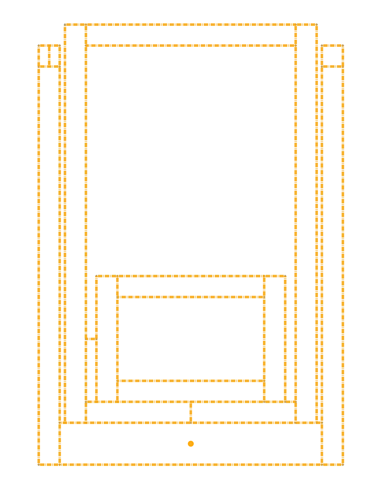
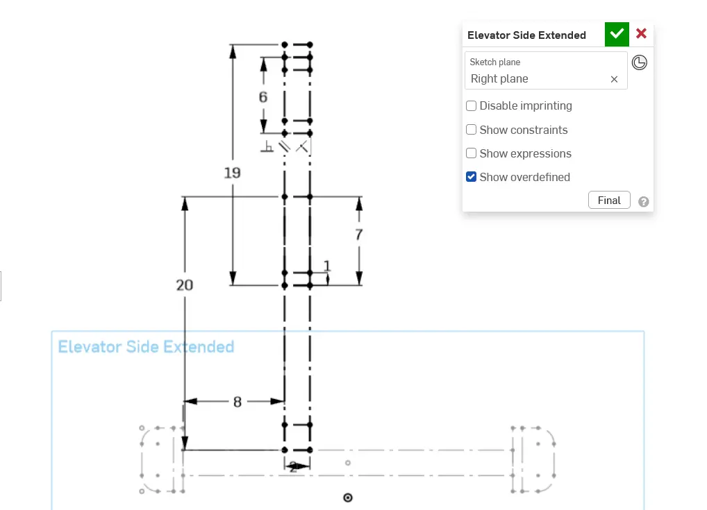
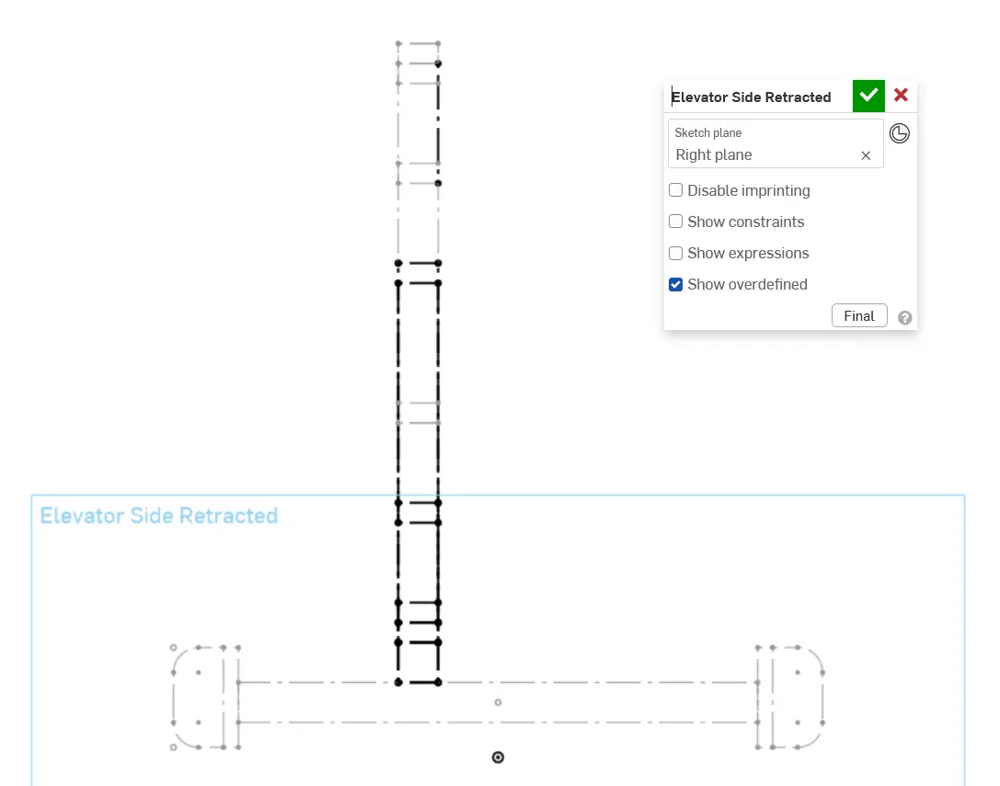
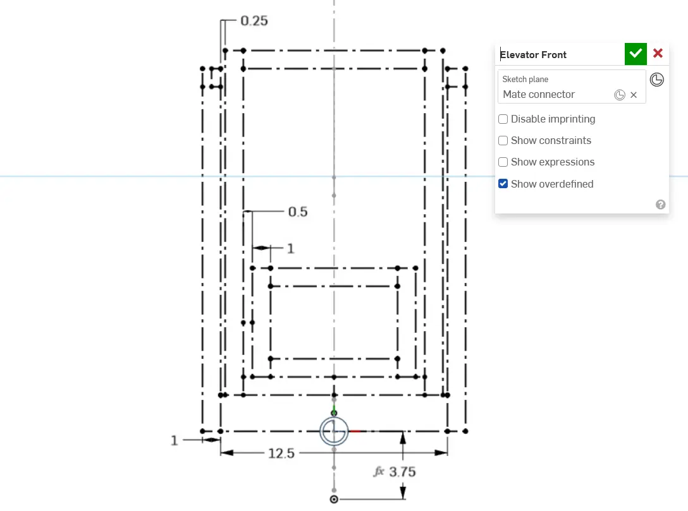

---
title: 布局草图
description: 为升降机构创建布局草图
---

## 布局草图

升降机构的主布局草图通常从完全伸展的侧视图开始，这样就可以根据伸展限制，以及被移动机构所需的起始和终止位置来确定升降机构长度。

虽然这个升降机构没有具体应用背景，但仍值得遵循从侧视草图开始的相同工作流程。侧视草图会包含大部分重要尺寸，尽管一开始可能较难建立空间概念。

按照幻灯片中的说明创建升降机构布局草图。

<Slides>
  
  升降机构方管正视草图的清晰视图。

  
  为阶段 3 做准备，我们先根据底盘侧视草图定义升降机构的位置。使用矩形表示 2x2 方管和各级段长度，再添加矩形表示各级段和滑台的底部方管。

  
  你也可以创建收回状态侧视草图（将其约束到第一个侧视草图的几何），帮助复核几何和集成情况。这在设计完整机器人时尤其有用。

  
  现在添加正视草图，定义所有升降机构方管、升降机构宽度，以及侧面各级段之间的距离。
</Slides>

<Aside type="tip" title="Tip（提示）">
除了创建“伸展”和“收回”视图，也可以将各级段分别放入独立侧视草图，从而在草图中“演示”它们的运动。你可以使用配置实现这一点。
</Aside>
