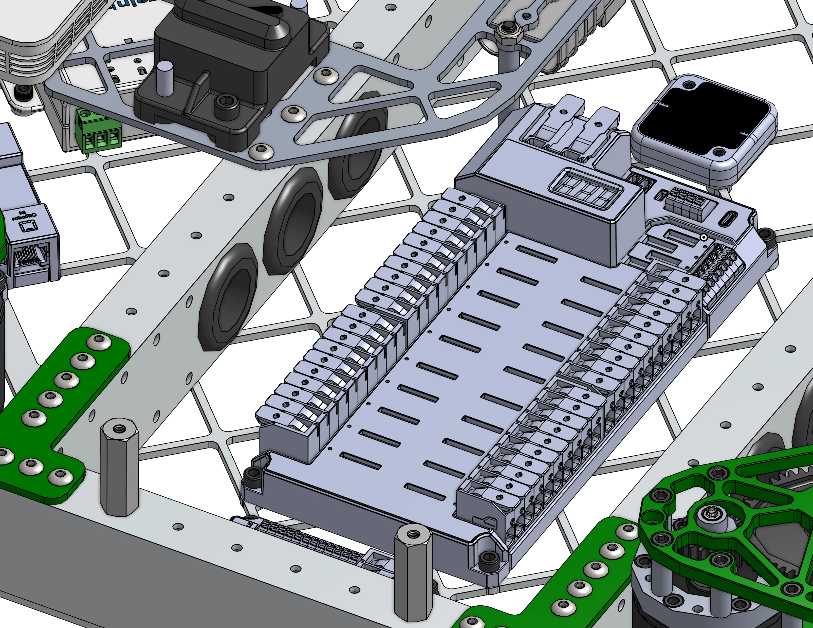
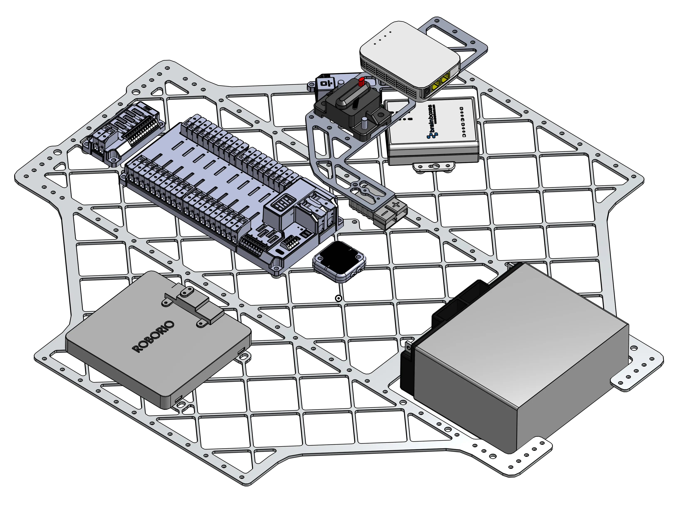

---
title: 2910 Charged Up 舵轮底盘
description: 横向方管配有穿线护圈的舵轮底盘
socialCard:
  image: ./img/2910/2910_2023_dt.webp
---

<a href="https://cad.onshape.com/documents/cd06c24a1f9c6c76ba35c8b1/w/a16c3bc2858ebe73ed66d141/e/fb73561fc4c787b4c7e5d9d3"><ContentFigure src="./img/2910/2910_2023_dt.webp" alt="2910 Charged Up 舵轮底盘" width="80%">采用 MK4i 舵轮模块、减重开槽底板和机加工黄铜框架梁来分配重量的舵轮底盘。</ContentFigure></a>

### 链接

<LinkButton href="https://cad.onshape.com/documents/cd06c24a1f9c6c76ba35c8b1/w/a16c3bc2858ebe73ed66d141/e/fb73561fc4c787b4c7e5d9d3" center>
  CAD 文档
</LinkButton>

## 设计思路

这款舵轮底盘体现了优秀底盘设计的所有基本原则，包括以下特点：

### 刚性

<ContentFigure src="./img/2910/2910topdown.webp" alt="2910 舵轮底盘俯视图" />

这款舵轮底盘主要使用壁厚 1/8 英寸的方管制造，关键的横梁为结构提供了刚性。机器人在场地上高速行驶时，底盘会承受每次碰撞的大部分冲击，因此必须制造得极其坚固。底板使各框架构件保持相互平行，从而提供额外的刚性。

### 电气系统

<Slides>
  
  底盘框架梁上的孔让电气组可以轻松地将电线布设到所需位置。在铝材上加工的孔可能有锋利边缘，因此务必用橡胶护圈包住孔边！

  
  设计机器人底板时，应预先为大多数主要电子元件设置安装孔。这样可以方便、牢固地固定 PDH 等元件，并降低电子元件在比赛中松脱的可能性。
</Slides>

底盘通常还兼作机器人的电气系统中心，因此必须将电子元件纳入设计考量。查看 CAD 时，你可能会注意到这款底盘专门为电子元件设计了以下几个关键细节：

- 减重开槽底板既能减轻重量，又能提供许多使用扎带固定电线的位置。
- 所有电子元件都有预先设计的安装孔。
- PDH 周围框架梁上的孔便于布线，同时让电线保持在底板低处，不妨碍其他部件。
