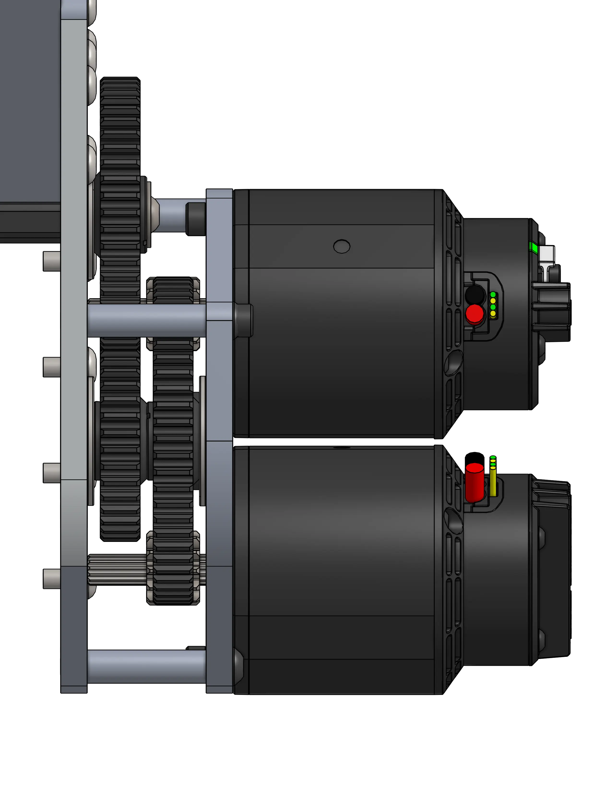
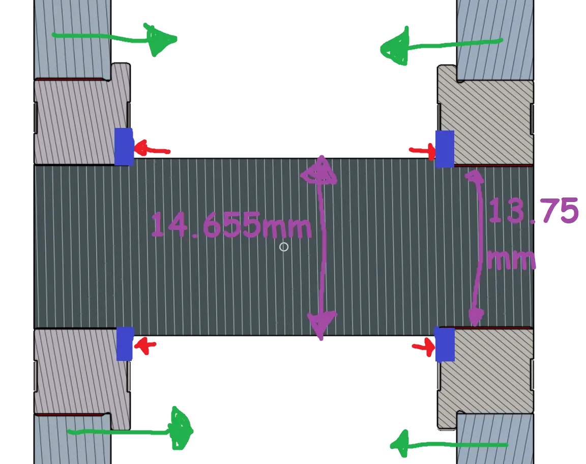
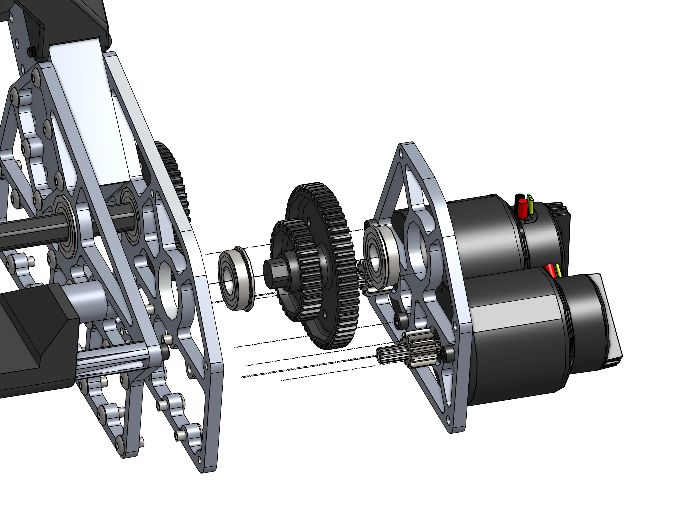
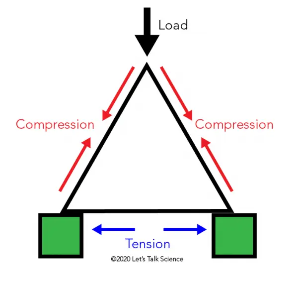
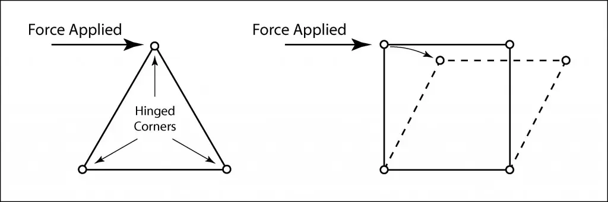

---
title: 2910 队 2023 年死轴转轴机构
description: 采用巧妙链条张紧设计的定制死轴转轴机构
socialCard:
  image: ./img/2910/2910_2023_pivot.webp
---

<a href="https://cad.onshape.com/documents/9b839dcfb57e2325343c7e68/w/d4eb9bd29f2760b8b1531c60/e/f0179551d0ae559b6caa8dd6"><ContentFigure src="./img/2910/2910_2023_pivot.webp" alt="2910 死轴转轴机构" width="60%">采用巧妙链条张紧方案的定制死轴转轴机构。</ContentFigure></a>

### 链接

<LinkButton href="https://cad.onshape.com/documents/9b839dcfb57e2325343c7e68/w/d4eb9bd29f2760b8b1531c60/e/f0179551d0ae559b6caa8dd6" center>
  CAD 文档
</LinkButton>

（感谢 FRC6995 的 JB 整理了 OnShape 文档！）

- [CAD 与技术资料发布 ChiefDelphi 帖子](https://www.chiefdelphi.com/t/2910-cad-and-tech-binder-release-2023/436653)
- [比赛视频](https://www.youtube.com/watch?v=LzgU0rbpWqY)

## 设计思路

该转轴机构由 2 个互为镜像的双 Falcon 500 齿轮箱驱动。这些齿轮箱极其紧凑，整个转轴机构处处采用了周到的设计来减少零件数量。齿轮箱采用了 Thunderhex 轴承固定方法：每根轴的两端都从 1/2" 六角轴车削至 13.75mm（Thunderhex 直径），只要两块板压紧，就能完全约束每个法兰轴承。

<Slides>
  
  双 Falcon 500 齿轮箱设计

  
  使用车削六角轴台阶、轴承法兰和固定板的 Thunderhex 轴承固定方法。

  
  展示装配方式的爆炸视图
</Slides>

所有这些板件都进行了大幅减重，以提高机器人的最高速度和加速能力（F=ma），并保持较低的重心。齿轮箱以及齿轮箱上的电机都尽可能布置在低处和中央，以改善机器人的质心位置。

### 机械联动

<ContentFigure src="./img/2910/pivot_link.webp" alt="转轴机构联动轴" width="60%" />

第二级传动轴横跨机器人并连接两个齿轮箱，这对消除机械臂的扭转至关重要；如果转轴机构两侧独立驱动不均匀，就会产生这种扭转。

### 链条张紧

第三级既提供额外减速，也兼作张紧机构。它将机械联动轴复用为空转轴，并绕该轴转动，从而调整末级链传动的中心距。

<ContentFigure src="./img/2910/planetgear_idler.webp" alt="链条张紧机构" width="50%"/>

### 三角形上部结构

<Slides>
  
  三角形非常坚固！这一上部结构不会被压缩。

  
  当任意一边受到压力时，总会有另一边受拉来抵消该力。
</Slides>

主转轴本身是一根固定在三角形上部结构中的大型死轴。这个死轴组件非常简单，只包含 3 个定制零件，而且都很容易用车床手工加工。
