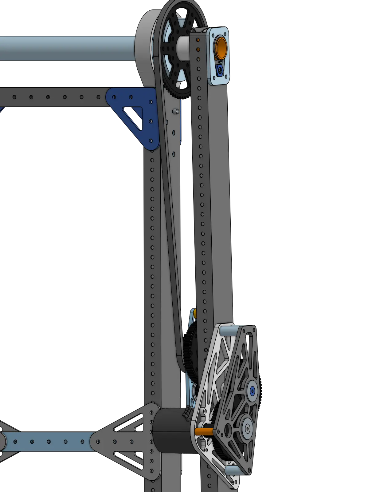
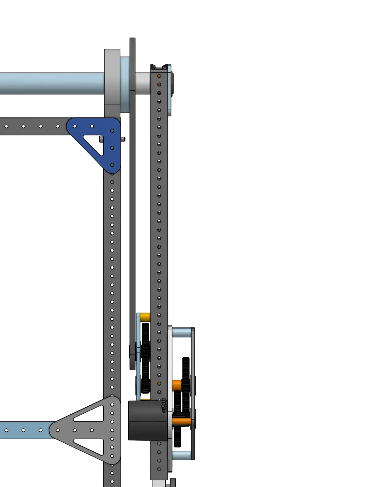

<a href="https://cad.onshape.com/documents/7b17c8664d1313c397a0fcf3/w/61b5c8329f7f5c6023f50c77/e/58bc5035e6e718d34ade872d"><ContentFigure src="./img/6328/6328_2023_pivot.webp" alt="Mechanical Advantage 转轴机构" width="40%">这一三转轴设计可以向内折叠，使其初始状态位于机架边界内，同时让机器人的末端执行器几乎能够进行全方位操作。</ContentFigure></a>

### 链接

<LinkButton href="https://cad.onshape.com/documents/7b17c8664d1313c397a0fcf3/w/61b5c8329f7f5c6023f50c77/e/58bc5035e6e718d34ade872d" center>
  CAD 文档
</LinkButton>

- [ChiefDelphi OpenAlliance 制作记录帖](https://www.chiefdelphi.com/t/frc-6328-mechanical-advantage-2023-build-thread/420691)
- [转轴机构 April Tag 跟踪](https://youtu.be/XA15Qq2CXY0)

## 设计思路

在很多情况下，转轴机械臂是机器人架构中的基础机构。因此，刚性高、坚固且快速的转轴机构会直接决定设计的成败。机械臂完全伸展时，这个转轴关节会承受巨大的弯矩载荷，因此其驱动机构必须动力强劲且极其可靠。

### 转轴机械臂受力分析

扭矩主要取决于几个变量：作用力的大小、旋转轴线到力作用点的距离（通常称为力臂或力矩臂），以及力的作用角度。重力分布在物体各处质量上的作用，可以等效为一个施加在物体重心上的集中力。机械臂完全伸展时，力臂的重心（CoG）与转轴轴线的距离达到最大，并且重力以相对力臂 90 度的方向在重心处施加集中载荷。此时，作用在转轴上的扭矩等于该力乘以重心到转轴的距离。

<ContentFigure src="./img/6328/6328_forces.webp" alt="6328 受力分析" width="75%" />

主转轴关节承受的巨大弯矩载荷，要求转轴机构既要足够坚固，能承受如此大的扭矩而不损坏；又要有足够的动力抵消并克服该扭矩，从而驱动转轴。为这类转轴机械臂设计驱动机构和齿轮箱时，根据机械臂的长度和质量，合理估算驱动它所需的动力通常非常有用。因此，许多设计者会使用 [Reca.lc 机械臂计算器](https://www.reca.lc/arm)或 [AMB 机构传动比计算器](https://ambcalc.com/mechanism?=)等仿真工具。

*以下分析摘自 ChiefDelphi 上的 6328 OpenAlliance 帖子，由 [FRC 6328 的 Matthew3](https://www.chiefdelphi.com/u/Matthew3/summary)撰写。*

## **改进后的设计**

### 定制齿轮箱

由于 MAXPlanetaries 供应有限，而且底板空间受限，我们重新评估了第一个关节的驱动方式。齿轮箱将安装在底板较低的位置，驱动一根死轴 MAXSpline，再通过链条连接到两个第一关节。与之前的方案相比，这样做有几个主要优势：改善空间布局；以机械方式联动两个第一关节；减少伸入机器人中央区域的部分，使其他结构更容易从中穿过；并省去多个 MAXPlantary 齿轮盒。

<ContentFigure src="./img/6328/6328_gearbox.webp" alt="6328 齿轮箱" width="40%" />

底部的两个 NEO 驱动横跨机器人宽度的 MAXSpline，而配有 MAXPlanetary 的 NEO 则驱动方块拾取机构的关节。

新的第一关节死轴采用壁厚 0.25" 的 1.25" 管材，并在轴承安装处车削至 30mm。固定死轴的方式受到 971 队 2018 年机器人的启发，他们使用 mitee-bites 固定死轴。

<ContentFigure src="./img/6328/6328_1.webp" alt="6328_1" width="40%" />

为此，我们使用一块位于“外侧”的 0.25 铝板，并在其中加工出特殊轮廓，为管材周围留出间隙，同时控制接触点的位置。内侧板可以移动，也采用相同轮廓，但旋转了 180 度。

<ContentFigure src="./img/6328/6328_2.webp" alt="6328_2" width="30%" />

这块内侧板通过几颗螺栓安装在放大了 0.005" 的孔中。螺栓拧入外侧板，而蓝色板上的间隙孔允许蓝色内侧板略微移动。因此，拧紧 mitee-bite 时，它会将死轴夹紧到位。经计算，该系统可向死轴施加约 1800 lbs 的夹紧力，从而可靠固定。这样一来，即使出现需要更换死轴或关节这种较为极端的情况，也能轻松拆换。

<ContentFigure src="./img/6328/6328_3.webp" alt="6328_3" width="30%" />

整套堆叠结构由两个卡簧（98541A134）约束。最外侧的约束用于应对 mitee-bites 失效的“最坏情况”。内侧卡簧对于保持堆叠结构完整至关重要。

<ContentFigure src="./img/6328/6328_4.webp" alt="6328_4" width="40%" />

再来看关节本身。之前的设计采用活轴 MAXspline，存在一些小问题，也是我们今后明确希望解决的问题。改用真正的死轴后，我们（希望）能够解决所有这些问题。

<ContentFigure src="./img/6328/6328_5.webp" alt="6328_5" width="30%" />

观察关节本身，可以看到连杆管材以及连接到连杆的关节。这大幅提高了可维修性，也是我们的设计要求之一。我们还将连杆管材从薄壁 MAXtube 改为厚壁 MAXtube。关节本身由嵌入 PA12-CF 尼龙 3D 打印件中的 0.25" 铝板组成。在下图中，可以看到铝板（浅蓝色）嵌在尼龙零件（浅灰色）中。铝板用于安装轴承，尼龙零件则固定轴承并将其定位在管材内（从而形成 MAXtube 内部较复杂的几何形状），同时作为轴承之间的横向隔套。

<ContentFigure src="./img/6328/6328_6.webp" alt="6328_6" width="30%" />

编码器安装在一个从链轮侧面伸出的 3D 打印零件上，并采用与之前设计相同的系统。

<ContentFigure src="./img/6328/6328_7.webp" alt="6328_7" width="40%" />

### 第二关节

机械臂的大部分问题都出在第二关节。这主要是因为最初制造时，我们选择了设计上看起来最简单的方案。回顾一下，之前的关节采用 3 级 max planetary 和 32t 到 80t 的齿轮减速。这个关节非常简单，但充其量只能说问题重重。MAXplanetary 的回程间隙很大，整体又由压配管块等零件装配而成，几乎无法拆卸，而且 MAXspline 本身也有明显的弹性形变。了解这些问题后，我们来看看新设计。

<ContentFigure src="./img/6328/6328_8.webp" alt="6328_8" width="40%" />

这个关节与第一关节非常相似。死轴采用与第一关节类似的系统夹紧，由副板（浅蓝色）将死轴夹紧在第一根管材上。轴的外侧装有卡簧，以应对管材滑动的最坏情况。

<ContentFigure src="./img/6328/6328_9.webp" alt="6328_9" width="40%" />

死轴管（橙色）上装有薄壁铝管（外径 1.25、壁厚 0.028）作为隔套，与轴承内圈和外侧管材接触。为便于装配，死轴（橙色管）有一段车削至比管材其余部分的 30mm 外径小 0.005"（即不与轴承接触的那一段）。

这个系统（希望）能减小弹性形变，并将关节与管材分开，从而提高可维修性。

<Slides>
  

  
</Slides>

齿轮箱采用 3 级传动（加链传动），总减速比为 228:1。虽然这会增加机械臂的重量，但与之前的方案相比，它的位置相对较低；为了减小回程间隙，我们愿意接受额外重量。齿轮箱输出端通过链条连接到安装在第二连杆上的链轮。该链轮为 Rev 64t maxspline 链轮，中心孔扩大至 1.375，为死轴周围留出间隙。链轮与关节之间由 Pa12-CF 尼龙丝材制成的 3D 打印隔套隔开，隔套通过贯穿螺栓固定到关节上。

<ContentFigure src="./img/6328/6328_12.webp" alt="6328_12" width="30%" />

与之前的设计相比，第二关节增加了更多支撑。现在将使用壁厚 1/16 的完整 2x1 方管横跨第二连杆，而之前横跨连杆的只是 ½ 六角轴。角撑板将铆接到横向 2x1 方管上，并用螺栓连接到 MAXtube，以便维修。

<ContentFigure src="./img/6328/6328_13.webp" alt="6328_13" width="30%" />

腕部堆叠结构将与之前完全相同，并继续使用相同的末端执行器和编码器/链条系统。

## 观看转轴机构实际运行

<ContentFigure src="3cXXOSFAnJU" />

<ContentFigure src="89FRu3nUPtU" />
